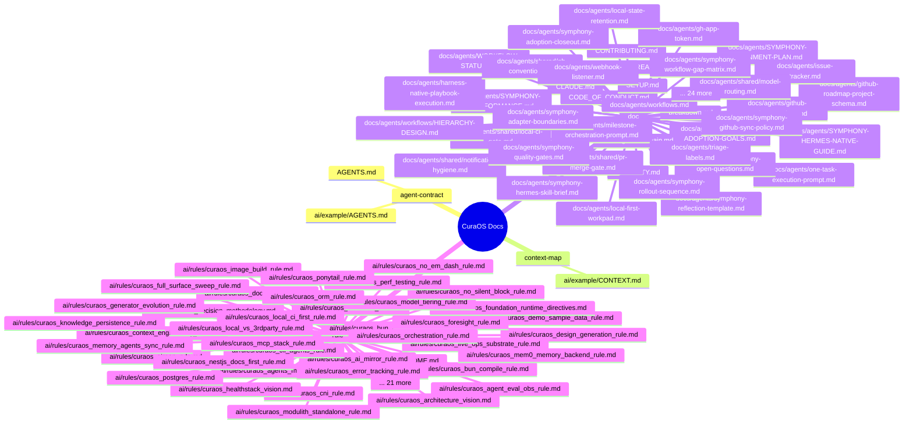

# CuraOS Document Graph

Generated by `scripts/check-doc-graph.js --write`. Do not edit relationship tables by hand.

## Method

- Every Markdown file is a graph node.
- Explicit Markdown links and wikilinks become `references` / `wikilink` edges.
- Path conventions infer typed edges: `AGENTS.md` governs or `README.md` introduces a repo slice, `CONTEXT.md` contextualizes, `Requirements.md` specifies, `RESOLUTION-MAP.md` indexes ADR status, and `ai/rules/README.md` indexes rules.
- Historical research stays in the graph but does not override rules or ADR status.

## Summary

- Nodes: 128
- Edges: 1041
- Isolated nodes: 0
- Broken links: 0

## Node Counts

| Type | Count |
|---|---:|
| agent-contract | 2 |
| context-map | 1 |
| doc | 64 |
| rule | 61 |

## Mind Map

## Nodes

| File | Type | In | Out | Title |
|---|---|---:|---:|---|
| [AGENTS.md](../../../AGENTS.md) | agent-contract | 128 | 187 | AGENTS.md - Workspace Example |
| [CLAUDE.md](../../../CLAUDE.md) | doc | 1 | 1 | CLAUDE.md |
| [CODE_OF_CONDUCT.md](../../../CODE_OF_CONDUCT.md) | doc | 1 | 1 | Code of Conduct |
| [CONTRIBUTING.md](../../../CONTRIBUTING.md) | doc | 2 | 1 | Contributing |
| [README.md](../../../README.md) | doc | 1 | 8 | CuraOS Workspace Example |
| [SECURITY.md](../../../SECURITY.md) | doc | 2 | 1 | Security Policy |
| [SETUP.md](../../../SETUP.md) | doc | 2 | 2 | Setup |
| [ai/example/AGENTS.md](../AGENTS.md) | agent-contract | 2 | 3 | Example Project Agent Contract |
| [ai/example/CONTEXT.md](../CONTEXT.md) | context-map | 4 | 2 | Example Project Context |
| [ai/rules/README.md](../../rules/README.md) | rule | 123 | 131 | Workspace Rules |
| [ai/rules/curaos_agent_eval_obs_rule.md](../../rules/curaos_agent_eval_obs_rule.md) | rule | 9 | 16 | tests/agent_evals/test_identity_service.py |
| [ai/rules/curaos_agents_md_schema_rule.md](../../rules/curaos_agents_md_schema_rule.md) | rule | 14 | 9 | curaos_agents_md_schema_rule.md |
| [ai/rules/curaos_ai_mirror_rule.md](../../rules/curaos_ai_mirror_rule.md) | rule | 21 | 4 | curaos_ai_mirror_rule.md |
| [ai/rules/curaos_airgap_rule.md](../../rules/curaos_airgap_rule.md) | rule | 9 | 12 | packages/curaos/zarf.yaml |
| [ai/rules/curaos_architecture_vision.md](../../rules/curaos_architecture_vision.md) | rule | 6 | 4 | curaos_architecture_vision.md |
| [ai/rules/curaos_bun_compile_rule.md](../../rules/curaos_bun_compile_rule.md) | rule | 4 | 8 | Bun compile packaging rule |
| [ai/rules/curaos_bun_primary_rule.md](../../rules/curaos_bun_primary_rule.md) | rule | 20 | 3 | curaos_bun_primary_rule.md |
| [ai/rules/curaos_caveman_rule.md](../../rules/curaos_caveman_rule.md) | rule | 5 | 7 | CuraOS Caveman Rule |
| [ai/rules/curaos_cli_agents_rule.md](../../rules/curaos_cli_agents_rule.md) | rule | 12 | 12 | Worker tier - paid Zen Go |
| [ai/rules/curaos_cni_rule.md](../../rules/curaos_cni_rule.md) | rule | 10 | 8 | K3s server install w/ Flannel + kube-proxy disabled (NetworkPolicy too - Cilium takes over) |
| [ai/rules/curaos_context_engineering_rule.md](../../rules/curaos_context_engineering_rule.md) | rule | 11 | 11 | High-frequency session (>3 reads per 5 min) - default 5-min TTL OK |
| [ai/rules/curaos_decision_methodology.md](../../rules/curaos_decision_methodology.md) | rule | 7 | 3 | curaos_decision_methodology.md |
| [ai/rules/curaos_demo_sample_data_rule.md](../../rules/curaos_demo_sample_data_rule.md) | rule | 5 | 6 | CuraOS Demo/Sample Data Rule |
| [ai/rules/curaos_design_generation_rule.md](../../rules/curaos_design_generation_rule.md) | rule | 5 | 5 | Design Generation Rule (OpenDesign-driven, generator-ingestable) |
| [ai/rules/curaos_doc_graph_rule.md](../../rules/curaos_doc_graph_rule.md) | rule | 8 | 3 | CuraOS Doc Graph Rule |
| [ai/rules/curaos_error_tracking_rule.md](../../rules/curaos_error_tracking_rule.md) | rule | 11 | 11 | curaos_error_tracking_rule.md |
| [ai/rules/curaos_foresight_rule.md](../../rules/curaos_foresight_rule.md) | rule | 9 | 8 | Foresight + Proactive Task Creation rule |
| [ai/rules/curaos_foundation_runtime_directives.md](../../rules/curaos_foundation_runtime_directives.md) | rule | 6 | 3 | curaos_foundation_runtime_directives.md |
| [ai/rules/curaos_full_surface_sweep_rule.md](../../rules/curaos_full_surface_sweep_rule.md) | rule | 4 | 8 | Full-surface sweep rule (binding) |
| [ai/rules/curaos_generator_evolution_rule.md](../../rules/curaos_generator_evolution_rule.md) | rule | 16 | 11 | CuraOS Generator-Evolution Rule |
| [ai/rules/curaos_healthstack_vision.md](../../rules/curaos_healthstack_vision.md) | rule | 8 | 3 | curaos_healthstack_vision.md |
| [ai/rules/curaos_image_build_rule.md](../../rules/curaos_image_build_rule.md) | rule | 11 | 9 | Bun-first base per curaos_bun_primary_rule |
| [ai/rules/curaos_knowledge_persistence_rule.md](../../rules/curaos_knowledge_persistence_rule.md) | rule | 12 | 12 | Module: <name> |
| [ai/rules/curaos_live_ops_substrate_rule.md](../../rules/curaos_live_ops_substrate_rule.md) | rule | 7 | 3 | Live Ops Substrate Rule |
| [ai/rules/curaos_local_ci_first_rule.md](../../rules/curaos_local_ci_first_rule.md) | rule | 12 | 7 | curaos_local_ci_first_rule.md |
| [ai/rules/curaos_local_vs_3rdparty_rule.md](../../rules/curaos_local_vs_3rdparty_rule.md) | rule | 14 | 3 | curaos_local_vs_3rdparty_rule.md |
| [ai/rules/curaos_mcp_stack_rule.md](../../rules/curaos_mcp_stack_rule.md) | rule | 17 | 14 | curaos_mcp_stack_rule.md |
| [ai/rules/curaos_mem0_memory_backend_rule.md](../../rules/curaos_mem0_memory_backend_rule.md) | rule | 6 | 6 | curaos_mem0_memory_backend_rule.md |
| [ai/rules/curaos_memory_agents_sync_rule.md](../../rules/curaos_memory_agents_sync_rule.md) | rule | 19 | 4 | Memory must NOT contain rule files (other than this sync rule + reference memories) |
| [ai/rules/curaos_model_tiering_rule.md](../../rules/curaos_model_tiering_rule.md) | rule | 12 | 7 | curaos_model_tiering_rule.md |
| [ai/rules/curaos_modulith_standalone_rule.md](../../rules/curaos_modulith_standalone_rule.md) | rule | 18 | 3 | curaos_modulith_standalone_rule.md |
| [ai/rules/curaos_nestjs_docs_first_rule.md](../../rules/curaos_nestjs_docs_first_rule.md) | rule | 5 | 4 | curaos_nestjs_docs_first_rule.md |
| [ai/rules/curaos_no_em_dash_rule.md](../../rules/curaos_no_em_dash_rule.md) | rule | 6 | 3 | Rule: never use em-dashes |
| [ai/rules/curaos_no_silent_block_rule.md](../../rules/curaos_no_silent_block_rule.md) | rule | 5 | 6 | No Silent Block: escalate every blocker to the user immediately |
| [ai/rules/curaos_orchestration_rule.md](../../rules/curaos_orchestration_rule.md) | rule | 14 | 16 | Zarf one-shot: |
| [ai/rules/curaos_orm_rule.md](../../rules/curaos_orm_rule.md) | rule | 8 | 3 | curaos_orm_rule.md |
| [ai/rules/curaos_perf_testing_rule.md](../../rules/curaos_perf_testing_rule.md) | rule | 4 | 13 | .github/workflows/perf-smoke.yml (PR) |
| [ai/rules/curaos_ponytail_rule.md](../../rules/curaos_ponytail_rule.md) | rule | 5 | 7 | CuraOS Ponytail Rule |
| [ai/rules/curaos_postgres_rule.md](../../rules/curaos_postgres_rule.md) | rule | 14 | 13 | curaos_postgres_rule.md |
| [ai/rules/curaos_quality_gates_rule.md](../../rules/curaos_quality_gates_rule.md) | rule | 15 | 23 | lefthook.yml |
| [ai/rules/curaos_recommendation_auto_apply_rule.md](../../rules/curaos_recommendation_auto_apply_rule.md) | rule | 9 | 6 | Recommendation Auto-Apply Rule |
| [ai/rules/curaos_repo_boundary_rule.md](../../rules/curaos_repo_boundary_rule.md) | rule | 12 | 3 | curaos_repo_boundary_rule.md |
| [ai/rules/curaos_repo_conventions_rule.md](../../rules/curaos_repo_conventions_rule.md) | rule | 12 | 11 | curaos_repo_conventions_rule.md |
| [ai/rules/curaos_reuse_dry_rule.md](../../rules/curaos_reuse_dry_rule.md) | rule | 9 | 3 | CuraOS Reuse + DRY Rule |
| [ai/rules/curaos_rn_e2e_rule.md](../../rules/curaos_rn_e2e_rule.md) | rule | 5 | 10 | apps/clinician-app/.maestro/login-and-view-patient.yaml |
| [ai/rules/curaos_roadmap_workflow_rule.md](../../rules/curaos_roadmap_workflow_rule.md) | rule | 15 | 13 | CuraOS Roadmap Workflow Rule |
| [ai/rules/curaos_rolling_update_rule.md](../../rules/curaos_rolling_update_rule.md) | rule | 7 | 8 | e.g. signal:auth-diamond-divergence == 0 (over the gauge's own sampling window) |
| [ai/rules/curaos_runtime_decisions.md](../../rules/curaos_runtime_decisions.md) | rule | 4 | 3 | curaos_runtime_decisions.md |
| [ai/rules/curaos_self_serve_no_user_handoff_rule.md](../../rules/curaos_self_serve_no_user_handoff_rule.md) | rule | 6 | 5 | Self-serve: never hand the user work the agent can do |
| [ai/rules/curaos_slo_rule.md](../../rules/curaos_slo_rule.md) | rule | 10 | 12 | Generated by Codegen recipe nestjs-service-v1 |
| [ai/rules/curaos_speed_patterns_rule.md](../../rules/curaos_speed_patterns_rule.md) | rule | 7 | 16 | Backend service via Nx |
| [ai/rules/curaos_stack_priorities.md](../../rules/curaos_stack_priorities.md) | rule | 4 | 3 | curaos_stack_priorities.md |
| [ai/rules/curaos_swarm_collaboration_rule.md](../../rules/curaos_swarm_collaboration_rule.md) | rule | 11 | 16 | Check no agent currently claimed on this submodule |
| [ai/rules/curaos_symphony_alignment_rule.md](../../rules/curaos_symphony_alignment_rule.md) | rule | 8 | 10 | CuraOS Symphony Alignment Rule |
| [ai/rules/curaos_triplet_split_rule.md](../../rules/curaos_triplet_split_rule.md) | rule | 4 | 3 | CuraOS Triplet Split Rule |
| [ai/rules/curaos_validation_rule.md](../../rules/curaos_validation_rule.md) | rule | 8 | 4 | curaos_validation_rule.md |
| [ai/rules/curaos_verification_stack_rule.md](../../rules/curaos_verification_stack_rule.md) | rule | 25 | 17 | lefthook.yml (excerpt) |
| [ai/rules/curaos_verify_before_build_rule.md](../../rules/curaos_verify_before_build_rule.md) | rule | 7 | 8 | curaos_verify_before_build_rule.md |
| [ai/rules/curaos_version_pinning_rule.md](../../rules/curaos_version_pinning_rule.md) | rule | 9 | 12 | Bad |
| [ai/rules/curaos_version_planning_rule.md](../../rules/curaos_version_planning_rule.md) | rule | 8 | 8 | CuraOS Version-Planning Rule |
| [breakdown.md](../../../breakdown.md) | doc | 1 | 1 | breakdown |
| [docs/agents/SYMPHONY-ADOPTION-GOALS.md](../../../docs/agents/SYMPHONY-ADOPTION-GOALS.md) | doc | 6 | 2 | Symphony Adoption Goals |
| [docs/agents/SYMPHONY-ALIGNMENT-PLAN.md](../../../docs/agents/SYMPHONY-ALIGNMENT-PLAN.md) | doc | 12 | 2 | Symphony Alignment Plan |
| [docs/agents/SYMPHONY-CONFORMANCE.md](../../../docs/agents/SYMPHONY-CONFORMANCE.md) | doc | 3 | 3 | Symphony Conformance Map for CuraOS Workflows |
| [docs/agents/SYMPHONY-HERMES-NATIVE-GUIDE.md](../../../docs/agents/SYMPHONY-HERMES-NATIVE-GUIDE.md) | doc | 5 | 4 | Symphony-aligned native execution guide for Hermes |
| [docs/agents/WORKFLOW-STATUS.md](../../../docs/agents/WORKFLOW-STATUS.md) | doc | 2 | 3 | WORKFLOW-STATUS |
| [docs/agents/domain.md](../../../docs/agents/domain.md) | doc | 1 | 3 | Domain Docs |
| [docs/agents/gh-app-token.md](../../../docs/agents/gh-app-token.md) | doc | 2 | 1 | GitHub App Installation Token (REST ceiling raise) |
| [docs/agents/github-roadmap-project-schema.md](../../../docs/agents/github-roadmap-project-schema.md) | doc | 1 | 3 | GitHub Roadmap Project schema (generated) |
| [docs/agents/github-roadmap-project.md](../../../docs/agents/github-roadmap-project.md) | doc | 3 | 8 | GitHub Roadmap Project |
| [docs/agents/harness-native-playbook-execution.md](../../../docs/agents/harness-native-playbook-execution.md) | doc | 3 | 2 | Harness-native Playbook Execution |
| [docs/agents/issue-tracker.md](../../../docs/agents/issue-tracker.md) | doc | 3 | 4 | Issue tracker: GitHub (per-repo, matched at runtime) |
| [docs/agents/local-first-workpad.md](../../../docs/agents/local-first-workpad.md) | doc | 4 | 3 | Local-first Workpad Model |
| [docs/agents/local-state-retention.md](../../../docs/agents/local-state-retention.md) | doc | 2 | 1 | Local-State Retention Policy (RP-75) |
| [docs/agents/milestone-orchestration-prompt.md](../../../docs/agents/milestone-orchestration-prompt.md) | doc | 10 | 17 | Milestone Orchestration Prompt |
| [docs/agents/one-task-execution-prompt.md](../../../docs/agents/one-task-execution-prompt.md) | doc | 9 | 3 | One-Task Execution Prompt |
| [docs/agents/shared/gh-conventions.md](../../../docs/agents/shared/gh-conventions.md) | doc | 2 | 4 | Shared: gh + Script Invocation Conventions |
| [docs/agents/shared/local-ci-gate.md](../../../docs/agents/shared/local-ci-gate.md) | doc | 2 | 3 | Shared: Local CI Merge Gate (GH auto-CI OFF) |
| [docs/agents/shared/model-routing.md](../../../docs/agents/shared/model-routing.md) | doc | 2 | 3 | Shared: Subagent Model + Effort Routing |
| [docs/agents/shared/notification-hygiene.md](../../../docs/agents/shared/notification-hygiene.md) | doc | 3 | 4 | Shared: PR Inbox-Notification Hygiene |
| [docs/agents/shared/pr-merge-gate.md](../../../docs/agents/shared/pr-merge-gate.md) | doc | 2 | 3 | Shared: PR Merge + Closure Invariants |
| [docs/agents/symphony-adapter-boundaries.md](../../../docs/agents/symphony-adapter-boundaries.md) | doc | 1 | 2 | Symphony Adapter Boundaries |
| [docs/agents/symphony-adoption-closeout.md](../../../docs/agents/symphony-adoption-closeout.md) | doc | 1 | 3 | Symphony Adoption Closeout Checklist |
| [docs/agents/symphony-github-sync-policy.md](../../../docs/agents/symphony-github-sync-policy.md) | doc | 1 | 3 | Symphony GitHub Sync Policy |
| [docs/agents/symphony-hermes-skill-brief.md](../../../docs/agents/symphony-hermes-skill-brief.md) | doc | 1 | 2 | Hermes Skill Brief for Symphony Alignment |
| [docs/agents/symphony-open-questions.md](../../../docs/agents/symphony-open-questions.md) | doc | 1 | 2 | Symphony Adoption Open Questions |
| [docs/agents/symphony-quality-gates.md](../../../docs/agents/symphony-quality-gates.md) | doc | 1 | 2 | Symphony Quality Gates |
| [docs/agents/symphony-reflection-template.md](../../../docs/agents/symphony-reflection-template.md) | doc | 1 | 2 | Symphony Reflection Template |
| [docs/agents/symphony-rollout-sequence.md](../../../docs/agents/symphony-rollout-sequence.md) | doc | 1 | 2 | Symphony Rollout Sequence |
| [docs/agents/symphony-workflow-gap-matrix.md](../../../docs/agents/symphony-workflow-gap-matrix.md) | doc | 1 | 3 | Symphony Workflow Gap Matrix |
| [docs/agents/triage-labels.md](../../../docs/agents/triage-labels.md) | doc | 3 | 2 | Triage Labels |
| [docs/agents/webhook-listener.md](../../../docs/agents/webhook-listener.md) | doc | 2 | 1 | Org Webhook -> Homelab Listener (event-driven convergers) |
| [docs/agents/workflows.md](../../../docs/agents/workflows.md) | doc | 4 | 15 | Agent-Workflow Trigger Map |
| [docs/agents/workflows/HIERARCHY-DESIGN.md](../../../docs/agents/workflows/HIERARCHY-DESIGN.md) | doc | 3 | 3 | Workflow Hierarchy Design |
| [docs/agents/workflows/README.md](../../../docs/agents/workflows/README.md) | doc | 27 | 26 | CuraOS Agent-Workflow Library |
| [docs/agents/workflows/breakdown.md](../../../docs/agents/workflows/breakdown.md) | doc | 2 | 2 | breakdown |
| [docs/agents/workflows/context-load.md](../../../docs/agents/workflows/context-load.md) | doc | 2 | 6 | context-load |
| [docs/agents/workflows/doc-governance.md](../../../docs/agents/workflows/doc-governance.md) | doc | 3 | 2 | doc-governance |
| [docs/agents/workflows/foresight-capture.md](../../../docs/agents/workflows/foresight-capture.md) | doc | 5 | 2 | foresight-capture |
| [docs/agents/workflows/foresight-sweep.md](../../../docs/agents/workflows/foresight-sweep.md) | doc | 5 | 3 | foresight-sweep |
| [docs/agents/workflows/gh-issue-seed.md](../../../docs/agents/workflows/gh-issue-seed.md) | doc | 2 | 4 | gh-issue-seed |
| [docs/agents/workflows/gh-issue-triage.md](../../../docs/agents/workflows/gh-issue-triage.md) | doc | 2 | 3 | gh-issue-triage |
| [docs/agents/workflows/gh-pr-gate-snapshot.md](../../../docs/agents/workflows/gh-pr-gate-snapshot.md) | doc | 2 | 2 | gh-pr-gate-snapshot |
| [docs/agents/workflows/gh-project-sync.md](../../../docs/agents/workflows/gh-project-sync.md) | doc | 2 | 2 | gh-project-sync |
| [docs/agents/workflows/gh-roadmap-mirror.md](../../../docs/agents/workflows/gh-roadmap-mirror.md) | doc | 2 | 2 | gh-roadmap-mirror |
| [docs/agents/workflows/gh-subissue-wire.md](../../../docs/agents/workflows/gh-subissue-wire.md) | doc | 2 | 2 | gh-subissue-wire |
| [docs/agents/workflows/lens-review.md](../../../docs/agents/workflows/lens-review.md) | doc | 2 | 4 | lens-review |
| [docs/agents/workflows/milestone-active-scan.md](../../../docs/agents/workflows/milestone-active-scan.md) | doc | 2 | 4 | milestone-active-scan |
| [docs/agents/workflows/milestone-wave.md](../../../docs/agents/workflows/milestone-wave.md) | doc | 4 | 10 | milestone-wave |
| [docs/agents/workflows/opposite-harness-grill.md](../../../docs/agents/workflows/opposite-harness-grill.md) | doc | 3 | 3 | opposite-harness-grill |
| [docs/agents/workflows/pm-triage-gate.md](../../../docs/agents/workflows/pm-triage-gate.md) | doc | 3 | 2 | pm-triage-gate |
| [docs/agents/workflows/pr-verify-merge.md](../../../docs/agents/workflows/pr-verify-merge.md) | doc | 3 | 3 | pr-verify-merge |
| [docs/agents/workflows/task-execute.md](../../../docs/agents/workflows/task-execute.md) | doc | 3 | 3 | task-execute |
| [docs/agents/workflows/tdd-implement.md](../../../docs/agents/workflows/tdd-implement.md) | doc | 2 | 3 | tdd-implement |
| [docs/agents/workflows/wave-prioritize.md](../../../docs/agents/workflows/wave-prioritize.md) | doc | 3 | 10 | wave-prioritize |
| [opposite-harness-grill.md](../../../opposite-harness-grill.md) | doc | 1 | 2 | opposite-harness-grill |
| [pr-verify-merge.md](../../../pr-verify-merge.md) | doc | 1 | 2 | pr-verify-merge |
| [scripts/test-fixtures/grills/issue-621-synthetic-empty-report.md](../../../scripts/test-fixtures/grills/issue-621-synthetic-empty-report.md) | doc | 1 | 1 | Opposite Harness Grill Blocked |

## Edges

| From | Relationship | To | Note |
|---|---|---|---|
| [AGENTS.md](../../../AGENTS.md) | governs | [ai/example/AGENTS.md](../AGENTS.md) |  |
| [AGENTS.md](../../../AGENTS.md) | governs | [ai/example/CONTEXT.md](../CONTEXT.md) |  |
| [AGENTS.md](../../../AGENTS.md) | governs | [ai/rules/curaos_agent_eval_obs_rule.md](../../rules/curaos_agent_eval_obs_rule.md) |  |
| [AGENTS.md](../../../AGENTS.md) | governs | [ai/rules/curaos_agents_md_schema_rule.md](../../rules/curaos_agents_md_schema_rule.md) |  |
| [AGENTS.md](../../../AGENTS.md) | governs | [ai/rules/curaos_ai_mirror_rule.md](../../rules/curaos_ai_mirror_rule.md) |  |
| [AGENTS.md](../../../AGENTS.md) | governs | [ai/rules/curaos_airgap_rule.md](../../rules/curaos_airgap_rule.md) |  |
| [AGENTS.md](../../../AGENTS.md) | governs | [ai/rules/curaos_architecture_vision.md](../../rules/curaos_architecture_vision.md) |  |
| [AGENTS.md](../../../AGENTS.md) | governs | [ai/rules/curaos_bun_compile_rule.md](../../rules/curaos_bun_compile_rule.md) |  |
| [AGENTS.md](../../../AGENTS.md) | governs | [ai/rules/curaos_bun_primary_rule.md](../../rules/curaos_bun_primary_rule.md) |  |
| [AGENTS.md](../../../AGENTS.md) | governs | [ai/rules/curaos_caveman_rule.md](../../rules/curaos_caveman_rule.md) |  |
| [AGENTS.md](../../../AGENTS.md) | governs | [ai/rules/curaos_cli_agents_rule.md](../../rules/curaos_cli_agents_rule.md) |  |
| [AGENTS.md](../../../AGENTS.md) | governs | [ai/rules/curaos_cni_rule.md](../../rules/curaos_cni_rule.md) |  |
| [AGENTS.md](../../../AGENTS.md) | governs | [ai/rules/curaos_context_engineering_rule.md](../../rules/curaos_context_engineering_rule.md) |  |
| [AGENTS.md](../../../AGENTS.md) | governs | [ai/rules/curaos_decision_methodology.md](../../rules/curaos_decision_methodology.md) |  |
| [AGENTS.md](../../../AGENTS.md) | governs | [ai/rules/curaos_demo_sample_data_rule.md](../../rules/curaos_demo_sample_data_rule.md) |  |
| [AGENTS.md](../../../AGENTS.md) | governs | [ai/rules/curaos_design_generation_rule.md](../../rules/curaos_design_generation_rule.md) |  |
| [AGENTS.md](../../../AGENTS.md) | governs | [ai/rules/curaos_doc_graph_rule.md](../../rules/curaos_doc_graph_rule.md) |  |
| [AGENTS.md](../../../AGENTS.md) | governs | [ai/rules/curaos_error_tracking_rule.md](../../rules/curaos_error_tracking_rule.md) |  |
| [AGENTS.md](../../../AGENTS.md) | governs | [ai/rules/curaos_foresight_rule.md](../../rules/curaos_foresight_rule.md) |  |
| [AGENTS.md](../../../AGENTS.md) | governs | [ai/rules/curaos_foundation_runtime_directives.md](../../rules/curaos_foundation_runtime_directives.md) |  |
| [AGENTS.md](../../../AGENTS.md) | governs | [ai/rules/curaos_full_surface_sweep_rule.md](../../rules/curaos_full_surface_sweep_rule.md) |  |
| [AGENTS.md](../../../AGENTS.md) | governs | [ai/rules/curaos_generator_evolution_rule.md](../../rules/curaos_generator_evolution_rule.md) |  |
| [AGENTS.md](../../../AGENTS.md) | governs | [ai/rules/curaos_healthstack_vision.md](../../rules/curaos_healthstack_vision.md) |  |
| [AGENTS.md](../../../AGENTS.md) | governs | [ai/rules/curaos_image_build_rule.md](../../rules/curaos_image_build_rule.md) |  |
| [AGENTS.md](../../../AGENTS.md) | governs | [ai/rules/curaos_knowledge_persistence_rule.md](../../rules/curaos_knowledge_persistence_rule.md) |  |
| [AGENTS.md](../../../AGENTS.md) | governs | [ai/rules/curaos_live_ops_substrate_rule.md](../../rules/curaos_live_ops_substrate_rule.md) |  |
| [AGENTS.md](../../../AGENTS.md) | governs | [ai/rules/curaos_local_ci_first_rule.md](../../rules/curaos_local_ci_first_rule.md) |  |
| [AGENTS.md](../../../AGENTS.md) | governs | [ai/rules/curaos_local_vs_3rdparty_rule.md](../../rules/curaos_local_vs_3rdparty_rule.md) |  |
| [AGENTS.md](../../../AGENTS.md) | governs | [ai/rules/curaos_mcp_stack_rule.md](../../rules/curaos_mcp_stack_rule.md) |  |
| [AGENTS.md](../../../AGENTS.md) | governs | [ai/rules/curaos_mem0_memory_backend_rule.md](../../rules/curaos_mem0_memory_backend_rule.md) |  |
| [AGENTS.md](../../../AGENTS.md) | governs | [ai/rules/curaos_memory_agents_sync_rule.md](../../rules/curaos_memory_agents_sync_rule.md) |  |
| [AGENTS.md](../../../AGENTS.md) | governs | [ai/rules/curaos_model_tiering_rule.md](../../rules/curaos_model_tiering_rule.md) |  |
| [AGENTS.md](../../../AGENTS.md) | governs | [ai/rules/curaos_modulith_standalone_rule.md](../../rules/curaos_modulith_standalone_rule.md) |  |
| [AGENTS.md](../../../AGENTS.md) | governs | [ai/rules/curaos_nestjs_docs_first_rule.md](../../rules/curaos_nestjs_docs_first_rule.md) |  |
| [AGENTS.md](../../../AGENTS.md) | governs | [ai/rules/curaos_no_em_dash_rule.md](../../rules/curaos_no_em_dash_rule.md) |  |
| [AGENTS.md](../../../AGENTS.md) | governs | [ai/rules/curaos_no_silent_block_rule.md](../../rules/curaos_no_silent_block_rule.md) |  |
| [AGENTS.md](../../../AGENTS.md) | governs | [ai/rules/curaos_orchestration_rule.md](../../rules/curaos_orchestration_rule.md) |  |
| [AGENTS.md](../../../AGENTS.md) | governs | [ai/rules/curaos_orm_rule.md](../../rules/curaos_orm_rule.md) |  |
| [AGENTS.md](../../../AGENTS.md) | governs | [ai/rules/curaos_perf_testing_rule.md](../../rules/curaos_perf_testing_rule.md) |  |
| [AGENTS.md](../../../AGENTS.md) | governs | [ai/rules/curaos_ponytail_rule.md](../../rules/curaos_ponytail_rule.md) |  |
| [AGENTS.md](../../../AGENTS.md) | governs | [ai/rules/curaos_postgres_rule.md](../../rules/curaos_postgres_rule.md) |  |
| [AGENTS.md](../../../AGENTS.md) | governs | [ai/rules/curaos_quality_gates_rule.md](../../rules/curaos_quality_gates_rule.md) |  |
| [AGENTS.md](../../../AGENTS.md) | governs | [ai/rules/curaos_recommendation_auto_apply_rule.md](../../rules/curaos_recommendation_auto_apply_rule.md) |  |
| [AGENTS.md](../../../AGENTS.md) | governs | [ai/rules/curaos_repo_boundary_rule.md](../../rules/curaos_repo_boundary_rule.md) |  |
| [AGENTS.md](../../../AGENTS.md) | governs | [ai/rules/curaos_repo_conventions_rule.md](../../rules/curaos_repo_conventions_rule.md) |  |
| [AGENTS.md](../../../AGENTS.md) | governs | [ai/rules/curaos_reuse_dry_rule.md](../../rules/curaos_reuse_dry_rule.md) |  |
| [AGENTS.md](../../../AGENTS.md) | governs | [ai/rules/curaos_rn_e2e_rule.md](../../rules/curaos_rn_e2e_rule.md) |  |
| [AGENTS.md](../../../AGENTS.md) | governs | [ai/rules/curaos_roadmap_workflow_rule.md](../../rules/curaos_roadmap_workflow_rule.md) |  |
| [AGENTS.md](../../../AGENTS.md) | governs | [ai/rules/curaos_rolling_update_rule.md](../../rules/curaos_rolling_update_rule.md) |  |
| [AGENTS.md](../../../AGENTS.md) | governs | [ai/rules/curaos_runtime_decisions.md](../../rules/curaos_runtime_decisions.md) |  |
| [AGENTS.md](../../../AGENTS.md) | governs | [ai/rules/curaos_self_serve_no_user_handoff_rule.md](../../rules/curaos_self_serve_no_user_handoff_rule.md) |  |
| [AGENTS.md](../../../AGENTS.md) | governs | [ai/rules/curaos_slo_rule.md](../../rules/curaos_slo_rule.md) |  |
| [AGENTS.md](../../../AGENTS.md) | governs | [ai/rules/curaos_speed_patterns_rule.md](../../rules/curaos_speed_patterns_rule.md) |  |
| [AGENTS.md](../../../AGENTS.md) | governs | [ai/rules/curaos_stack_priorities.md](../../rules/curaos_stack_priorities.md) |  |
| [AGENTS.md](../../../AGENTS.md) | governs | [ai/rules/curaos_swarm_collaboration_rule.md](../../rules/curaos_swarm_collaboration_rule.md) |  |
| [AGENTS.md](../../../AGENTS.md) | governs | [ai/rules/curaos_symphony_alignment_rule.md](../../rules/curaos_symphony_alignment_rule.md) |  |
| [AGENTS.md](../../../AGENTS.md) | governs | [ai/rules/curaos_triplet_split_rule.md](../../rules/curaos_triplet_split_rule.md) |  |
| [AGENTS.md](../../../AGENTS.md) | governs | [ai/rules/curaos_validation_rule.md](../../rules/curaos_validation_rule.md) |  |
| [AGENTS.md](../../../AGENTS.md) | governs | [ai/rules/curaos_verification_stack_rule.md](../../rules/curaos_verification_stack_rule.md) |  |
| [AGENTS.md](../../../AGENTS.md) | governs | [ai/rules/curaos_verify_before_build_rule.md](../../rules/curaos_verify_before_build_rule.md) |  |
| [AGENTS.md](../../../AGENTS.md) | governs | [ai/rules/curaos_version_pinning_rule.md](../../rules/curaos_version_pinning_rule.md) |  |
| [AGENTS.md](../../../AGENTS.md) | governs | [ai/rules/curaos_version_planning_rule.md](../../rules/curaos_version_planning_rule.md) |  |
| [AGENTS.md](../../../AGENTS.md) | governs | [ai/rules/README.md](../../rules/README.md) |  |
| [AGENTS.md](../../../AGENTS.md) | governs | [breakdown.md](../../../breakdown.md) |  |
| [AGENTS.md](../../../AGENTS.md) | governs | [CLAUDE.md](../../../CLAUDE.md) |  |
| [AGENTS.md](../../../AGENTS.md) | governs | [CODE_OF_CONDUCT.md](../../../CODE_OF_CONDUCT.md) |  |
| [AGENTS.md](../../../AGENTS.md) | governs | [CONTRIBUTING.md](../../../CONTRIBUTING.md) |  |
| [AGENTS.md](../../../AGENTS.md) | governs | [docs/agents/domain.md](../../../docs/agents/domain.md) |  |
| [AGENTS.md](../../../AGENTS.md) | governs | [docs/agents/gh-app-token.md](../../../docs/agents/gh-app-token.md) |  |
| [AGENTS.md](../../../AGENTS.md) | governs | [docs/agents/github-roadmap-project-schema.md](../../../docs/agents/github-roadmap-project-schema.md) |  |
| [AGENTS.md](../../../AGENTS.md) | governs | [docs/agents/github-roadmap-project.md](../../../docs/agents/github-roadmap-project.md) |  |
| [AGENTS.md](../../../AGENTS.md) | governs | [docs/agents/harness-native-playbook-execution.md](../../../docs/agents/harness-native-playbook-execution.md) |  |
| [AGENTS.md](../../../AGENTS.md) | governs | [docs/agents/issue-tracker.md](../../../docs/agents/issue-tracker.md) |  |
| [AGENTS.md](../../../AGENTS.md) | governs | [docs/agents/local-first-workpad.md](../../../docs/agents/local-first-workpad.md) |  |
| [AGENTS.md](../../../AGENTS.md) | governs | [docs/agents/local-state-retention.md](../../../docs/agents/local-state-retention.md) |  |
| [AGENTS.md](../../../AGENTS.md) | governs | [docs/agents/milestone-orchestration-prompt.md](../../../docs/agents/milestone-orchestration-prompt.md) |  |
| [AGENTS.md](../../../AGENTS.md) | governs | [docs/agents/one-task-execution-prompt.md](../../../docs/agents/one-task-execution-prompt.md) |  |
| [AGENTS.md](../../../AGENTS.md) | governs | [docs/agents/shared/gh-conventions.md](../../../docs/agents/shared/gh-conventions.md) |  |
| [AGENTS.md](../../../AGENTS.md) | governs | [docs/agents/shared/local-ci-gate.md](../../../docs/agents/shared/local-ci-gate.md) |  |
| [AGENTS.md](../../../AGENTS.md) | governs | [docs/agents/shared/model-routing.md](../../../docs/agents/shared/model-routing.md) |  |
| [AGENTS.md](../../../AGENTS.md) | governs | [docs/agents/shared/notification-hygiene.md](../../../docs/agents/shared/notification-hygiene.md) |  |
| [AGENTS.md](../../../AGENTS.md) | governs | [docs/agents/shared/pr-merge-gate.md](../../../docs/agents/shared/pr-merge-gate.md) |  |
| [AGENTS.md](../../../AGENTS.md) | governs | [docs/agents/symphony-adapter-boundaries.md](../../../docs/agents/symphony-adapter-boundaries.md) |  |
| [AGENTS.md](../../../AGENTS.md) | governs | [docs/agents/symphony-adoption-closeout.md](../../../docs/agents/symphony-adoption-closeout.md) |  |
| [AGENTS.md](../../../AGENTS.md) | governs | [docs/agents/SYMPHONY-ADOPTION-GOALS.md](../../../docs/agents/SYMPHONY-ADOPTION-GOALS.md) |  |
| [AGENTS.md](../../../AGENTS.md) | governs | [docs/agents/SYMPHONY-ALIGNMENT-PLAN.md](../../../docs/agents/SYMPHONY-ALIGNMENT-PLAN.md) |  |
| [AGENTS.md](../../../AGENTS.md) | governs | [docs/agents/SYMPHONY-CONFORMANCE.md](../../../docs/agents/SYMPHONY-CONFORMANCE.md) |  |
| [AGENTS.md](../../../AGENTS.md) | governs | [docs/agents/symphony-github-sync-policy.md](../../../docs/agents/symphony-github-sync-policy.md) |  |
| [AGENTS.md](../../../AGENTS.md) | governs | [docs/agents/SYMPHONY-HERMES-NATIVE-GUIDE.md](../../../docs/agents/SYMPHONY-HERMES-NATIVE-GUIDE.md) |  |
| [AGENTS.md](../../../AGENTS.md) | governs | [docs/agents/symphony-hermes-skill-brief.md](../../../docs/agents/symphony-hermes-skill-brief.md) |  |
| [AGENTS.md](../../../AGENTS.md) | governs | [docs/agents/symphony-open-questions.md](../../../docs/agents/symphony-open-questions.md) |  |
| [AGENTS.md](../../../AGENTS.md) | governs | [docs/agents/symphony-quality-gates.md](../../../docs/agents/symphony-quality-gates.md) |  |
| [AGENTS.md](../../../AGENTS.md) | governs | [docs/agents/symphony-reflection-template.md](../../../docs/agents/symphony-reflection-template.md) |  |
| [AGENTS.md](../../../AGENTS.md) | governs | [docs/agents/symphony-rollout-sequence.md](../../../docs/agents/symphony-rollout-sequence.md) |  |
| [AGENTS.md](../../../AGENTS.md) | governs | [docs/agents/symphony-workflow-gap-matrix.md](../../../docs/agents/symphony-workflow-gap-matrix.md) |  |
| [AGENTS.md](../../../AGENTS.md) | governs | [docs/agents/triage-labels.md](../../../docs/agents/triage-labels.md) |  |
| [AGENTS.md](../../../AGENTS.md) | governs | [docs/agents/webhook-listener.md](../../../docs/agents/webhook-listener.md) |  |
| [AGENTS.md](../../../AGENTS.md) | governs | [docs/agents/WORKFLOW-STATUS.md](../../../docs/agents/WORKFLOW-STATUS.md) |  |
| [AGENTS.md](../../../AGENTS.md) | governs | [docs/agents/workflows.md](../../../docs/agents/workflows.md) |  |
| [AGENTS.md](../../../AGENTS.md) | governs | [docs/agents/workflows/breakdown.md](../../../docs/agents/workflows/breakdown.md) |  |
| [AGENTS.md](../../../AGENTS.md) | governs | [docs/agents/workflows/context-load.md](../../../docs/agents/workflows/context-load.md) |  |
| [AGENTS.md](../../../AGENTS.md) | governs | [docs/agents/workflows/doc-governance.md](../../../docs/agents/workflows/doc-governance.md) |  |
| [AGENTS.md](../../../AGENTS.md) | governs | [docs/agents/workflows/foresight-capture.md](../../../docs/agents/workflows/foresight-capture.md) |  |
| [AGENTS.md](../../../AGENTS.md) | governs | [docs/agents/workflows/foresight-sweep.md](../../../docs/agents/workflows/foresight-sweep.md) |  |
| [AGENTS.md](../../../AGENTS.md) | governs | [docs/agents/workflows/gh-issue-seed.md](../../../docs/agents/workflows/gh-issue-seed.md) |  |
| [AGENTS.md](../../../AGENTS.md) | governs | [docs/agents/workflows/gh-issue-triage.md](../../../docs/agents/workflows/gh-issue-triage.md) |  |
| [AGENTS.md](../../../AGENTS.md) | governs | [docs/agents/workflows/gh-pr-gate-snapshot.md](../../../docs/agents/workflows/gh-pr-gate-snapshot.md) |  |
| [AGENTS.md](../../../AGENTS.md) | governs | [docs/agents/workflows/gh-project-sync.md](../../../docs/agents/workflows/gh-project-sync.md) |  |
| [AGENTS.md](../../../AGENTS.md) | governs | [docs/agents/workflows/gh-roadmap-mirror.md](../../../docs/agents/workflows/gh-roadmap-mirror.md) |  |
| [AGENTS.md](../../../AGENTS.md) | governs | [docs/agents/workflows/gh-subissue-wire.md](../../../docs/agents/workflows/gh-subissue-wire.md) |  |
| [AGENTS.md](../../../AGENTS.md) | governs | [docs/agents/workflows/HIERARCHY-DESIGN.md](../../../docs/agents/workflows/HIERARCHY-DESIGN.md) |  |
| [AGENTS.md](../../../AGENTS.md) | governs | [docs/agents/workflows/lens-review.md](../../../docs/agents/workflows/lens-review.md) |  |
| [AGENTS.md](../../../AGENTS.md) | governs | [docs/agents/workflows/milestone-active-scan.md](../../../docs/agents/workflows/milestone-active-scan.md) |  |
| [AGENTS.md](../../../AGENTS.md) | governs | [docs/agents/workflows/milestone-wave.md](../../../docs/agents/workflows/milestone-wave.md) |  |
| [AGENTS.md](../../../AGENTS.md) | governs | [docs/agents/workflows/opposite-harness-grill.md](../../../docs/agents/workflows/opposite-harness-grill.md) |  |
| [AGENTS.md](../../../AGENTS.md) | governs | [docs/agents/workflows/pm-triage-gate.md](../../../docs/agents/workflows/pm-triage-gate.md) |  |
| [AGENTS.md](../../../AGENTS.md) | governs | [docs/agents/workflows/pr-verify-merge.md](../../../docs/agents/workflows/pr-verify-merge.md) |  |
| [AGENTS.md](../../../AGENTS.md) | governs | [docs/agents/workflows/README.md](../../../docs/agents/workflows/README.md) |  |
| [AGENTS.md](../../../AGENTS.md) | governs | [docs/agents/workflows/task-execute.md](../../../docs/agents/workflows/task-execute.md) |  |
| [AGENTS.md](../../../AGENTS.md) | governs | [docs/agents/workflows/tdd-implement.md](../../../docs/agents/workflows/tdd-implement.md) |  |
| [AGENTS.md](../../../AGENTS.md) | governs | [docs/agents/workflows/wave-prioritize.md](../../../docs/agents/workflows/wave-prioritize.md) |  |
| [AGENTS.md](../../../AGENTS.md) | governs | [opposite-harness-grill.md](../../../opposite-harness-grill.md) |  |
| [AGENTS.md](../../../AGENTS.md) | governs | [pr-verify-merge.md](../../../pr-verify-merge.md) |  |
| [AGENTS.md](../../../AGENTS.md) | governs | [README.md](../../../README.md) |  |
| [AGENTS.md](../../../AGENTS.md) | governs | [scripts/test-fixtures/grills/issue-621-synthetic-empty-report.md](../../../scripts/test-fixtures/grills/issue-621-synthetic-empty-report.md) |  |
| [AGENTS.md](../../../AGENTS.md) | governs | [SECURITY.md](../../../SECURITY.md) |  |
| [AGENTS.md](../../../AGENTS.md) | governs | [SETUP.md](../../../SETUP.md) |  |
| [AGENTS.md](../../../AGENTS.md) | references | [ai/rules/curaos_agent_eval_obs_rule.md](../../rules/curaos_agent_eval_obs_rule.md) |  |
| [AGENTS.md](../../../AGENTS.md) | references | [ai/rules/curaos_agents_md_schema_rule.md](../../rules/curaos_agents_md_schema_rule.md) |  |
| [AGENTS.md](../../../AGENTS.md) | references | [ai/rules/curaos_ai_mirror_rule.md](../../rules/curaos_ai_mirror_rule.md) |  |
| [AGENTS.md](../../../AGENTS.md) | references | [ai/rules/curaos_airgap_rule.md](../../rules/curaos_airgap_rule.md) |  |
| [AGENTS.md](../../../AGENTS.md) | references | [ai/rules/curaos_architecture_vision.md](../../rules/curaos_architecture_vision.md) |  |
| [AGENTS.md](../../../AGENTS.md) | references | [ai/rules/curaos_bun_compile_rule.md](../../rules/curaos_bun_compile_rule.md) |  |
| [AGENTS.md](../../../AGENTS.md) | references | [ai/rules/curaos_bun_primary_rule.md](../../rules/curaos_bun_primary_rule.md) |  |
| [AGENTS.md](../../../AGENTS.md) | references | [ai/rules/curaos_caveman_rule.md](../../rules/curaos_caveman_rule.md) |  |
| [AGENTS.md](../../../AGENTS.md) | references | [ai/rules/curaos_cli_agents_rule.md](../../rules/curaos_cli_agents_rule.md) |  |
| [AGENTS.md](../../../AGENTS.md) | references | [ai/rules/curaos_cni_rule.md](../../rules/curaos_cni_rule.md) |  |
| [AGENTS.md](../../../AGENTS.md) | references | [ai/rules/curaos_context_engineering_rule.md](../../rules/curaos_context_engineering_rule.md) |  |
| [AGENTS.md](../../../AGENTS.md) | references | [ai/rules/curaos_decision_methodology.md](../../rules/curaos_decision_methodology.md) |  |
| [AGENTS.md](../../../AGENTS.md) | references | [ai/rules/curaos_demo_sample_data_rule.md](../../rules/curaos_demo_sample_data_rule.md) |  |
| [AGENTS.md](../../../AGENTS.md) | references | [ai/rules/curaos_design_generation_rule.md](../../rules/curaos_design_generation_rule.md) |  |
| [AGENTS.md](../../../AGENTS.md) | references | [ai/rules/curaos_doc_graph_rule.md](../../rules/curaos_doc_graph_rule.md) |  |
| [AGENTS.md](../../../AGENTS.md) | references | [ai/rules/curaos_error_tracking_rule.md](../../rules/curaos_error_tracking_rule.md) |  |
| [AGENTS.md](../../../AGENTS.md) | references | [ai/rules/curaos_foresight_rule.md](../../rules/curaos_foresight_rule.md) |  |
| [AGENTS.md](../../../AGENTS.md) | references | [ai/rules/curaos_foundation_runtime_directives.md](../../rules/curaos_foundation_runtime_directives.md) |  |
| [AGENTS.md](../../../AGENTS.md) | references | [ai/rules/curaos_full_surface_sweep_rule.md](../../rules/curaos_full_surface_sweep_rule.md) |  |
| [AGENTS.md](../../../AGENTS.md) | references | [ai/rules/curaos_generator_evolution_rule.md](../../rules/curaos_generator_evolution_rule.md) |  |
| [AGENTS.md](../../../AGENTS.md) | references | [ai/rules/curaos_healthstack_vision.md](../../rules/curaos_healthstack_vision.md) |  |
| [AGENTS.md](../../../AGENTS.md) | references | [ai/rules/curaos_image_build_rule.md](../../rules/curaos_image_build_rule.md) |  |
| [AGENTS.md](../../../AGENTS.md) | references | [ai/rules/curaos_knowledge_persistence_rule.md](../../rules/curaos_knowledge_persistence_rule.md) |  |
| [AGENTS.md](../../../AGENTS.md) | references | [ai/rules/curaos_live_ops_substrate_rule.md](../../rules/curaos_live_ops_substrate_rule.md) |  |
| [AGENTS.md](../../../AGENTS.md) | references | [ai/rules/curaos_local_ci_first_rule.md](../../rules/curaos_local_ci_first_rule.md) |  |
| [AGENTS.md](../../../AGENTS.md) | references | [ai/rules/curaos_local_vs_3rdparty_rule.md](../../rules/curaos_local_vs_3rdparty_rule.md) |  |
| [AGENTS.md](../../../AGENTS.md) | references | [ai/rules/curaos_mcp_stack_rule.md](../../rules/curaos_mcp_stack_rule.md) |  |
| [AGENTS.md](../../../AGENTS.md) | references | [ai/rules/curaos_mem0_memory_backend_rule.md](../../rules/curaos_mem0_memory_backend_rule.md) |  |
| [AGENTS.md](../../../AGENTS.md) | references | [ai/rules/curaos_memory_agents_sync_rule.md](../../rules/curaos_memory_agents_sync_rule.md) |  |
| [AGENTS.md](../../../AGENTS.md) | references | [ai/rules/curaos_model_tiering_rule.md](../../rules/curaos_model_tiering_rule.md) |  |
| [AGENTS.md](../../../AGENTS.md) | references | [ai/rules/curaos_modulith_standalone_rule.md](../../rules/curaos_modulith_standalone_rule.md) |  |
| [AGENTS.md](../../../AGENTS.md) | references | [ai/rules/curaos_nestjs_docs_first_rule.md](../../rules/curaos_nestjs_docs_first_rule.md) |  |
| [AGENTS.md](../../../AGENTS.md) | references | [ai/rules/curaos_no_em_dash_rule.md](../../rules/curaos_no_em_dash_rule.md) |  |
| [AGENTS.md](../../../AGENTS.md) | references | [ai/rules/curaos_no_silent_block_rule.md](../../rules/curaos_no_silent_block_rule.md) |  |
| [AGENTS.md](../../../AGENTS.md) | references | [ai/rules/curaos_orchestration_rule.md](../../rules/curaos_orchestration_rule.md) |  |
| [AGENTS.md](../../../AGENTS.md) | references | [ai/rules/curaos_orm_rule.md](../../rules/curaos_orm_rule.md) |  |
| [AGENTS.md](../../../AGENTS.md) | references | [ai/rules/curaos_perf_testing_rule.md](../../rules/curaos_perf_testing_rule.md) |  |
| [AGENTS.md](../../../AGENTS.md) | references | [ai/rules/curaos_ponytail_rule.md](../../rules/curaos_ponytail_rule.md) |  |
| [AGENTS.md](../../../AGENTS.md) | references | [ai/rules/curaos_postgres_rule.md](../../rules/curaos_postgres_rule.md) |  |
| [AGENTS.md](../../../AGENTS.md) | references | [ai/rules/curaos_quality_gates_rule.md](../../rules/curaos_quality_gates_rule.md) |  |
| [AGENTS.md](../../../AGENTS.md) | references | [ai/rules/curaos_recommendation_auto_apply_rule.md](../../rules/curaos_recommendation_auto_apply_rule.md) |  |
| [AGENTS.md](../../../AGENTS.md) | references | [ai/rules/curaos_repo_boundary_rule.md](../../rules/curaos_repo_boundary_rule.md) |  |
| [AGENTS.md](../../../AGENTS.md) | references | [ai/rules/curaos_repo_conventions_rule.md](../../rules/curaos_repo_conventions_rule.md) |  |
| [AGENTS.md](../../../AGENTS.md) | references | [ai/rules/curaos_reuse_dry_rule.md](../../rules/curaos_reuse_dry_rule.md) |  |
| [AGENTS.md](../../../AGENTS.md) | references | [ai/rules/curaos_rn_e2e_rule.md](../../rules/curaos_rn_e2e_rule.md) |  |
| [AGENTS.md](../../../AGENTS.md) | references | [ai/rules/curaos_roadmap_workflow_rule.md](../../rules/curaos_roadmap_workflow_rule.md) |  |
| [AGENTS.md](../../../AGENTS.md) | references | [ai/rules/curaos_rolling_update_rule.md](../../rules/curaos_rolling_update_rule.md) |  |
| [AGENTS.md](../../../AGENTS.md) | references | [ai/rules/curaos_runtime_decisions.md](../../rules/curaos_runtime_decisions.md) |  |
| [AGENTS.md](../../../AGENTS.md) | references | [ai/rules/curaos_self_serve_no_user_handoff_rule.md](../../rules/curaos_self_serve_no_user_handoff_rule.md) |  |
| [AGENTS.md](../../../AGENTS.md) | references | [ai/rules/curaos_slo_rule.md](../../rules/curaos_slo_rule.md) |  |
| [AGENTS.md](../../../AGENTS.md) | references | [ai/rules/curaos_speed_patterns_rule.md](../../rules/curaos_speed_patterns_rule.md) |  |
| [AGENTS.md](../../../AGENTS.md) | references | [ai/rules/curaos_stack_priorities.md](../../rules/curaos_stack_priorities.md) |  |
| [AGENTS.md](../../../AGENTS.md) | references | [ai/rules/curaos_swarm_collaboration_rule.md](../../rules/curaos_swarm_collaboration_rule.md) |  |
| [AGENTS.md](../../../AGENTS.md) | references | [ai/rules/curaos_symphony_alignment_rule.md](../../rules/curaos_symphony_alignment_rule.md) |  |
| [AGENTS.md](../../../AGENTS.md) | references | [ai/rules/curaos_triplet_split_rule.md](../../rules/curaos_triplet_split_rule.md) |  |
| [AGENTS.md](../../../AGENTS.md) | references | [ai/rules/curaos_validation_rule.md](../../rules/curaos_validation_rule.md) |  |
| [AGENTS.md](../../../AGENTS.md) | references | [ai/rules/curaos_verification_stack_rule.md](../../rules/curaos_verification_stack_rule.md) |  |
| [AGENTS.md](../../../AGENTS.md) | references | [ai/rules/curaos_verify_before_build_rule.md](../../rules/curaos_verify_before_build_rule.md) |  |
| [AGENTS.md](../../../AGENTS.md) | references | [ai/rules/curaos_version_pinning_rule.md](../../rules/curaos_version_pinning_rule.md) |  |
| [AGENTS.md](../../../AGENTS.md) | references | [ai/rules/curaos_version_planning_rule.md](../../rules/curaos_version_planning_rule.md) |  |
| [ai/example/AGENTS.md](../AGENTS.md) | contextualized_by | [ai/example/CONTEXT.md](../CONTEXT.md) |  |
| [ai/example/AGENTS.md](../AGENTS.md) | governed_by | [AGENTS.md](../../../AGENTS.md) |  |
| [ai/example/AGENTS.md](../AGENTS.md) | loads_context | [ai/example/CONTEXT.md](../CONTEXT.md) |  |
| [ai/example/CONTEXT.md](../CONTEXT.md) | governed_by | [AGENTS.md](../../../AGENTS.md) |  |
| [ai/example/CONTEXT.md](../CONTEXT.md) | module_contract | [ai/example/AGENTS.md](../AGENTS.md) |  |
| [ai/rules/curaos_agent_eval_obs_rule.md](../../rules/curaos_agent_eval_obs_rule.md) | governed_by | [AGENTS.md](../../../AGENTS.md) |  |
| [ai/rules/curaos_agent_eval_obs_rule.md](../../rules/curaos_agent_eval_obs_rule.md) | indexed_by | [ai/rules/README.md](../../rules/README.md) |  |
| [ai/rules/curaos_agent_eval_obs_rule.md](../../rules/curaos_agent_eval_obs_rule.md) | introduced_by | [ai/rules/README.md](../../rules/README.md) |  |
| [ai/rules/curaos_agent_eval_obs_rule.md](../../rules/curaos_agent_eval_obs_rule.md) | wikilink | [ai/rules/curaos_airgap_rule.md](../../rules/curaos_airgap_rule.md) | curaos-airgap-rule |
| [ai/rules/curaos_agent_eval_obs_rule.md](../../rules/curaos_agent_eval_obs_rule.md) | wikilink | [ai/rules/curaos_cli_agents_rule.md](../../rules/curaos_cli_agents_rule.md) | curaos-cli-agents-rule |
| [ai/rules/curaos_agent_eval_obs_rule.md](../../rules/curaos_agent_eval_obs_rule.md) | wikilink | [ai/rules/curaos_context_engineering_rule.md](../../rules/curaos_context_engineering_rule.md) | curaos-context-engineering-rule |
| [ai/rules/curaos_agent_eval_obs_rule.md](../../rules/curaos_agent_eval_obs_rule.md) | wikilink | [ai/rules/curaos_error_tracking_rule.md](../../rules/curaos_error_tracking_rule.md) | curaos-error-tracking-rule |
| [ai/rules/curaos_agent_eval_obs_rule.md](../../rules/curaos_agent_eval_obs_rule.md) | wikilink | [ai/rules/curaos_mcp_stack_rule.md](../../rules/curaos_mcp_stack_rule.md) | curaos-mcp-stack-rule |
| [ai/rules/curaos_agent_eval_obs_rule.md](../../rules/curaos_agent_eval_obs_rule.md) | wikilink | [ai/rules/curaos_memory_agents_sync_rule.md](../../rules/curaos_memory_agents_sync_rule.md) | curaos-memory-agents-sync-rule |
| [ai/rules/curaos_agent_eval_obs_rule.md](../../rules/curaos_agent_eval_obs_rule.md) | wikilink | [ai/rules/curaos_model_tiering_rule.md](../../rules/curaos_model_tiering_rule.md) | curaos-model-tiering-rule |
| [ai/rules/curaos_agent_eval_obs_rule.md](../../rules/curaos_agent_eval_obs_rule.md) | wikilink | [ai/rules/curaos_orchestration_rule.md](../../rules/curaos_orchestration_rule.md) | curaos-orchestration-rule |
| [ai/rules/curaos_agent_eval_obs_rule.md](../../rules/curaos_agent_eval_obs_rule.md) | wikilink | [ai/rules/curaos_postgres_rule.md](../../rules/curaos_postgres_rule.md) | curaos-postgres-rule |
| [ai/rules/curaos_agent_eval_obs_rule.md](../../rules/curaos_agent_eval_obs_rule.md) | wikilink | [ai/rules/curaos_quality_gates_rule.md](../../rules/curaos_quality_gates_rule.md) | curaos-quality-gates-rule |
| [ai/rules/curaos_agent_eval_obs_rule.md](../../rules/curaos_agent_eval_obs_rule.md) | wikilink | [ai/rules/curaos_slo_rule.md](../../rules/curaos_slo_rule.md) | curaos-slo-rule |
| [ai/rules/curaos_agent_eval_obs_rule.md](../../rules/curaos_agent_eval_obs_rule.md) | wikilink | [ai/rules/curaos_swarm_collaboration_rule.md](../../rules/curaos_swarm_collaboration_rule.md) | curaos-swarm-collaboration-rule |
| [ai/rules/curaos_agent_eval_obs_rule.md](../../rules/curaos_agent_eval_obs_rule.md) | wikilink | [ai/rules/curaos_verification_stack_rule.md](../../rules/curaos_verification_stack_rule.md) | curaos-verification-stack-rule |
| [ai/rules/curaos_agents_md_schema_rule.md](../../rules/curaos_agents_md_schema_rule.md) | governed_by | [AGENTS.md](../../../AGENTS.md) |  |
| [ai/rules/curaos_agents_md_schema_rule.md](../../rules/curaos_agents_md_schema_rule.md) | indexed_by | [ai/rules/README.md](../../rules/README.md) |  |
| [ai/rules/curaos_agents_md_schema_rule.md](../../rules/curaos_agents_md_schema_rule.md) | introduced_by | [ai/rules/README.md](../../rules/README.md) |  |
| [ai/rules/curaos_agents_md_schema_rule.md](../../rules/curaos_agents_md_schema_rule.md) | wikilink | [ai/rules/curaos_ai_mirror_rule.md](../../rules/curaos_ai_mirror_rule.md) | curaos-ai-mirror-rule |
| [ai/rules/curaos_agents_md_schema_rule.md](../../rules/curaos_agents_md_schema_rule.md) | wikilink | [ai/rules/curaos_bun_primary_rule.md](../../rules/curaos_bun_primary_rule.md) | curaos-bun-primary-rule |
| [ai/rules/curaos_agents_md_schema_rule.md](../../rules/curaos_agents_md_schema_rule.md) | wikilink | [ai/rules/curaos_knowledge_persistence_rule.md](../../rules/curaos_knowledge_persistence_rule.md) | curaos-knowledge-persistence-rule |
| [ai/rules/curaos_agents_md_schema_rule.md](../../rules/curaos_agents_md_schema_rule.md) | wikilink | [ai/rules/curaos_memory_agents_sync_rule.md](../../rules/curaos_memory_agents_sync_rule.md) | curaos-memory-agents-sync-rule |
| [ai/rules/curaos_agents_md_schema_rule.md](../../rules/curaos_agents_md_schema_rule.md) | wikilink | [ai/rules/curaos_modulith_standalone_rule.md](../../rules/curaos_modulith_standalone_rule.md) | curaos-modulith-standalone-rule |
| [ai/rules/curaos_agents_md_schema_rule.md](../../rules/curaos_agents_md_schema_rule.md) | wikilink | [ai/rules/curaos_repo_boundary_rule.md](../../rules/curaos_repo_boundary_rule.md) | curaos-repo-boundary-rule |
| [ai/rules/curaos_ai_mirror_rule.md](../../rules/curaos_ai_mirror_rule.md) | governed_by | [AGENTS.md](../../../AGENTS.md) |  |
| [ai/rules/curaos_ai_mirror_rule.md](../../rules/curaos_ai_mirror_rule.md) | indexed_by | [ai/rules/README.md](../../rules/README.md) |  |
| [ai/rules/curaos_ai_mirror_rule.md](../../rules/curaos_ai_mirror_rule.md) | introduced_by | [ai/rules/README.md](../../rules/README.md) |  |
| [ai/rules/curaos_ai_mirror_rule.md](../../rules/curaos_ai_mirror_rule.md) | wikilink | [ai/rules/curaos_repo_boundary_rule.md](../../rules/curaos_repo_boundary_rule.md) | curaos-repo-boundary-rule |
| [ai/rules/curaos_airgap_rule.md](../../rules/curaos_airgap_rule.md) | governed_by | [AGENTS.md](../../../AGENTS.md) |  |
| [ai/rules/curaos_airgap_rule.md](../../rules/curaos_airgap_rule.md) | indexed_by | [ai/rules/README.md](../../rules/README.md) |  |
| [ai/rules/curaos_airgap_rule.md](../../rules/curaos_airgap_rule.md) | introduced_by | [ai/rules/README.md](../../rules/README.md) |  |
| [ai/rules/curaos_airgap_rule.md](../../rules/curaos_airgap_rule.md) | wikilink | [ai/rules/curaos_ai_mirror_rule.md](../../rules/curaos_ai_mirror_rule.md) | curaos-ai-mirror-rule |
| [ai/rules/curaos_airgap_rule.md](../../rules/curaos_airgap_rule.md) | wikilink | [ai/rules/curaos_cni_rule.md](../../rules/curaos_cni_rule.md) | curaos-cni-rule |
| [ai/rules/curaos_airgap_rule.md](../../rules/curaos_airgap_rule.md) | wikilink | [ai/rules/curaos_error_tracking_rule.md](../../rules/curaos_error_tracking_rule.md) | curaos-error-tracking-rule |
| [ai/rules/curaos_airgap_rule.md](../../rules/curaos_airgap_rule.md) | wikilink | [ai/rules/curaos_image_build_rule.md](../../rules/curaos_image_build_rule.md) | curaos-image-build-rule |
| [ai/rules/curaos_airgap_rule.md](../../rules/curaos_airgap_rule.md) | wikilink | [ai/rules/curaos_local_vs_3rdparty_rule.md](../../rules/curaos_local_vs_3rdparty_rule.md) | curaos-local-vs-3rdparty-rule |
| [ai/rules/curaos_airgap_rule.md](../../rules/curaos_airgap_rule.md) | wikilink | [ai/rules/curaos_modulith_standalone_rule.md](../../rules/curaos_modulith_standalone_rule.md) | curaos-modulith-standalone-rule |
| [ai/rules/curaos_airgap_rule.md](../../rules/curaos_airgap_rule.md) | wikilink | [ai/rules/curaos_orchestration_rule.md](../../rules/curaos_orchestration_rule.md) | curaos-orchestration-rule |
| [ai/rules/curaos_airgap_rule.md](../../rules/curaos_airgap_rule.md) | wikilink | [ai/rules/curaos_postgres_rule.md](../../rules/curaos_postgres_rule.md) | curaos-postgres-rule |
| [ai/rules/curaos_airgap_rule.md](../../rules/curaos_airgap_rule.md) | wikilink | [ai/rules/curaos_slo_rule.md](../../rules/curaos_slo_rule.md) | curaos-slo-rule |
| [ai/rules/curaos_architecture_vision.md](../../rules/curaos_architecture_vision.md) | governed_by | [AGENTS.md](../../../AGENTS.md) |  |
| [ai/rules/curaos_architecture_vision.md](../../rules/curaos_architecture_vision.md) | indexed_by | [ai/rules/README.md](../../rules/README.md) |  |
| [ai/rules/curaos_architecture_vision.md](../../rules/curaos_architecture_vision.md) | introduced_by | [ai/rules/README.md](../../rules/README.md) |  |
| [ai/rules/curaos_architecture_vision.md](../../rules/curaos_architecture_vision.md) | wikilink | [ai/rules/curaos_decision_methodology.md](../../rules/curaos_decision_methodology.md) | curaos-decision-methodology |
| [ai/rules/curaos_bun_compile_rule.md](../../rules/curaos_bun_compile_rule.md) | governed_by | [AGENTS.md](../../../AGENTS.md) |  |
| [ai/rules/curaos_bun_compile_rule.md](../../rules/curaos_bun_compile_rule.md) | indexed_by | [ai/rules/README.md](../../rules/README.md) |  |
| [ai/rules/curaos_bun_compile_rule.md](../../rules/curaos_bun_compile_rule.md) | introduced_by | [ai/rules/README.md](../../rules/README.md) |  |
| [ai/rules/curaos_bun_compile_rule.md](../../rules/curaos_bun_compile_rule.md) | wikilink | [ai/rules/curaos_bun_primary_rule.md](../../rules/curaos_bun_primary_rule.md) | curaos-bun-primary-rule |
| [ai/rules/curaos_bun_compile_rule.md](../../rules/curaos_bun_compile_rule.md) | wikilink | [ai/rules/curaos_generator_evolution_rule.md](../../rules/curaos_generator_evolution_rule.md) | curaos-generator-evolution-rule |
| [ai/rules/curaos_bun_compile_rule.md](../../rules/curaos_bun_compile_rule.md) | wikilink | [ai/rules/curaos_image_build_rule.md](../../rules/curaos_image_build_rule.md) | curaos-image-build-rule |
| [ai/rules/curaos_bun_compile_rule.md](../../rules/curaos_bun_compile_rule.md) | wikilink | [ai/rules/curaos_validation_rule.md](../../rules/curaos_validation_rule.md) | curaos-validation-rule |
| [ai/rules/curaos_bun_compile_rule.md](../../rules/curaos_bun_compile_rule.md) | wikilink | [ai/rules/curaos_verify_before_build_rule.md](../../rules/curaos_verify_before_build_rule.md) | curaos-verify-before-build-rule |
| [ai/rules/curaos_bun_primary_rule.md](../../rules/curaos_bun_primary_rule.md) | governed_by | [AGENTS.md](../../../AGENTS.md) |  |
| [ai/rules/curaos_bun_primary_rule.md](../../rules/curaos_bun_primary_rule.md) | indexed_by | [ai/rules/README.md](../../rules/README.md) |  |
| [ai/rules/curaos_bun_primary_rule.md](../../rules/curaos_bun_primary_rule.md) | introduced_by | [ai/rules/README.md](../../rules/README.md) |  |
| [ai/rules/curaos_caveman_rule.md](../../rules/curaos_caveman_rule.md) | governed_by | [AGENTS.md](../../../AGENTS.md) |  |
| [ai/rules/curaos_caveman_rule.md](../../rules/curaos_caveman_rule.md) | indexed_by | [ai/rules/README.md](../../rules/README.md) |  |
| [ai/rules/curaos_caveman_rule.md](../../rules/curaos_caveman_rule.md) | introduced_by | [ai/rules/README.md](../../rules/README.md) |  |
| [ai/rules/curaos_caveman_rule.md](../../rules/curaos_caveman_rule.md) | wikilink | [ai/rules/curaos_no_em_dash_rule.md](../../rules/curaos_no_em_dash_rule.md) | curaos_no_em_dash_rule |
| [ai/rules/curaos_caveman_rule.md](../../rules/curaos_caveman_rule.md) | wikilink | [ai/rules/curaos_ponytail_rule.md](../../rules/curaos_ponytail_rule.md) | curaos_ponytail_rule |
| [ai/rules/curaos_caveman_rule.md](../../rules/curaos_caveman_rule.md) | wikilink | [ai/rules/curaos_recommendation_auto_apply_rule.md](../../rules/curaos_recommendation_auto_apply_rule.md) | curaos_recommendation_auto_apply_rule |
| [ai/rules/curaos_caveman_rule.md](../../rules/curaos_caveman_rule.md) | wikilink | [ai/rules/curaos_self_serve_no_user_handoff_rule.md](../../rules/curaos_self_serve_no_user_handoff_rule.md) | curaos_self_serve_no_user_handoff_rule |
| [ai/rules/curaos_cli_agents_rule.md](../../rules/curaos_cli_agents_rule.md) | governed_by | [AGENTS.md](../../../AGENTS.md) |  |
| [ai/rules/curaos_cli_agents_rule.md](../../rules/curaos_cli_agents_rule.md) | indexed_by | [ai/rules/README.md](../../rules/README.md) |  |
| [ai/rules/curaos_cli_agents_rule.md](../../rules/curaos_cli_agents_rule.md) | introduced_by | [ai/rules/README.md](../../rules/README.md) |  |
| [ai/rules/curaos_cli_agents_rule.md](../../rules/curaos_cli_agents_rule.md) | wikilink | [ai/rules/curaos_agents_md_schema_rule.md](../../rules/curaos_agents_md_schema_rule.md) | curaos-agents-md-schema-rule |
| [ai/rules/curaos_cli_agents_rule.md](../../rules/curaos_cli_agents_rule.md) | wikilink | [ai/rules/curaos_ai_mirror_rule.md](../../rules/curaos_ai_mirror_rule.md) | curaos-ai-mirror-rule |
| [ai/rules/curaos_cli_agents_rule.md](../../rules/curaos_cli_agents_rule.md) | wikilink | [ai/rules/curaos_bun_primary_rule.md](../../rules/curaos_bun_primary_rule.md) | curaos-bun-primary-rule |
| [ai/rules/curaos_cli_agents_rule.md](../../rules/curaos_cli_agents_rule.md) | wikilink | [ai/rules/curaos_context_engineering_rule.md](../../rules/curaos_context_engineering_rule.md) | curaos-context-engineering-rule |
| [ai/rules/curaos_cli_agents_rule.md](../../rules/curaos_cli_agents_rule.md) | wikilink | [ai/rules/curaos_local_vs_3rdparty_rule.md](../../rules/curaos_local_vs_3rdparty_rule.md) | curaos-local-vs-3rdparty-rule |
| [ai/rules/curaos_cli_agents_rule.md](../../rules/curaos_cli_agents_rule.md) | wikilink | [ai/rules/curaos_memory_agents_sync_rule.md](../../rules/curaos_memory_agents_sync_rule.md) | curaos-memory-agents-sync-rule |
| [ai/rules/curaos_cli_agents_rule.md](../../rules/curaos_cli_agents_rule.md) | wikilink | [ai/rules/curaos_modulith_standalone_rule.md](../../rules/curaos_modulith_standalone_rule.md) | curaos-modulith-standalone-rule |
| [ai/rules/curaos_cli_agents_rule.md](../../rules/curaos_cli_agents_rule.md) | wikilink | [ai/rules/curaos_repo_boundary_rule.md](../../rules/curaos_repo_boundary_rule.md) | curaos-repo-boundary-rule |
| [ai/rules/curaos_cli_agents_rule.md](../../rules/curaos_cli_agents_rule.md) | wikilink | [ai/rules/curaos_repo_conventions_rule.md](../../rules/curaos_repo_conventions_rule.md) | curaos-repo-conventions-rule |
| [ai/rules/curaos_cni_rule.md](../../rules/curaos_cni_rule.md) | governed_by | [AGENTS.md](../../../AGENTS.md) |  |
| [ai/rules/curaos_cni_rule.md](../../rules/curaos_cni_rule.md) | indexed_by | [ai/rules/README.md](../../rules/README.md) |  |
| [ai/rules/curaos_cni_rule.md](../../rules/curaos_cni_rule.md) | introduced_by | [ai/rules/README.md](../../rules/README.md) |  |
| [ai/rules/curaos_cni_rule.md](../../rules/curaos_cni_rule.md) | wikilink | [ai/rules/curaos_ai_mirror_rule.md](../../rules/curaos_ai_mirror_rule.md) | curaos-ai-mirror-rule |
| [ai/rules/curaos_cni_rule.md](../../rules/curaos_cni_rule.md) | wikilink | [ai/rules/curaos_healthstack_vision.md](../../rules/curaos_healthstack_vision.md) | curaos-healthstack-vision |
| [ai/rules/curaos_cni_rule.md](../../rules/curaos_cni_rule.md) | wikilink | [ai/rules/curaos_local_vs_3rdparty_rule.md](../../rules/curaos_local_vs_3rdparty_rule.md) | curaos-local-vs-3rdparty-rule |
| [ai/rules/curaos_cni_rule.md](../../rules/curaos_cni_rule.md) | wikilink | [ai/rules/curaos_modulith_standalone_rule.md](../../rules/curaos_modulith_standalone_rule.md) | curaos-modulith-standalone-rule |
| [ai/rules/curaos_cni_rule.md](../../rules/curaos_cni_rule.md) | wikilink | [ai/rules/curaos_orchestration_rule.md](../../rules/curaos_orchestration_rule.md) | curaos-orchestration-rule |
| [ai/rules/curaos_context_engineering_rule.md](../../rules/curaos_context_engineering_rule.md) | governed_by | [AGENTS.md](../../../AGENTS.md) |  |
| [ai/rules/curaos_context_engineering_rule.md](../../rules/curaos_context_engineering_rule.md) | indexed_by | [ai/rules/README.md](../../rules/README.md) |  |
| [ai/rules/curaos_context_engineering_rule.md](../../rules/curaos_context_engineering_rule.md) | introduced_by | [ai/rules/README.md](../../rules/README.md) |  |
| [ai/rules/curaos_context_engineering_rule.md](../../rules/curaos_context_engineering_rule.md) | wikilink | [ai/rules/curaos_agent_eval_obs_rule.md](../../rules/curaos_agent_eval_obs_rule.md) | curaos-agent-eval-obs-rule |
| [ai/rules/curaos_context_engineering_rule.md](../../rules/curaos_context_engineering_rule.md) | wikilink | [ai/rules/curaos_agents_md_schema_rule.md](../../rules/curaos_agents_md_schema_rule.md) | curaos-agents-md-schema-rule |
| [ai/rules/curaos_context_engineering_rule.md](../../rules/curaos_context_engineering_rule.md) | wikilink | [ai/rules/curaos_cli_agents_rule.md](../../rules/curaos_cli_agents_rule.md) | curaos-cli-agents-rule |
| [ai/rules/curaos_context_engineering_rule.md](../../rules/curaos_context_engineering_rule.md) | wikilink | [ai/rules/curaos_knowledge_persistence_rule.md](../../rules/curaos_knowledge_persistence_rule.md) | curaos-knowledge-persistence-rule |
| [ai/rules/curaos_context_engineering_rule.md](../../rules/curaos_context_engineering_rule.md) | wikilink | [ai/rules/curaos_mcp_stack_rule.md](../../rules/curaos_mcp_stack_rule.md) | curaos-mcp-stack-rule |
| [ai/rules/curaos_context_engineering_rule.md](../../rules/curaos_context_engineering_rule.md) | wikilink | [ai/rules/curaos_memory_agents_sync_rule.md](../../rules/curaos_memory_agents_sync_rule.md) | curaos-memory-agents-sync-rule |
| [ai/rules/curaos_context_engineering_rule.md](../../rules/curaos_context_engineering_rule.md) | wikilink | [ai/rules/curaos_repo_conventions_rule.md](../../rules/curaos_repo_conventions_rule.md) | curaos-repo-conventions-rule |
| [ai/rules/curaos_context_engineering_rule.md](../../rules/curaos_context_engineering_rule.md) | wikilink | [ai/rules/curaos_verification_stack_rule.md](../../rules/curaos_verification_stack_rule.md) | curaos-verification-stack-rule |
| [ai/rules/curaos_decision_methodology.md](../../rules/curaos_decision_methodology.md) | governed_by | [AGENTS.md](../../../AGENTS.md) |  |
| [ai/rules/curaos_decision_methodology.md](../../rules/curaos_decision_methodology.md) | indexed_by | [ai/rules/README.md](../../rules/README.md) |  |
| [ai/rules/curaos_decision_methodology.md](../../rules/curaos_decision_methodology.md) | introduced_by | [ai/rules/README.md](../../rules/README.md) |  |
| [ai/rules/curaos_demo_sample_data_rule.md](../../rules/curaos_demo_sample_data_rule.md) | governed_by | [AGENTS.md](../../../AGENTS.md) |  |
| [ai/rules/curaos_demo_sample_data_rule.md](../../rules/curaos_demo_sample_data_rule.md) | indexed_by | [ai/rules/README.md](../../rules/README.md) |  |
| [ai/rules/curaos_demo_sample_data_rule.md](../../rules/curaos_demo_sample_data_rule.md) | introduced_by | [ai/rules/README.md](../../rules/README.md) |  |
| [ai/rules/curaos_demo_sample_data_rule.md](../../rules/curaos_demo_sample_data_rule.md) | wikilink | [ai/rules/curaos_generator_evolution_rule.md](../../rules/curaos_generator_evolution_rule.md) | curaos-generator-evolution-rule |
| [ai/rules/curaos_demo_sample_data_rule.md](../../rules/curaos_demo_sample_data_rule.md) | wikilink | [ai/rules/curaos_local_ci_first_rule.md](../../rules/curaos_local_ci_first_rule.md) | curaos-local-ci-first-rule |
| [ai/rules/curaos_demo_sample_data_rule.md](../../rules/curaos_demo_sample_data_rule.md) | wikilink | [ai/rules/curaos_verify_before_build_rule.md](../../rules/curaos_verify_before_build_rule.md) | curaos-verify-before-build-rule |
| [ai/rules/curaos_design_generation_rule.md](../../rules/curaos_design_generation_rule.md) | governed_by | [AGENTS.md](../../../AGENTS.md) |  |
| [ai/rules/curaos_design_generation_rule.md](../../rules/curaos_design_generation_rule.md) | indexed_by | [ai/rules/README.md](../../rules/README.md) |  |
| [ai/rules/curaos_design_generation_rule.md](../../rules/curaos_design_generation_rule.md) | introduced_by | [ai/rules/README.md](../../rules/README.md) |  |
| [ai/rules/curaos_design_generation_rule.md](../../rules/curaos_design_generation_rule.md) | wikilink | [ai/rules/curaos_generator_evolution_rule.md](../../rules/curaos_generator_evolution_rule.md) | curaos-generator-evolution-rule |
| [ai/rules/curaos_design_generation_rule.md](../../rules/curaos_design_generation_rule.md) | wikilink | [ai/rules/curaos_speed_patterns_rule.md](../../rules/curaos_speed_patterns_rule.md) | curaos-speed-patterns-rule |
| [ai/rules/curaos_doc_graph_rule.md](../../rules/curaos_doc_graph_rule.md) | governed_by | [AGENTS.md](../../../AGENTS.md) |  |
| [ai/rules/curaos_doc_graph_rule.md](../../rules/curaos_doc_graph_rule.md) | indexed_by | [ai/rules/README.md](../../rules/README.md) |  |
| [ai/rules/curaos_doc_graph_rule.md](../../rules/curaos_doc_graph_rule.md) | introduced_by | [ai/rules/README.md](../../rules/README.md) |  |
| [ai/rules/curaos_error_tracking_rule.md](../../rules/curaos_error_tracking_rule.md) | governed_by | [AGENTS.md](../../../AGENTS.md) |  |
| [ai/rules/curaos_error_tracking_rule.md](../../rules/curaos_error_tracking_rule.md) | indexed_by | [ai/rules/README.md](../../rules/README.md) |  |
| [ai/rules/curaos_error_tracking_rule.md](../../rules/curaos_error_tracking_rule.md) | introduced_by | [ai/rules/README.md](../../rules/README.md) |  |
| [ai/rules/curaos_error_tracking_rule.md](../../rules/curaos_error_tracking_rule.md) | wikilink | [ai/rules/curaos_ai_mirror_rule.md](../../rules/curaos_ai_mirror_rule.md) | curaos-ai-mirror-rule |
| [ai/rules/curaos_error_tracking_rule.md](../../rules/curaos_error_tracking_rule.md) | wikilink | [ai/rules/curaos_bun_primary_rule.md](../../rules/curaos_bun_primary_rule.md) | curaos-bun-primary-rule |
| [ai/rules/curaos_error_tracking_rule.md](../../rules/curaos_error_tracking_rule.md) | wikilink | [ai/rules/curaos_cni_rule.md](../../rules/curaos_cni_rule.md) | curaos-cni-rule |
| [ai/rules/curaos_error_tracking_rule.md](../../rules/curaos_error_tracking_rule.md) | wikilink | [ai/rules/curaos_healthstack_vision.md](../../rules/curaos_healthstack_vision.md) | curaos-healthstack-vision |
| [ai/rules/curaos_error_tracking_rule.md](../../rules/curaos_error_tracking_rule.md) | wikilink | [ai/rules/curaos_local_vs_3rdparty_rule.md](../../rules/curaos_local_vs_3rdparty_rule.md) | curaos-local-vs-3rdparty-rule |
| [ai/rules/curaos_error_tracking_rule.md](../../rules/curaos_error_tracking_rule.md) | wikilink | [ai/rules/curaos_modulith_standalone_rule.md](../../rules/curaos_modulith_standalone_rule.md) | curaos-modulith-standalone-rule |
| [ai/rules/curaos_error_tracking_rule.md](../../rules/curaos_error_tracking_rule.md) | wikilink | [ai/rules/curaos_orchestration_rule.md](../../rules/curaos_orchestration_rule.md) | curaos-orchestration-rule |
| [ai/rules/curaos_error_tracking_rule.md](../../rules/curaos_error_tracking_rule.md) | wikilink | [ai/rules/curaos_postgres_rule.md](../../rules/curaos_postgres_rule.md) | curaos-postgres-rule |
| [ai/rules/curaos_foresight_rule.md](../../rules/curaos_foresight_rule.md) | governed_by | [AGENTS.md](../../../AGENTS.md) |  |
| [ai/rules/curaos_foresight_rule.md](../../rules/curaos_foresight_rule.md) | indexed_by | [ai/rules/README.md](../../rules/README.md) |  |
| [ai/rules/curaos_foresight_rule.md](../../rules/curaos_foresight_rule.md) | introduced_by | [ai/rules/README.md](../../rules/README.md) |  |
| [ai/rules/curaos_foresight_rule.md](../../rules/curaos_foresight_rule.md) | references | [docs/agents/workflows/foresight-capture.md](../../../docs/agents/workflows/foresight-capture.md) |  |
| [ai/rules/curaos_foresight_rule.md](../../rules/curaos_foresight_rule.md) | references | [docs/agents/workflows/foresight-sweep.md](../../../docs/agents/workflows/foresight-sweep.md) |  |
| [ai/rules/curaos_foresight_rule.md](../../rules/curaos_foresight_rule.md) | wikilink | [ai/rules/curaos_generator_evolution_rule.md](../../rules/curaos_generator_evolution_rule.md) | curaos-generator-evolution-rule |
| [ai/rules/curaos_foresight_rule.md](../../rules/curaos_foresight_rule.md) | wikilink | [ai/rules/curaos_knowledge_persistence_rule.md](../../rules/curaos_knowledge_persistence_rule.md) | curaos-knowledge-persistence-rule |
| [ai/rules/curaos_foresight_rule.md](../../rules/curaos_foresight_rule.md) | wikilink | [ai/rules/curaos_roadmap_workflow_rule.md](../../rules/curaos_roadmap_workflow_rule.md) | curaos-roadmap-workflow-rule |
| [ai/rules/curaos_foundation_runtime_directives.md](../../rules/curaos_foundation_runtime_directives.md) | governed_by | [AGENTS.md](../../../AGENTS.md) |  |
| [ai/rules/curaos_foundation_runtime_directives.md](../../rules/curaos_foundation_runtime_directives.md) | indexed_by | [ai/rules/README.md](../../rules/README.md) |  |
| [ai/rules/curaos_foundation_runtime_directives.md](../../rules/curaos_foundation_runtime_directives.md) | introduced_by | [ai/rules/README.md](../../rules/README.md) |  |
| [ai/rules/curaos_full_surface_sweep_rule.md](../../rules/curaos_full_surface_sweep_rule.md) | governed_by | [AGENTS.md](../../../AGENTS.md) |  |
| [ai/rules/curaos_full_surface_sweep_rule.md](../../rules/curaos_full_surface_sweep_rule.md) | indexed_by | [ai/rules/README.md](../../rules/README.md) |  |
| [ai/rules/curaos_full_surface_sweep_rule.md](../../rules/curaos_full_surface_sweep_rule.md) | introduced_by | [ai/rules/README.md](../../rules/README.md) |  |
| [ai/rules/curaos_full_surface_sweep_rule.md](../../rules/curaos_full_surface_sweep_rule.md) | wikilink | [ai/rules/curaos_demo_sample_data_rule.md](../../rules/curaos_demo_sample_data_rule.md) | curaos-demo-sample-data-rule |
| [ai/rules/curaos_full_surface_sweep_rule.md](../../rules/curaos_full_surface_sweep_rule.md) | wikilink | [ai/rules/curaos_design_generation_rule.md](../../rules/curaos_design_generation_rule.md) | curaos-design-generation-rule |
| [ai/rules/curaos_full_surface_sweep_rule.md](../../rules/curaos_full_surface_sweep_rule.md) | wikilink | [ai/rules/curaos_doc_graph_rule.md](../../rules/curaos_doc_graph_rule.md) | curaos-doc-graph-rule |
| [ai/rules/curaos_full_surface_sweep_rule.md](../../rules/curaos_full_surface_sweep_rule.md) | wikilink | [ai/rules/curaos_verification_stack_rule.md](../../rules/curaos_verification_stack_rule.md) | curaos-verification-stack-rule |
| [ai/rules/curaos_full_surface_sweep_rule.md](../../rules/curaos_full_surface_sweep_rule.md) | wikilink | [ai/rules/curaos_verify_before_build_rule.md](../../rules/curaos_verify_before_build_rule.md) | curaos-verify-before-build-rule |
| [ai/rules/curaos_generator_evolution_rule.md](../../rules/curaos_generator_evolution_rule.md) | governed_by | [AGENTS.md](../../../AGENTS.md) |  |
| [ai/rules/curaos_generator_evolution_rule.md](../../rules/curaos_generator_evolution_rule.md) | indexed_by | [ai/rules/README.md](../../rules/README.md) |  |
| [ai/rules/curaos_generator_evolution_rule.md](../../rules/curaos_generator_evolution_rule.md) | introduced_by | [ai/rules/README.md](../../rules/README.md) |  |
| [ai/rules/curaos_generator_evolution_rule.md](../../rules/curaos_generator_evolution_rule.md) | wikilink | [ai/rules/curaos_agents_md_schema_rule.md](../../rules/curaos_agents_md_schema_rule.md) | curaos-agents-md-schema-rule |
| [ai/rules/curaos_generator_evolution_rule.md](../../rules/curaos_generator_evolution_rule.md) | wikilink | [ai/rules/curaos_ai_mirror_rule.md](../../rules/curaos_ai_mirror_rule.md) | curaos-ai-mirror-rule |
| [ai/rules/curaos_generator_evolution_rule.md](../../rules/curaos_generator_evolution_rule.md) | wikilink | [ai/rules/curaos_architecture_vision.md](../../rules/curaos_architecture_vision.md) | curaos-architecture-vision |
| [ai/rules/curaos_generator_evolution_rule.md](../../rules/curaos_generator_evolution_rule.md) | wikilink | [ai/rules/curaos_foundation_runtime_directives.md](../../rules/curaos_foundation_runtime_directives.md) | curaos-foundation-runtime-directives |
| [ai/rules/curaos_generator_evolution_rule.md](../../rules/curaos_generator_evolution_rule.md) | wikilink | [ai/rules/curaos_modulith_standalone_rule.md](../../rules/curaos_modulith_standalone_rule.md) | curaos-modulith-standalone-rule |
| [ai/rules/curaos_generator_evolution_rule.md](../../rules/curaos_generator_evolution_rule.md) | wikilink | [ai/rules/curaos_quality_gates_rule.md](../../rules/curaos_quality_gates_rule.md) | curaos-quality-gates-rule |
| [ai/rules/curaos_generator_evolution_rule.md](../../rules/curaos_generator_evolution_rule.md) | wikilink | [ai/rules/curaos_repo_boundary_rule.md](../../rules/curaos_repo_boundary_rule.md) | curaos-repo-boundary-rule |
| [ai/rules/curaos_generator_evolution_rule.md](../../rules/curaos_generator_evolution_rule.md) | wikilink | [ai/rules/curaos_reuse_dry_rule.md](../../rules/curaos_reuse_dry_rule.md) | curaos-reuse-dry-rule |
| [ai/rules/curaos_healthstack_vision.md](../../rules/curaos_healthstack_vision.md) | governed_by | [AGENTS.md](../../../AGENTS.md) |  |
| [ai/rules/curaos_healthstack_vision.md](../../rules/curaos_healthstack_vision.md) | indexed_by | [ai/rules/README.md](../../rules/README.md) |  |
| [ai/rules/curaos_healthstack_vision.md](../../rules/curaos_healthstack_vision.md) | introduced_by | [ai/rules/README.md](../../rules/README.md) |  |
| [ai/rules/curaos_image_build_rule.md](../../rules/curaos_image_build_rule.md) | governed_by | [AGENTS.md](../../../AGENTS.md) |  |
| [ai/rules/curaos_image_build_rule.md](../../rules/curaos_image_build_rule.md) | indexed_by | [ai/rules/README.md](../../rules/README.md) |  |
| [ai/rules/curaos_image_build_rule.md](../../rules/curaos_image_build_rule.md) | introduced_by | [ai/rules/README.md](../../rules/README.md) |  |
| [ai/rules/curaos_image_build_rule.md](../../rules/curaos_image_build_rule.md) | wikilink | [ai/rules/curaos_ai_mirror_rule.md](../../rules/curaos_ai_mirror_rule.md) | curaos-ai-mirror-rule |
| [ai/rules/curaos_image_build_rule.md](../../rules/curaos_image_build_rule.md) | wikilink | [ai/rules/curaos_bun_primary_rule.md](../../rules/curaos_bun_primary_rule.md) | curaos-bun-primary-rule |
| [ai/rules/curaos_image_build_rule.md](../../rules/curaos_image_build_rule.md) | wikilink | [ai/rules/curaos_local_vs_3rdparty_rule.md](../../rules/curaos_local_vs_3rdparty_rule.md) | curaos-local-vs-3rdparty-rule |
| [ai/rules/curaos_image_build_rule.md](../../rules/curaos_image_build_rule.md) | wikilink | [ai/rules/curaos_modulith_standalone_rule.md](../../rules/curaos_modulith_standalone_rule.md) | curaos-modulith-standalone-rule |
| [ai/rules/curaos_image_build_rule.md](../../rules/curaos_image_build_rule.md) | wikilink | [ai/rules/curaos_orchestration_rule.md](../../rules/curaos_orchestration_rule.md) | curaos-orchestration-rule |
| [ai/rules/curaos_image_build_rule.md](../../rules/curaos_image_build_rule.md) | wikilink | [ai/rules/curaos_orm_rule.md](../../rules/curaos_orm_rule.md) | curaos-orm-rule |
| [ai/rules/curaos_knowledge_persistence_rule.md](../../rules/curaos_knowledge_persistence_rule.md) | governed_by | [AGENTS.md](../../../AGENTS.md) |  |
| [ai/rules/curaos_knowledge_persistence_rule.md](../../rules/curaos_knowledge_persistence_rule.md) | indexed_by | [ai/rules/README.md](../../rules/README.md) |  |
| [ai/rules/curaos_knowledge_persistence_rule.md](../../rules/curaos_knowledge_persistence_rule.md) | introduced_by | [ai/rules/README.md](../../rules/README.md) |  |
| [ai/rules/curaos_knowledge_persistence_rule.md](../../rules/curaos_knowledge_persistence_rule.md) | wikilink | [ai/rules/curaos_agents_md_schema_rule.md](../../rules/curaos_agents_md_schema_rule.md) | curaos-agents-md-schema-rule |
| [ai/rules/curaos_knowledge_persistence_rule.md](../../rules/curaos_knowledge_persistence_rule.md) | wikilink | [ai/rules/curaos_ai_mirror_rule.md](../../rules/curaos_ai_mirror_rule.md) | curaos-ai-mirror-rule |
| [ai/rules/curaos_knowledge_persistence_rule.md](../../rules/curaos_knowledge_persistence_rule.md) | wikilink | [ai/rules/curaos_context_engineering_rule.md](../../rules/curaos_context_engineering_rule.md) | curaos-context-engineering-rule |
| [ai/rules/curaos_knowledge_persistence_rule.md](../../rules/curaos_knowledge_persistence_rule.md) | wikilink | [ai/rules/curaos_foresight_rule.md](../../rules/curaos_foresight_rule.md) | curaos-foresight-rule |
| [ai/rules/curaos_knowledge_persistence_rule.md](../../rules/curaos_knowledge_persistence_rule.md) | wikilink | [ai/rules/curaos_mcp_stack_rule.md](../../rules/curaos_mcp_stack_rule.md) | curaos-mcp-stack-rule |
| [ai/rules/curaos_knowledge_persistence_rule.md](../../rules/curaos_knowledge_persistence_rule.md) | wikilink | [ai/rules/curaos_mem0_memory_backend_rule.md](../../rules/curaos_mem0_memory_backend_rule.md) | curaos-mem0-memory-backend-rule |
| [ai/rules/curaos_knowledge_persistence_rule.md](../../rules/curaos_knowledge_persistence_rule.md) | wikilink | [ai/rules/curaos_memory_agents_sync_rule.md](../../rules/curaos_memory_agents_sync_rule.md) | curaos-memory-agents-sync-rule |
| [ai/rules/curaos_knowledge_persistence_rule.md](../../rules/curaos_knowledge_persistence_rule.md) | wikilink | [ai/rules/curaos_repo_boundary_rule.md](../../rules/curaos_repo_boundary_rule.md) | curaos-repo-boundary-rule |
| [ai/rules/curaos_knowledge_persistence_rule.md](../../rules/curaos_knowledge_persistence_rule.md) | wikilink | [ai/rules/curaos_repo_conventions_rule.md](../../rules/curaos_repo_conventions_rule.md) | curaos-repo-conventions-rule |
| [ai/rules/curaos_live_ops_substrate_rule.md](../../rules/curaos_live_ops_substrate_rule.md) | governed_by | [AGENTS.md](../../../AGENTS.md) |  |
| [ai/rules/curaos_live_ops_substrate_rule.md](../../rules/curaos_live_ops_substrate_rule.md) | indexed_by | [ai/rules/README.md](../../rules/README.md) |  |
| [ai/rules/curaos_live_ops_substrate_rule.md](../../rules/curaos_live_ops_substrate_rule.md) | introduced_by | [ai/rules/README.md](../../rules/README.md) |  |
| [ai/rules/curaos_local_ci_first_rule.md](../../rules/curaos_local_ci_first_rule.md) | governed_by | [AGENTS.md](../../../AGENTS.md) |  |
| [ai/rules/curaos_local_ci_first_rule.md](../../rules/curaos_local_ci_first_rule.md) | indexed_by | [ai/rules/README.md](../../rules/README.md) |  |
| [ai/rules/curaos_local_ci_first_rule.md](../../rules/curaos_local_ci_first_rule.md) | introduced_by | [ai/rules/README.md](../../rules/README.md) |  |
| [ai/rules/curaos_local_ci_first_rule.md](../../rules/curaos_local_ci_first_rule.md) | wikilink | [ai/rules/curaos_memory_agents_sync_rule.md](../../rules/curaos_memory_agents_sync_rule.md) | curaos-memory-agents-sync-rule |
| [ai/rules/curaos_local_ci_first_rule.md](../../rules/curaos_local_ci_first_rule.md) | wikilink | [ai/rules/curaos_quality_gates_rule.md](../../rules/curaos_quality_gates_rule.md) | curaos-quality-gates-rule |
| [ai/rules/curaos_local_ci_first_rule.md](../../rules/curaos_local_ci_first_rule.md) | wikilink | [ai/rules/curaos_swarm_collaboration_rule.md](../../rules/curaos_swarm_collaboration_rule.md) | curaos-swarm-collaboration-rule |
| [ai/rules/curaos_local_ci_first_rule.md](../../rules/curaos_local_ci_first_rule.md) | wikilink | [ai/rules/curaos_verification_stack_rule.md](../../rules/curaos_verification_stack_rule.md) | curaos-verification-stack-rule |
| [ai/rules/curaos_local_vs_3rdparty_rule.md](../../rules/curaos_local_vs_3rdparty_rule.md) | governed_by | [AGENTS.md](../../../AGENTS.md) |  |
| [ai/rules/curaos_local_vs_3rdparty_rule.md](../../rules/curaos_local_vs_3rdparty_rule.md) | indexed_by | [ai/rules/README.md](../../rules/README.md) |  |
| [ai/rules/curaos_local_vs_3rdparty_rule.md](../../rules/curaos_local_vs_3rdparty_rule.md) | introduced_by | [ai/rules/README.md](../../rules/README.md) |  |
| [ai/rules/curaos_mcp_stack_rule.md](../../rules/curaos_mcp_stack_rule.md) | governed_by | [AGENTS.md](../../../AGENTS.md) |  |
| [ai/rules/curaos_mcp_stack_rule.md](../../rules/curaos_mcp_stack_rule.md) | indexed_by | [ai/rules/README.md](../../rules/README.md) |  |
| [ai/rules/curaos_mcp_stack_rule.md](../../rules/curaos_mcp_stack_rule.md) | introduced_by | [ai/rules/README.md](../../rules/README.md) |  |
| [ai/rules/curaos_mcp_stack_rule.md](../../rules/curaos_mcp_stack_rule.md) | wikilink | [ai/rules/curaos_agents_md_schema_rule.md](../../rules/curaos_agents_md_schema_rule.md) | curaos-agents-md-schema-rule |
| [ai/rules/curaos_mcp_stack_rule.md](../../rules/curaos_mcp_stack_rule.md) | wikilink | [ai/rules/curaos_bun_primary_rule.md](../../rules/curaos_bun_primary_rule.md) | curaos-bun-primary-rule |
| [ai/rules/curaos_mcp_stack_rule.md](../../rules/curaos_mcp_stack_rule.md) | wikilink | [ai/rules/curaos_cli_agents_rule.md](../../rules/curaos_cli_agents_rule.md) | curaos-cli-agents-rule |
| [ai/rules/curaos_mcp_stack_rule.md](../../rules/curaos_mcp_stack_rule.md) | wikilink | [ai/rules/curaos_error_tracking_rule.md](../../rules/curaos_error_tracking_rule.md) | curaos-error-tracking-rule |
| [ai/rules/curaos_mcp_stack_rule.md](../../rules/curaos_mcp_stack_rule.md) | wikilink | [ai/rules/curaos_knowledge_persistence_rule.md](../../rules/curaos_knowledge_persistence_rule.md) | curaos-knowledge-persistence-rule |
| [ai/rules/curaos_mcp_stack_rule.md](../../rules/curaos_mcp_stack_rule.md) | wikilink | [ai/rules/curaos_mem0_memory_backend_rule.md](../../rules/curaos_mem0_memory_backend_rule.md) | curaos-mem0-memory-backend-rule |
| [ai/rules/curaos_mcp_stack_rule.md](../../rules/curaos_mcp_stack_rule.md) | wikilink | [ai/rules/curaos_memory_agents_sync_rule.md](../../rules/curaos_memory_agents_sync_rule.md) | curaos-memory-agents-sync-rule |
| [ai/rules/curaos_mcp_stack_rule.md](../../rules/curaos_mcp_stack_rule.md) | wikilink | [ai/rules/curaos_postgres_rule.md](../../rules/curaos_postgres_rule.md) | curaos-postgres-rule |
| [ai/rules/curaos_mcp_stack_rule.md](../../rules/curaos_mcp_stack_rule.md) | wikilink | [ai/rules/curaos_quality_gates_rule.md](../../rules/curaos_quality_gates_rule.md) | curaos-quality-gates-rule |
| [ai/rules/curaos_mcp_stack_rule.md](../../rules/curaos_mcp_stack_rule.md) | wikilink | [ai/rules/curaos_repo_boundary_rule.md](../../rules/curaos_repo_boundary_rule.md) | curaos-repo-boundary-rule |
| [ai/rules/curaos_mcp_stack_rule.md](../../rules/curaos_mcp_stack_rule.md) | wikilink | [ai/rules/curaos_slo_rule.md](../../rules/curaos_slo_rule.md) | curaos-slo-rule |
| [ai/rules/curaos_mem0_memory_backend_rule.md](../../rules/curaos_mem0_memory_backend_rule.md) | governed_by | [AGENTS.md](../../../AGENTS.md) |  |
| [ai/rules/curaos_mem0_memory_backend_rule.md](../../rules/curaos_mem0_memory_backend_rule.md) | indexed_by | [ai/rules/README.md](../../rules/README.md) |  |
| [ai/rules/curaos_mem0_memory_backend_rule.md](../../rules/curaos_mem0_memory_backend_rule.md) | introduced_by | [ai/rules/README.md](../../rules/README.md) |  |
| [ai/rules/curaos_mem0_memory_backend_rule.md](../../rules/curaos_mem0_memory_backend_rule.md) | wikilink | [ai/rules/curaos_mcp_stack_rule.md](../../rules/curaos_mcp_stack_rule.md) | curaos-mcp-stack-rule |
| [ai/rules/curaos_mem0_memory_backend_rule.md](../../rules/curaos_mem0_memory_backend_rule.md) | wikilink | [ai/rules/curaos_memory_agents_sync_rule.md](../../rules/curaos_memory_agents_sync_rule.md) | curaos-memory-agents-sync-rule |
| [ai/rules/curaos_mem0_memory_backend_rule.md](../../rules/curaos_mem0_memory_backend_rule.md) | wikilink | [ai/rules/curaos_postgres_rule.md](../../rules/curaos_postgres_rule.md) | curaos-postgres-rule |
| [ai/rules/curaos_memory_agents_sync_rule.md](../../rules/curaos_memory_agents_sync_rule.md) | governed_by | [AGENTS.md](../../../AGENTS.md) |  |
| [ai/rules/curaos_memory_agents_sync_rule.md](../../rules/curaos_memory_agents_sync_rule.md) | indexed_by | [ai/rules/README.md](../../rules/README.md) |  |
| [ai/rules/curaos_memory_agents_sync_rule.md](../../rules/curaos_memory_agents_sync_rule.md) | introduced_by | [ai/rules/README.md](../../rules/README.md) |  |
| [ai/rules/curaos_memory_agents_sync_rule.md](../../rules/curaos_memory_agents_sync_rule.md) | wikilink | [ai/rules/curaos_mcp_stack_rule.md](../../rules/curaos_mcp_stack_rule.md) | curaos-mcp-stack-rule |
| [ai/rules/curaos_model_tiering_rule.md](../../rules/curaos_model_tiering_rule.md) | governed_by | [AGENTS.md](../../../AGENTS.md) |  |
| [ai/rules/curaos_model_tiering_rule.md](../../rules/curaos_model_tiering_rule.md) | indexed_by | [ai/rules/README.md](../../rules/README.md) |  |
| [ai/rules/curaos_model_tiering_rule.md](../../rules/curaos_model_tiering_rule.md) | introduced_by | [ai/rules/README.md](../../rules/README.md) |  |
| [ai/rules/curaos_model_tiering_rule.md](../../rules/curaos_model_tiering_rule.md) | wikilink | [ai/rules/curaos_cli_agents_rule.md](../../rules/curaos_cli_agents_rule.md) | curaos-cli-agents-rule |
| [ai/rules/curaos_model_tiering_rule.md](../../rules/curaos_model_tiering_rule.md) | wikilink | [ai/rules/curaos_context_engineering_rule.md](../../rules/curaos_context_engineering_rule.md) | curaos-context-engineering-rule |
| [ai/rules/curaos_model_tiering_rule.md](../../rules/curaos_model_tiering_rule.md) | wikilink | [ai/rules/curaos_mcp_stack_rule.md](../../rules/curaos_mcp_stack_rule.md) | curaos-mcp-stack-rule |
| [ai/rules/curaos_model_tiering_rule.md](../../rules/curaos_model_tiering_rule.md) | wikilink | [ai/rules/curaos_memory_agents_sync_rule.md](../../rules/curaos_memory_agents_sync_rule.md) | curaos-memory-agents-sync-rule |
| [ai/rules/curaos_modulith_standalone_rule.md](../../rules/curaos_modulith_standalone_rule.md) | governed_by | [AGENTS.md](../../../AGENTS.md) |  |
| [ai/rules/curaos_modulith_standalone_rule.md](../../rules/curaos_modulith_standalone_rule.md) | indexed_by | [ai/rules/README.md](../../rules/README.md) |  |
| [ai/rules/curaos_modulith_standalone_rule.md](../../rules/curaos_modulith_standalone_rule.md) | introduced_by | [ai/rules/README.md](../../rules/README.md) |  |
| [ai/rules/curaos_nestjs_docs_first_rule.md](../../rules/curaos_nestjs_docs_first_rule.md) | governed_by | [AGENTS.md](../../../AGENTS.md) |  |
| [ai/rules/curaos_nestjs_docs_first_rule.md](../../rules/curaos_nestjs_docs_first_rule.md) | indexed_by | [ai/rules/README.md](../../rules/README.md) |  |
| [ai/rules/curaos_nestjs_docs_first_rule.md](../../rules/curaos_nestjs_docs_first_rule.md) | introduced_by | [ai/rules/README.md](../../rules/README.md) |  |
| [ai/rules/curaos_nestjs_docs_first_rule.md](../../rules/curaos_nestjs_docs_first_rule.md) | wikilink | [ai/rules/curaos_bun_primary_rule.md](../../rules/curaos_bun_primary_rule.md) | curaos-bun-primary-rule |
| [ai/rules/curaos_no_em_dash_rule.md](../../rules/curaos_no_em_dash_rule.md) | governed_by | [AGENTS.md](../../../AGENTS.md) |  |
| [ai/rules/curaos_no_em_dash_rule.md](../../rules/curaos_no_em_dash_rule.md) | indexed_by | [ai/rules/README.md](../../rules/README.md) |  |
| [ai/rules/curaos_no_em_dash_rule.md](../../rules/curaos_no_em_dash_rule.md) | introduced_by | [ai/rules/README.md](../../rules/README.md) |  |
| [ai/rules/curaos_no_silent_block_rule.md](../../rules/curaos_no_silent_block_rule.md) | governed_by | [AGENTS.md](../../../AGENTS.md) |  |
| [ai/rules/curaos_no_silent_block_rule.md](../../rules/curaos_no_silent_block_rule.md) | indexed_by | [ai/rules/README.md](../../rules/README.md) |  |
| [ai/rules/curaos_no_silent_block_rule.md](../../rules/curaos_no_silent_block_rule.md) | introduced_by | [ai/rules/README.md](../../rules/README.md) |  |
| [ai/rules/curaos_no_silent_block_rule.md](../../rules/curaos_no_silent_block_rule.md) | wikilink | [ai/rules/curaos_foresight_rule.md](../../rules/curaos_foresight_rule.md) | curaos-foresight-rule |
| [ai/rules/curaos_no_silent_block_rule.md](../../rules/curaos_no_silent_block_rule.md) | wikilink | [ai/rules/curaos_live_ops_substrate_rule.md](../../rules/curaos_live_ops_substrate_rule.md) | curaos-live-ops-substrate-rule |
| [ai/rules/curaos_no_silent_block_rule.md](../../rules/curaos_no_silent_block_rule.md) | wikilink | [ai/rules/curaos_recommendation_auto_apply_rule.md](../../rules/curaos_recommendation_auto_apply_rule.md) | curaos-recommendation-auto-apply-rule |
| [ai/rules/curaos_orchestration_rule.md](../../rules/curaos_orchestration_rule.md) | governed_by | [AGENTS.md](../../../AGENTS.md) |  |
| [ai/rules/curaos_orchestration_rule.md](../../rules/curaos_orchestration_rule.md) | indexed_by | [ai/rules/README.md](../../rules/README.md) |  |
| [ai/rules/curaos_orchestration_rule.md](../../rules/curaos_orchestration_rule.md) | introduced_by | [ai/rules/README.md](../../rules/README.md) |  |
| [ai/rules/curaos_orchestration_rule.md](../../rules/curaos_orchestration_rule.md) | wikilink | [ai/rules/curaos_ai_mirror_rule.md](../../rules/curaos_ai_mirror_rule.md) | curaos-ai-mirror-rule |
| [ai/rules/curaos_orchestration_rule.md](../../rules/curaos_orchestration_rule.md) | wikilink | [ai/rules/curaos_airgap_rule.md](../../rules/curaos_airgap_rule.md) | curaos-airgap-rule |
| [ai/rules/curaos_orchestration_rule.md](../../rules/curaos_orchestration_rule.md) | wikilink | [ai/rules/curaos_bun_primary_rule.md](../../rules/curaos_bun_primary_rule.md) | curaos-bun-primary-rule |
| [ai/rules/curaos_orchestration_rule.md](../../rules/curaos_orchestration_rule.md) | wikilink | [ai/rules/curaos_cni_rule.md](../../rules/curaos_cni_rule.md) | curaos-cni-rule |
| [ai/rules/curaos_orchestration_rule.md](../../rules/curaos_orchestration_rule.md) | wikilink | [ai/rules/curaos_error_tracking_rule.md](../../rules/curaos_error_tracking_rule.md) | curaos-error-tracking-rule |
| [ai/rules/curaos_orchestration_rule.md](../../rules/curaos_orchestration_rule.md) | wikilink | [ai/rules/curaos_image_build_rule.md](../../rules/curaos_image_build_rule.md) | curaos-image-build-rule |
| [ai/rules/curaos_orchestration_rule.md](../../rules/curaos_orchestration_rule.md) | wikilink | [ai/rules/curaos_live_ops_substrate_rule.md](../../rules/curaos_live_ops_substrate_rule.md) | curaos-live-ops-substrate-rule |
| [ai/rules/curaos_orchestration_rule.md](../../rules/curaos_orchestration_rule.md) | wikilink | [ai/rules/curaos_local_vs_3rdparty_rule.md](../../rules/curaos_local_vs_3rdparty_rule.md) | curaos-local-vs-3rdparty-rule |
| [ai/rules/curaos_orchestration_rule.md](../../rules/curaos_orchestration_rule.md) | wikilink | [ai/rules/curaos_mcp_stack_rule.md](../../rules/curaos_mcp_stack_rule.md) | curaos-mcp-stack-rule |
| [ai/rules/curaos_orchestration_rule.md](../../rules/curaos_orchestration_rule.md) | wikilink | [ai/rules/curaos_modulith_standalone_rule.md](../../rules/curaos_modulith_standalone_rule.md) | curaos-modulith-standalone-rule |
| [ai/rules/curaos_orchestration_rule.md](../../rules/curaos_orchestration_rule.md) | wikilink | [ai/rules/curaos_orm_rule.md](../../rules/curaos_orm_rule.md) | curaos-orm-rule |
| [ai/rules/curaos_orchestration_rule.md](../../rules/curaos_orchestration_rule.md) | wikilink | [ai/rules/curaos_postgres_rule.md](../../rules/curaos_postgres_rule.md) | curaos-postgres-rule |
| [ai/rules/curaos_orchestration_rule.md](../../rules/curaos_orchestration_rule.md) | wikilink | [ai/rules/curaos_slo_rule.md](../../rules/curaos_slo_rule.md) | curaos-slo-rule |
| [ai/rules/curaos_orm_rule.md](../../rules/curaos_orm_rule.md) | governed_by | [AGENTS.md](../../../AGENTS.md) |  |
| [ai/rules/curaos_orm_rule.md](../../rules/curaos_orm_rule.md) | indexed_by | [ai/rules/README.md](../../rules/README.md) |  |
| [ai/rules/curaos_orm_rule.md](../../rules/curaos_orm_rule.md) | introduced_by | [ai/rules/README.md](../../rules/README.md) |  |
| [ai/rules/curaos_perf_testing_rule.md](../../rules/curaos_perf_testing_rule.md) | governed_by | [AGENTS.md](../../../AGENTS.md) |  |
| [ai/rules/curaos_perf_testing_rule.md](../../rules/curaos_perf_testing_rule.md) | indexed_by | [ai/rules/README.md](../../rules/README.md) |  |
| [ai/rules/curaos_perf_testing_rule.md](../../rules/curaos_perf_testing_rule.md) | introduced_by | [ai/rules/README.md](../../rules/README.md) |  |
| [ai/rules/curaos_perf_testing_rule.md](../../rules/curaos_perf_testing_rule.md) | wikilink | [ai/rules/curaos_ai_mirror_rule.md](../../rules/curaos_ai_mirror_rule.md) | curaos-ai-mirror-rule |
| [ai/rules/curaos_perf_testing_rule.md](../../rules/curaos_perf_testing_rule.md) | wikilink | [ai/rules/curaos_bun_primary_rule.md](../../rules/curaos_bun_primary_rule.md) | curaos-bun-primary-rule |
| [ai/rules/curaos_perf_testing_rule.md](../../rules/curaos_perf_testing_rule.md) | wikilink | [ai/rules/curaos_cni_rule.md](../../rules/curaos_cni_rule.md) | curaos-cni-rule |
| [ai/rules/curaos_perf_testing_rule.md](../../rules/curaos_perf_testing_rule.md) | wikilink | [ai/rules/curaos_local_vs_3rdparty_rule.md](../../rules/curaos_local_vs_3rdparty_rule.md) | curaos-local-vs-3rdparty-rule |
| [ai/rules/curaos_perf_testing_rule.md](../../rules/curaos_perf_testing_rule.md) | wikilink | [ai/rules/curaos_mcp_stack_rule.md](../../rules/curaos_mcp_stack_rule.md) | curaos-mcp-stack-rule |
| [ai/rules/curaos_perf_testing_rule.md](../../rules/curaos_perf_testing_rule.md) | wikilink | [ai/rules/curaos_modulith_standalone_rule.md](../../rules/curaos_modulith_standalone_rule.md) | curaos-modulith-standalone-rule |
| [ai/rules/curaos_perf_testing_rule.md](../../rules/curaos_perf_testing_rule.md) | wikilink | [ai/rules/curaos_orchestration_rule.md](../../rules/curaos_orchestration_rule.md) | curaos-orchestration-rule |
| [ai/rules/curaos_perf_testing_rule.md](../../rules/curaos_perf_testing_rule.md) | wikilink | [ai/rules/curaos_postgres_rule.md](../../rules/curaos_postgres_rule.md) | curaos-postgres-rule |
| [ai/rules/curaos_perf_testing_rule.md](../../rules/curaos_perf_testing_rule.md) | wikilink | [ai/rules/curaos_slo_rule.md](../../rules/curaos_slo_rule.md) | curaos-slo-rule |
| [ai/rules/curaos_perf_testing_rule.md](../../rules/curaos_perf_testing_rule.md) | wikilink | [ai/rules/curaos_validation_rule.md](../../rules/curaos_validation_rule.md) | curaos-validation-rule |
| [ai/rules/curaos_ponytail_rule.md](../../rules/curaos_ponytail_rule.md) | governed_by | [AGENTS.md](../../../AGENTS.md) |  |
| [ai/rules/curaos_ponytail_rule.md](../../rules/curaos_ponytail_rule.md) | indexed_by | [ai/rules/README.md](../../rules/README.md) |  |
| [ai/rules/curaos_ponytail_rule.md](../../rules/curaos_ponytail_rule.md) | introduced_by | [ai/rules/README.md](../../rules/README.md) |  |
| [ai/rules/curaos_ponytail_rule.md](../../rules/curaos_ponytail_rule.md) | wikilink | [ai/rules/curaos_caveman_rule.md](../../rules/curaos_caveman_rule.md) | curaos_caveman_rule |
| [ai/rules/curaos_ponytail_rule.md](../../rules/curaos_ponytail_rule.md) | wikilink | [ai/rules/curaos_generator_evolution_rule.md](../../rules/curaos_generator_evolution_rule.md) | curaos_generator_evolution_rule |
| [ai/rules/curaos_ponytail_rule.md](../../rules/curaos_ponytail_rule.md) | wikilink | [ai/rules/curaos_reuse_dry_rule.md](../../rules/curaos_reuse_dry_rule.md) | curaos_reuse_dry_rule |
| [ai/rules/curaos_ponytail_rule.md](../../rules/curaos_ponytail_rule.md) | wikilink | [ai/rules/curaos_self_serve_no_user_handoff_rule.md](../../rules/curaos_self_serve_no_user_handoff_rule.md) | curaos_self_serve_no_user_handoff_rule |
| [ai/rules/curaos_postgres_rule.md](../../rules/curaos_postgres_rule.md) | governed_by | [AGENTS.md](../../../AGENTS.md) |  |
| [ai/rules/curaos_postgres_rule.md](../../rules/curaos_postgres_rule.md) | indexed_by | [ai/rules/README.md](../../rules/README.md) |  |
| [ai/rules/curaos_postgres_rule.md](../../rules/curaos_postgres_rule.md) | introduced_by | [ai/rules/README.md](../../rules/README.md) |  |
| [ai/rules/curaos_postgres_rule.md](../../rules/curaos_postgres_rule.md) | wikilink | [ai/rules/curaos_airgap_rule.md](../../rules/curaos_airgap_rule.md) | curaos-airgap-rule |
| [ai/rules/curaos_postgres_rule.md](../../rules/curaos_postgres_rule.md) | wikilink | [ai/rules/curaos_architecture_vision.md](../../rules/curaos_architecture_vision.md) | curaos-architecture-vision |
| [ai/rules/curaos_postgres_rule.md](../../rules/curaos_postgres_rule.md) | wikilink | [ai/rules/curaos_cni_rule.md](../../rules/curaos_cni_rule.md) | curaos-cni-rule |
| [ai/rules/curaos_postgres_rule.md](../../rules/curaos_postgres_rule.md) | wikilink | [ai/rules/curaos_healthstack_vision.md](../../rules/curaos_healthstack_vision.md) | curaos-healthstack-vision |
| [ai/rules/curaos_postgres_rule.md](../../rules/curaos_postgres_rule.md) | wikilink | [ai/rules/curaos_local_vs_3rdparty_rule.md](../../rules/curaos_local_vs_3rdparty_rule.md) | curaos-local-vs-3rdparty-rule |
| [ai/rules/curaos_postgres_rule.md](../../rules/curaos_postgres_rule.md) | wikilink | [ai/rules/curaos_modulith_standalone_rule.md](../../rules/curaos_modulith_standalone_rule.md) | curaos-modulith-standalone-rule |
| [ai/rules/curaos_postgres_rule.md](../../rules/curaos_postgres_rule.md) | wikilink | [ai/rules/curaos_orchestration_rule.md](../../rules/curaos_orchestration_rule.md) | curaos-orchestration-rule |
| [ai/rules/curaos_postgres_rule.md](../../rules/curaos_postgres_rule.md) | wikilink | [ai/rules/curaos_orm_rule.md](../../rules/curaos_orm_rule.md) | curaos-orm-rule |
| [ai/rules/curaos_postgres_rule.md](../../rules/curaos_postgres_rule.md) | wikilink | [ai/rules/curaos_slo_rule.md](../../rules/curaos_slo_rule.md) | curaos-slo-rule |
| [ai/rules/curaos_postgres_rule.md](../../rules/curaos_postgres_rule.md) | wikilink | [ai/rules/curaos_version_pinning_rule.md](../../rules/curaos_version_pinning_rule.md) | curaos-version-pinning-rule |
| [ai/rules/curaos_quality_gates_rule.md](../../rules/curaos_quality_gates_rule.md) | governed_by | [AGENTS.md](../../../AGENTS.md) |  |
| [ai/rules/curaos_quality_gates_rule.md](../../rules/curaos_quality_gates_rule.md) | indexed_by | [ai/rules/README.md](../../rules/README.md) |  |
| [ai/rules/curaos_quality_gates_rule.md](../../rules/curaos_quality_gates_rule.md) | introduced_by | [ai/rules/README.md](../../rules/README.md) |  |
| [ai/rules/curaos_quality_gates_rule.md](../../rules/curaos_quality_gates_rule.md) | wikilink | [ai/rules/curaos_agents_md_schema_rule.md](../../rules/curaos_agents_md_schema_rule.md) | curaos-agents-md-schema-rule |
| [ai/rules/curaos_quality_gates_rule.md](../../rules/curaos_quality_gates_rule.md) | wikilink | [ai/rules/curaos_ai_mirror_rule.md](../../rules/curaos_ai_mirror_rule.md) | curaos-ai-mirror-rule |
| [ai/rules/curaos_quality_gates_rule.md](../../rules/curaos_quality_gates_rule.md) | wikilink | [ai/rules/curaos_bun_primary_rule.md](../../rules/curaos_bun_primary_rule.md) | curaos-bun-primary-rule |
| [ai/rules/curaos_quality_gates_rule.md](../../rules/curaos_quality_gates_rule.md) | wikilink | [ai/rules/curaos_cli_agents_rule.md](../../rules/curaos_cli_agents_rule.md) | curaos-cli-agents-rule |
| [ai/rules/curaos_quality_gates_rule.md](../../rules/curaos_quality_gates_rule.md) | wikilink | [ai/rules/curaos_doc_graph_rule.md](../../rules/curaos_doc_graph_rule.md) | curaos-doc-graph-rule |
| [ai/rules/curaos_quality_gates_rule.md](../../rules/curaos_quality_gates_rule.md) | wikilink | [ai/rules/curaos_error_tracking_rule.md](../../rules/curaos_error_tracking_rule.md) | curaos-error-tracking-rule |
| [ai/rules/curaos_quality_gates_rule.md](../../rules/curaos_quality_gates_rule.md) | wikilink | [ai/rules/curaos_foresight_rule.md](../../rules/curaos_foresight_rule.md) | curaos-foresight-rule |
| [ai/rules/curaos_quality_gates_rule.md](../../rules/curaos_quality_gates_rule.md) | wikilink | [ai/rules/curaos_generator_evolution_rule.md](../../rules/curaos_generator_evolution_rule.md) | curaos-generator-evolution-rule |
| [ai/rules/curaos_quality_gates_rule.md](../../rules/curaos_quality_gates_rule.md) | wikilink | [ai/rules/curaos_image_build_rule.md](../../rules/curaos_image_build_rule.md) | curaos-image-build-rule |
| [ai/rules/curaos_quality_gates_rule.md](../../rules/curaos_quality_gates_rule.md) | wikilink | [ai/rules/curaos_local_ci_first_rule.md](../../rules/curaos_local_ci_first_rule.md) | curaos-local-ci-first-rule |
| [ai/rules/curaos_quality_gates_rule.md](../../rules/curaos_quality_gates_rule.md) | wikilink | [ai/rules/curaos_mcp_stack_rule.md](../../rules/curaos_mcp_stack_rule.md) | curaos-mcp-stack-rule |
| [ai/rules/curaos_quality_gates_rule.md](../../rules/curaos_quality_gates_rule.md) | wikilink | [ai/rules/curaos_memory_agents_sync_rule.md](../../rules/curaos_memory_agents_sync_rule.md) | curaos-memory-agents-sync-rule |
| [ai/rules/curaos_quality_gates_rule.md](../../rules/curaos_quality_gates_rule.md) | wikilink | [ai/rules/curaos_no_em_dash_rule.md](../../rules/curaos_no_em_dash_rule.md) | curaos-no-em-dash-rule |
| [ai/rules/curaos_quality_gates_rule.md](../../rules/curaos_quality_gates_rule.md) | wikilink | [ai/rules/curaos_orchestration_rule.md](../../rules/curaos_orchestration_rule.md) | curaos-orchestration-rule |
| [ai/rules/curaos_quality_gates_rule.md](../../rules/curaos_quality_gates_rule.md) | wikilink | [ai/rules/curaos_repo_conventions_rule.md](../../rules/curaos_repo_conventions_rule.md) | curaos-repo-conventions-rule |
| [ai/rules/curaos_quality_gates_rule.md](../../rules/curaos_quality_gates_rule.md) | wikilink | [ai/rules/curaos_roadmap_workflow_rule.md](../../rules/curaos_roadmap_workflow_rule.md) | curaos-roadmap-workflow-rule |
| [ai/rules/curaos_quality_gates_rule.md](../../rules/curaos_quality_gates_rule.md) | wikilink | [ai/rules/curaos_rolling_update_rule.md](../../rules/curaos_rolling_update_rule.md) | curaos-rolling-update-rule |
| [ai/rules/curaos_quality_gates_rule.md](../../rules/curaos_quality_gates_rule.md) | wikilink | [ai/rules/curaos_validation_rule.md](../../rules/curaos_validation_rule.md) | curaos-validation-rule |
| [ai/rules/curaos_quality_gates_rule.md](../../rules/curaos_quality_gates_rule.md) | wikilink | [ai/rules/curaos_verification_stack_rule.md](../../rules/curaos_verification_stack_rule.md) | curaos-verification-stack-rule |
| [ai/rules/curaos_quality_gates_rule.md](../../rules/curaos_quality_gates_rule.md) | wikilink | [ai/rules/curaos_version_pinning_rule.md](../../rules/curaos_version_pinning_rule.md) | curaos-version-pinning-rule |
| [ai/rules/curaos_recommendation_auto_apply_rule.md](../../rules/curaos_recommendation_auto_apply_rule.md) | governed_by | [AGENTS.md](../../../AGENTS.md) |  |
| [ai/rules/curaos_recommendation_auto_apply_rule.md](../../rules/curaos_recommendation_auto_apply_rule.md) | indexed_by | [ai/rules/README.md](../../rules/README.md) |  |
| [ai/rules/curaos_recommendation_auto_apply_rule.md](../../rules/curaos_recommendation_auto_apply_rule.md) | introduced_by | [ai/rules/README.md](../../rules/README.md) |  |
| [ai/rules/curaos_recommendation_auto_apply_rule.md](../../rules/curaos_recommendation_auto_apply_rule.md) | wikilink | [ai/rules/curaos_decision_methodology.md](../../rules/curaos_decision_methodology.md) | curaos-decision-methodology |
| [ai/rules/curaos_recommendation_auto_apply_rule.md](../../rules/curaos_recommendation_auto_apply_rule.md) | wikilink | [ai/rules/curaos_roadmap_workflow_rule.md](../../rules/curaos_roadmap_workflow_rule.md) | curaos-roadmap-workflow-rule |
| [ai/rules/curaos_recommendation_auto_apply_rule.md](../../rules/curaos_recommendation_auto_apply_rule.md) | wikilink | [ai/rules/curaos_verification_stack_rule.md](../../rules/curaos_verification_stack_rule.md) | curaos-verification-stack-rule |
| [ai/rules/curaos_repo_boundary_rule.md](../../rules/curaos_repo_boundary_rule.md) | governed_by | [AGENTS.md](../../../AGENTS.md) |  |
| [ai/rules/curaos_repo_boundary_rule.md](../../rules/curaos_repo_boundary_rule.md) | indexed_by | [ai/rules/README.md](../../rules/README.md) |  |
| [ai/rules/curaos_repo_boundary_rule.md](../../rules/curaos_repo_boundary_rule.md) | introduced_by | [ai/rules/README.md](../../rules/README.md) |  |
| [ai/rules/curaos_repo_conventions_rule.md](../../rules/curaos_repo_conventions_rule.md) | governed_by | [AGENTS.md](../../../AGENTS.md) |  |
| [ai/rules/curaos_repo_conventions_rule.md](../../rules/curaos_repo_conventions_rule.md) | indexed_by | [ai/rules/README.md](../../rules/README.md) |  |
| [ai/rules/curaos_repo_conventions_rule.md](../../rules/curaos_repo_conventions_rule.md) | introduced_by | [ai/rules/README.md](../../rules/README.md) |  |
| [ai/rules/curaos_repo_conventions_rule.md](../../rules/curaos_repo_conventions_rule.md) | wikilink | [ai/rules/curaos_agents_md_schema_rule.md](../../rules/curaos_agents_md_schema_rule.md) | curaos-agents-md-schema-rule |
| [ai/rules/curaos_repo_conventions_rule.md](../../rules/curaos_repo_conventions_rule.md) | wikilink | [ai/rules/curaos_ai_mirror_rule.md](../../rules/curaos_ai_mirror_rule.md) | curaos-ai-mirror-rule |
| [ai/rules/curaos_repo_conventions_rule.md](../../rules/curaos_repo_conventions_rule.md) | wikilink | [ai/rules/curaos_bun_primary_rule.md](../../rules/curaos_bun_primary_rule.md) | curaos-bun-primary-rule |
| [ai/rules/curaos_repo_conventions_rule.md](../../rules/curaos_repo_conventions_rule.md) | wikilink | [ai/rules/curaos_memory_agents_sync_rule.md](../../rules/curaos_memory_agents_sync_rule.md) | curaos-memory-agents-sync-rule |
| [ai/rules/curaos_repo_conventions_rule.md](../../rules/curaos_repo_conventions_rule.md) | wikilink | [ai/rules/curaos_modulith_standalone_rule.md](../../rules/curaos_modulith_standalone_rule.md) | curaos-modulith-standalone-rule |
| [ai/rules/curaos_repo_conventions_rule.md](../../rules/curaos_repo_conventions_rule.md) | wikilink | [ai/rules/curaos_quality_gates_rule.md](../../rules/curaos_quality_gates_rule.md) | curaos-quality-gates-rule |
| [ai/rules/curaos_repo_conventions_rule.md](../../rules/curaos_repo_conventions_rule.md) | wikilink | [ai/rules/curaos_repo_boundary_rule.md](../../rules/curaos_repo_boundary_rule.md) | curaos-repo-boundary-rule |
| [ai/rules/curaos_repo_conventions_rule.md](../../rules/curaos_repo_conventions_rule.md) | wikilink | [ai/rules/curaos_swarm_collaboration_rule.md](../../rules/curaos_swarm_collaboration_rule.md) | curaos-swarm-collaboration-rule |
| [ai/rules/curaos_reuse_dry_rule.md](../../rules/curaos_reuse_dry_rule.md) | governed_by | [AGENTS.md](../../../AGENTS.md) |  |
| [ai/rules/curaos_reuse_dry_rule.md](../../rules/curaos_reuse_dry_rule.md) | indexed_by | [ai/rules/README.md](../../rules/README.md) |  |
| [ai/rules/curaos_reuse_dry_rule.md](../../rules/curaos_reuse_dry_rule.md) | introduced_by | [ai/rules/README.md](../../rules/README.md) |  |
| [ai/rules/curaos_rn_e2e_rule.md](../../rules/curaos_rn_e2e_rule.md) | governed_by | [AGENTS.md](../../../AGENTS.md) |  |
| [ai/rules/curaos_rn_e2e_rule.md](../../rules/curaos_rn_e2e_rule.md) | indexed_by | [ai/rules/README.md](../../rules/README.md) |  |
| [ai/rules/curaos_rn_e2e_rule.md](../../rules/curaos_rn_e2e_rule.md) | introduced_by | [ai/rules/README.md](../../rules/README.md) |  |
| [ai/rules/curaos_rn_e2e_rule.md](../../rules/curaos_rn_e2e_rule.md) | wikilink | [ai/rules/curaos_ai_mirror_rule.md](../../rules/curaos_ai_mirror_rule.md) | curaos-ai-mirror-rule |
| [ai/rules/curaos_rn_e2e_rule.md](../../rules/curaos_rn_e2e_rule.md) | wikilink | [ai/rules/curaos_bun_primary_rule.md](../../rules/curaos_bun_primary_rule.md) | curaos-bun-primary-rule |
| [ai/rules/curaos_rn_e2e_rule.md](../../rules/curaos_rn_e2e_rule.md) | wikilink | [ai/rules/curaos_decision_methodology.md](../../rules/curaos_decision_methodology.md) | curaos-decision-methodology |
| [ai/rules/curaos_rn_e2e_rule.md](../../rules/curaos_rn_e2e_rule.md) | wikilink | [ai/rules/curaos_healthstack_vision.md](../../rules/curaos_healthstack_vision.md) | curaos-healthstack-vision |
| [ai/rules/curaos_rn_e2e_rule.md](../../rules/curaos_rn_e2e_rule.md) | wikilink | [ai/rules/curaos_local_vs_3rdparty_rule.md](../../rules/curaos_local_vs_3rdparty_rule.md) | curaos-local-vs-3rdparty-rule |
| [ai/rules/curaos_rn_e2e_rule.md](../../rules/curaos_rn_e2e_rule.md) | wikilink | [ai/rules/curaos_modulith_standalone_rule.md](../../rules/curaos_modulith_standalone_rule.md) | curaos-modulith-standalone-rule |
| [ai/rules/curaos_rn_e2e_rule.md](../../rules/curaos_rn_e2e_rule.md) | wikilink | [ai/rules/curaos_orchestration_rule.md](../../rules/curaos_orchestration_rule.md) | curaos-orchestration-rule |
| [ai/rules/curaos_roadmap_workflow_rule.md](../../rules/curaos_roadmap_workflow_rule.md) | governed_by | [AGENTS.md](../../../AGENTS.md) |  |
| [ai/rules/curaos_roadmap_workflow_rule.md](../../rules/curaos_roadmap_workflow_rule.md) | indexed_by | [ai/rules/README.md](../../rules/README.md) |  |
| [ai/rules/curaos_roadmap_workflow_rule.md](../../rules/curaos_roadmap_workflow_rule.md) | introduced_by | [ai/rules/README.md](../../rules/README.md) |  |
| [ai/rules/curaos_roadmap_workflow_rule.md](../../rules/curaos_roadmap_workflow_rule.md) | wikilink | [ai/rules/curaos_agents_md_schema_rule.md](../../rules/curaos_agents_md_schema_rule.md) | curaos-agents-md-schema-rule |
| [ai/rules/curaos_roadmap_workflow_rule.md](../../rules/curaos_roadmap_workflow_rule.md) | wikilink | [ai/rules/curaos_doc_graph_rule.md](../../rules/curaos_doc_graph_rule.md) | curaos-doc-graph-rule |
| [ai/rules/curaos_roadmap_workflow_rule.md](../../rules/curaos_roadmap_workflow_rule.md) | wikilink | [ai/rules/curaos_knowledge_persistence_rule.md](../../rules/curaos_knowledge_persistence_rule.md) | curaos-knowledge-persistence-rule |
| [ai/rules/curaos_roadmap_workflow_rule.md](../../rules/curaos_roadmap_workflow_rule.md) | wikilink | [ai/rules/curaos_local_ci_first_rule.md](../../rules/curaos_local_ci_first_rule.md) | curaos-local-ci-first-rule |
| [ai/rules/curaos_roadmap_workflow_rule.md](../../rules/curaos_roadmap_workflow_rule.md) | wikilink | [ai/rules/curaos_mcp_stack_rule.md](../../rules/curaos_mcp_stack_rule.md) | curaos-mcp-stack-rule |
| [ai/rules/curaos_roadmap_workflow_rule.md](../../rules/curaos_roadmap_workflow_rule.md) | wikilink | [ai/rules/curaos_memory_agents_sync_rule.md](../../rules/curaos_memory_agents_sync_rule.md) | curaos-memory-agents-sync-rule |
| [ai/rules/curaos_roadmap_workflow_rule.md](../../rules/curaos_roadmap_workflow_rule.md) | wikilink | [ai/rules/curaos_reuse_dry_rule.md](../../rules/curaos_reuse_dry_rule.md) | curaos-reuse-dry-rule |
| [ai/rules/curaos_roadmap_workflow_rule.md](../../rules/curaos_roadmap_workflow_rule.md) | wikilink | [ai/rules/curaos_swarm_collaboration_rule.md](../../rules/curaos_swarm_collaboration_rule.md) | curaos-swarm-collaboration-rule |
| [ai/rules/curaos_roadmap_workflow_rule.md](../../rules/curaos_roadmap_workflow_rule.md) | wikilink | [ai/rules/curaos_version_pinning_rule.md](../../rules/curaos_version_pinning_rule.md) | curaos-version-pinning-rule |
| [ai/rules/curaos_roadmap_workflow_rule.md](../../rules/curaos_roadmap_workflow_rule.md) | wikilink | [ai/rules/curaos_version_planning_rule.md](../../rules/curaos_version_planning_rule.md) | curaos-version-planning-rule |
| [ai/rules/curaos_rolling_update_rule.md](../../rules/curaos_rolling_update_rule.md) | governed_by | [AGENTS.md](../../../AGENTS.md) |  |
| [ai/rules/curaos_rolling_update_rule.md](../../rules/curaos_rolling_update_rule.md) | indexed_by | [ai/rules/README.md](../../rules/README.md) |  |
| [ai/rules/curaos_rolling_update_rule.md](../../rules/curaos_rolling_update_rule.md) | introduced_by | [ai/rules/README.md](../../rules/README.md) |  |
| [ai/rules/curaos_rolling_update_rule.md](../../rules/curaos_rolling_update_rule.md) | wikilink | [ai/rules/curaos_ai_mirror_rule.md](../../rules/curaos_ai_mirror_rule.md) | curaos-ai-mirror-rule |
| [ai/rules/curaos_rolling_update_rule.md](../../rules/curaos_rolling_update_rule.md) | wikilink | [ai/rules/curaos_doc_graph_rule.md](../../rules/curaos_doc_graph_rule.md) | curaos-doc-graph-rule |
| [ai/rules/curaos_rolling_update_rule.md](../../rules/curaos_rolling_update_rule.md) | wikilink | [ai/rules/curaos_modulith_standalone_rule.md](../../rules/curaos_modulith_standalone_rule.md) | curaos-modulith-standalone-rule |
| [ai/rules/curaos_rolling_update_rule.md](../../rules/curaos_rolling_update_rule.md) | wikilink | [ai/rules/curaos_roadmap_workflow_rule.md](../../rules/curaos_roadmap_workflow_rule.md) | curaos-roadmap-workflow-rule |
| [ai/rules/curaos_rolling_update_rule.md](../../rules/curaos_rolling_update_rule.md) | wikilink | [ai/rules/curaos_version_pinning_rule.md](../../rules/curaos_version_pinning_rule.md) | curaos-version-pinning-rule |
| [ai/rules/curaos_runtime_decisions.md](../../rules/curaos_runtime_decisions.md) | governed_by | [AGENTS.md](../../../AGENTS.md) |  |
| [ai/rules/curaos_runtime_decisions.md](../../rules/curaos_runtime_decisions.md) | indexed_by | [ai/rules/README.md](../../rules/README.md) |  |
| [ai/rules/curaos_runtime_decisions.md](../../rules/curaos_runtime_decisions.md) | introduced_by | [ai/rules/README.md](../../rules/README.md) |  |
| [ai/rules/curaos_self_serve_no_user_handoff_rule.md](../../rules/curaos_self_serve_no_user_handoff_rule.md) | governed_by | [AGENTS.md](../../../AGENTS.md) |  |
| [ai/rules/curaos_self_serve_no_user_handoff_rule.md](../../rules/curaos_self_serve_no_user_handoff_rule.md) | indexed_by | [ai/rules/README.md](../../rules/README.md) |  |
| [ai/rules/curaos_self_serve_no_user_handoff_rule.md](../../rules/curaos_self_serve_no_user_handoff_rule.md) | introduced_by | [ai/rules/README.md](../../rules/README.md) |  |
| [ai/rules/curaos_self_serve_no_user_handoff_rule.md](../../rules/curaos_self_serve_no_user_handoff_rule.md) | wikilink | [ai/rules/curaos_no_silent_block_rule.md](../../rules/curaos_no_silent_block_rule.md) | curaos-no-silent-block-rule |
| [ai/rules/curaos_self_serve_no_user_handoff_rule.md](../../rules/curaos_self_serve_no_user_handoff_rule.md) | wikilink | [ai/rules/curaos_recommendation_auto_apply_rule.md](../../rules/curaos_recommendation_auto_apply_rule.md) | curaos-recommendation-auto-apply-rule |
| [ai/rules/curaos_slo_rule.md](../../rules/curaos_slo_rule.md) | governed_by | [AGENTS.md](../../../AGENTS.md) |  |
| [ai/rules/curaos_slo_rule.md](../../rules/curaos_slo_rule.md) | indexed_by | [ai/rules/README.md](../../rules/README.md) |  |
| [ai/rules/curaos_slo_rule.md](../../rules/curaos_slo_rule.md) | introduced_by | [ai/rules/README.md](../../rules/README.md) |  |
| [ai/rules/curaos_slo_rule.md](../../rules/curaos_slo_rule.md) | wikilink | [ai/rules/curaos_ai_mirror_rule.md](../../rules/curaos_ai_mirror_rule.md) | curaos-ai-mirror-rule |
| [ai/rules/curaos_slo_rule.md](../../rules/curaos_slo_rule.md) | wikilink | [ai/rules/curaos_bun_primary_rule.md](../../rules/curaos_bun_primary_rule.md) | curaos-bun-primary-rule |
| [ai/rules/curaos_slo_rule.md](../../rules/curaos_slo_rule.md) | wikilink | [ai/rules/curaos_cni_rule.md](../../rules/curaos_cni_rule.md) | curaos-cni-rule |
| [ai/rules/curaos_slo_rule.md](../../rules/curaos_slo_rule.md) | wikilink | [ai/rules/curaos_error_tracking_rule.md](../../rules/curaos_error_tracking_rule.md) | curaos-error-tracking-rule |
| [ai/rules/curaos_slo_rule.md](../../rules/curaos_slo_rule.md) | wikilink | [ai/rules/curaos_foundation_runtime_directives.md](../../rules/curaos_foundation_runtime_directives.md) | curaos-foundation-runtime-directives |
| [ai/rules/curaos_slo_rule.md](../../rules/curaos_slo_rule.md) | wikilink | [ai/rules/curaos_local_vs_3rdparty_rule.md](../../rules/curaos_local_vs_3rdparty_rule.md) | curaos-local-vs-3rdparty-rule |
| [ai/rules/curaos_slo_rule.md](../../rules/curaos_slo_rule.md) | wikilink | [ai/rules/curaos_modulith_standalone_rule.md](../../rules/curaos_modulith_standalone_rule.md) | curaos-modulith-standalone-rule |
| [ai/rules/curaos_slo_rule.md](../../rules/curaos_slo_rule.md) | wikilink | [ai/rules/curaos_orchestration_rule.md](../../rules/curaos_orchestration_rule.md) | curaos-orchestration-rule |
| [ai/rules/curaos_slo_rule.md](../../rules/curaos_slo_rule.md) | wikilink | [ai/rules/curaos_postgres_rule.md](../../rules/curaos_postgres_rule.md) | curaos-postgres-rule |
| [ai/rules/curaos_speed_patterns_rule.md](../../rules/curaos_speed_patterns_rule.md) | governed_by | [AGENTS.md](../../../AGENTS.md) |  |
| [ai/rules/curaos_speed_patterns_rule.md](../../rules/curaos_speed_patterns_rule.md) | indexed_by | [ai/rules/README.md](../../rules/README.md) |  |
| [ai/rules/curaos_speed_patterns_rule.md](../../rules/curaos_speed_patterns_rule.md) | introduced_by | [ai/rules/README.md](../../rules/README.md) |  |
| [ai/rules/curaos_speed_patterns_rule.md](../../rules/curaos_speed_patterns_rule.md) | wikilink | [ai/rules/curaos_agents_md_schema_rule.md](../../rules/curaos_agents_md_schema_rule.md) | curaos-agents-md-schema-rule |
| [ai/rules/curaos_speed_patterns_rule.md](../../rules/curaos_speed_patterns_rule.md) | wikilink | [ai/rules/curaos_ai_mirror_rule.md](../../rules/curaos_ai_mirror_rule.md) | curaos-ai-mirror-rule |
| [ai/rules/curaos_speed_patterns_rule.md](../../rules/curaos_speed_patterns_rule.md) | wikilink | [ai/rules/curaos_airgap_rule.md](../../rules/curaos_airgap_rule.md) | curaos-airgap-rule |
| [ai/rules/curaos_speed_patterns_rule.md](../../rules/curaos_speed_patterns_rule.md) | wikilink | [ai/rules/curaos_bun_primary_rule.md](../../rules/curaos_bun_primary_rule.md) | curaos-bun-primary-rule |
| [ai/rules/curaos_speed_patterns_rule.md](../../rules/curaos_speed_patterns_rule.md) | wikilink | [ai/rules/curaos_cli_agents_rule.md](../../rules/curaos_cli_agents_rule.md) | curaos-cli-agents-rule |
| [ai/rules/curaos_speed_patterns_rule.md](../../rules/curaos_speed_patterns_rule.md) | wikilink | [ai/rules/curaos_image_build_rule.md](../../rules/curaos_image_build_rule.md) | curaos-image-build-rule |
| [ai/rules/curaos_speed_patterns_rule.md](../../rules/curaos_speed_patterns_rule.md) | wikilink | [ai/rules/curaos_knowledge_persistence_rule.md](../../rules/curaos_knowledge_persistence_rule.md) | curaos-knowledge-persistence-rule |
| [ai/rules/curaos_speed_patterns_rule.md](../../rules/curaos_speed_patterns_rule.md) | wikilink | [ai/rules/curaos_memory_agents_sync_rule.md](../../rules/curaos_memory_agents_sync_rule.md) | curaos-memory-agents-sync-rule |
| [ai/rules/curaos_speed_patterns_rule.md](../../rules/curaos_speed_patterns_rule.md) | wikilink | [ai/rules/curaos_model_tiering_rule.md](../../rules/curaos_model_tiering_rule.md) | curaos-model-tiering-rule |
| [ai/rules/curaos_speed_patterns_rule.md](../../rules/curaos_speed_patterns_rule.md) | wikilink | [ai/rules/curaos_orm_rule.md](../../rules/curaos_orm_rule.md) | curaos-orm-rule |
| [ai/rules/curaos_speed_patterns_rule.md](../../rules/curaos_speed_patterns_rule.md) | wikilink | [ai/rules/curaos_quality_gates_rule.md](../../rules/curaos_quality_gates_rule.md) | curaos-quality-gates-rule |
| [ai/rules/curaos_speed_patterns_rule.md](../../rules/curaos_speed_patterns_rule.md) | wikilink | [ai/rules/curaos_repo_conventions_rule.md](../../rules/curaos_repo_conventions_rule.md) | curaos-repo-conventions-rule |
| [ai/rules/curaos_speed_patterns_rule.md](../../rules/curaos_speed_patterns_rule.md) | wikilink | [ai/rules/curaos_verification_stack_rule.md](../../rules/curaos_verification_stack_rule.md) | curaos-verification-stack-rule |
| [ai/rules/curaos_stack_priorities.md](../../rules/curaos_stack_priorities.md) | governed_by | [AGENTS.md](../../../AGENTS.md) |  |
| [ai/rules/curaos_stack_priorities.md](../../rules/curaos_stack_priorities.md) | indexed_by | [ai/rules/README.md](../../rules/README.md) |  |
| [ai/rules/curaos_stack_priorities.md](../../rules/curaos_stack_priorities.md) | introduced_by | [ai/rules/README.md](../../rules/README.md) |  |
| [ai/rules/curaos_swarm_collaboration_rule.md](../../rules/curaos_swarm_collaboration_rule.md) | governed_by | [AGENTS.md](../../../AGENTS.md) |  |
| [ai/rules/curaos_swarm_collaboration_rule.md](../../rules/curaos_swarm_collaboration_rule.md) | indexed_by | [ai/rules/README.md](../../rules/README.md) |  |
| [ai/rules/curaos_swarm_collaboration_rule.md](../../rules/curaos_swarm_collaboration_rule.md) | introduced_by | [ai/rules/README.md](../../rules/README.md) |  |
| [ai/rules/curaos_swarm_collaboration_rule.md](../../rules/curaos_swarm_collaboration_rule.md) | wikilink | [ai/rules/curaos_agent_eval_obs_rule.md](../../rules/curaos_agent_eval_obs_rule.md) | curaos-agent-eval-obs-rule |
| [ai/rules/curaos_swarm_collaboration_rule.md](../../rules/curaos_swarm_collaboration_rule.md) | wikilink | [ai/rules/curaos_ai_mirror_rule.md](../../rules/curaos_ai_mirror_rule.md) | curaos-ai-mirror-rule |
| [ai/rules/curaos_swarm_collaboration_rule.md](../../rules/curaos_swarm_collaboration_rule.md) | wikilink | [ai/rules/curaos_cli_agents_rule.md](../../rules/curaos_cli_agents_rule.md) | curaos-cli-agents-rule |
| [ai/rules/curaos_swarm_collaboration_rule.md](../../rules/curaos_swarm_collaboration_rule.md) | wikilink | [ai/rules/curaos_context_engineering_rule.md](../../rules/curaos_context_engineering_rule.md) | curaos-context-engineering-rule |
| [ai/rules/curaos_swarm_collaboration_rule.md](../../rules/curaos_swarm_collaboration_rule.md) | wikilink | [ai/rules/curaos_knowledge_persistence_rule.md](../../rules/curaos_knowledge_persistence_rule.md) | curaos-knowledge-persistence-rule |
| [ai/rules/curaos_swarm_collaboration_rule.md](../../rules/curaos_swarm_collaboration_rule.md) | wikilink | [ai/rules/curaos_mcp_stack_rule.md](../../rules/curaos_mcp_stack_rule.md) | curaos-mcp-stack-rule |
| [ai/rules/curaos_swarm_collaboration_rule.md](../../rules/curaos_swarm_collaboration_rule.md) | wikilink | [ai/rules/curaos_memory_agents_sync_rule.md](../../rules/curaos_memory_agents_sync_rule.md) | curaos-memory-agents-sync-rule |
| [ai/rules/curaos_swarm_collaboration_rule.md](../../rules/curaos_swarm_collaboration_rule.md) | wikilink | [ai/rules/curaos_model_tiering_rule.md](../../rules/curaos_model_tiering_rule.md) | curaos-model-tiering-rule |
| [ai/rules/curaos_swarm_collaboration_rule.md](../../rules/curaos_swarm_collaboration_rule.md) | wikilink | [ai/rules/curaos_quality_gates_rule.md](../../rules/curaos_quality_gates_rule.md) | curaos-quality-gates-rule |
| [ai/rules/curaos_swarm_collaboration_rule.md](../../rules/curaos_swarm_collaboration_rule.md) | wikilink | [ai/rules/curaos_repo_conventions_rule.md](../../rules/curaos_repo_conventions_rule.md) | curaos-repo-conventions-rule |
| [ai/rules/curaos_swarm_collaboration_rule.md](../../rules/curaos_swarm_collaboration_rule.md) | wikilink | [ai/rules/curaos_roadmap_workflow_rule.md](../../rules/curaos_roadmap_workflow_rule.md) | curaos-roadmap-workflow-rule |
| [ai/rules/curaos_swarm_collaboration_rule.md](../../rules/curaos_swarm_collaboration_rule.md) | wikilink | [ai/rules/curaos_speed_patterns_rule.md](../../rules/curaos_speed_patterns_rule.md) | curaos-speed-patterns-rule |
| [ai/rules/curaos_swarm_collaboration_rule.md](../../rules/curaos_swarm_collaboration_rule.md) | wikilink | [ai/rules/curaos_verification_stack_rule.md](../../rules/curaos_verification_stack_rule.md) | curaos-verification-stack-rule |
| [ai/rules/curaos_symphony_alignment_rule.md](../../rules/curaos_symphony_alignment_rule.md) | governed_by | [AGENTS.md](../../../AGENTS.md) |  |
| [ai/rules/curaos_symphony_alignment_rule.md](../../rules/curaos_symphony_alignment_rule.md) | indexed_by | [ai/rules/README.md](../../rules/README.md) |  |
| [ai/rules/curaos_symphony_alignment_rule.md](../../rules/curaos_symphony_alignment_rule.md) | introduced_by | [ai/rules/README.md](../../rules/README.md) |  |
| [ai/rules/curaos_symphony_alignment_rule.md](../../rules/curaos_symphony_alignment_rule.md) | wikilink | [ai/rules/curaos_context_engineering_rule.md](../../rules/curaos_context_engineering_rule.md) | curaos-context-engineering-rule |
| [ai/rules/curaos_symphony_alignment_rule.md](../../rules/curaos_symphony_alignment_rule.md) | wikilink | [ai/rules/curaos_generator_evolution_rule.md](../../rules/curaos_generator_evolution_rule.md) | curaos-generator-evolution-rule |
| [ai/rules/curaos_symphony_alignment_rule.md](../../rules/curaos_symphony_alignment_rule.md) | wikilink | [ai/rules/curaos_local_ci_first_rule.md](../../rules/curaos_local_ci_first_rule.md) | curaos-local-ci-first-rule |
| [ai/rules/curaos_symphony_alignment_rule.md](../../rules/curaos_symphony_alignment_rule.md) | wikilink | [ai/rules/curaos_reuse_dry_rule.md](../../rules/curaos_reuse_dry_rule.md) | curaos-reuse-dry-rule |
| [ai/rules/curaos_symphony_alignment_rule.md](../../rules/curaos_symphony_alignment_rule.md) | wikilink | [ai/rules/curaos_roadmap_workflow_rule.md](../../rules/curaos_roadmap_workflow_rule.md) | curaos-roadmap-workflow-rule |
| [ai/rules/curaos_symphony_alignment_rule.md](../../rules/curaos_symphony_alignment_rule.md) | wikilink | [ai/rules/curaos_swarm_collaboration_rule.md](../../rules/curaos_swarm_collaboration_rule.md) | curaos-swarm-collaboration-rule |
| [ai/rules/curaos_symphony_alignment_rule.md](../../rules/curaos_symphony_alignment_rule.md) | wikilink | [ai/rules/curaos_verification_stack_rule.md](../../rules/curaos_verification_stack_rule.md) | curaos-verification-stack-rule |
| [ai/rules/curaos_triplet_split_rule.md](../../rules/curaos_triplet_split_rule.md) | governed_by | [AGENTS.md](../../../AGENTS.md) |  |
| [ai/rules/curaos_triplet_split_rule.md](../../rules/curaos_triplet_split_rule.md) | indexed_by | [ai/rules/README.md](../../rules/README.md) |  |
| [ai/rules/curaos_triplet_split_rule.md](../../rules/curaos_triplet_split_rule.md) | introduced_by | [ai/rules/README.md](../../rules/README.md) |  |
| [ai/rules/curaos_validation_rule.md](../../rules/curaos_validation_rule.md) | governed_by | [AGENTS.md](../../../AGENTS.md) |  |
| [ai/rules/curaos_validation_rule.md](../../rules/curaos_validation_rule.md) | indexed_by | [ai/rules/README.md](../../rules/README.md) |  |
| [ai/rules/curaos_validation_rule.md](../../rules/curaos_validation_rule.md) | introduced_by | [ai/rules/README.md](../../rules/README.md) |  |
| [ai/rules/curaos_validation_rule.md](../../rules/curaos_validation_rule.md) | references | [ai/rules/curaos_nestjs_docs_first_rule.md](../../rules/curaos_nestjs_docs_first_rule.md) |  |
| [ai/rules/curaos_verification_stack_rule.md](../../rules/curaos_verification_stack_rule.md) | governed_by | [AGENTS.md](../../../AGENTS.md) |  |
| [ai/rules/curaos_verification_stack_rule.md](../../rules/curaos_verification_stack_rule.md) | indexed_by | [ai/rules/README.md](../../rules/README.md) |  |
| [ai/rules/curaos_verification_stack_rule.md](../../rules/curaos_verification_stack_rule.md) | introduced_by | [ai/rules/README.md](../../rules/README.md) |  |
| [ai/rules/curaos_verification_stack_rule.md](../../rules/curaos_verification_stack_rule.md) | wikilink | [ai/rules/curaos_agent_eval_obs_rule.md](../../rules/curaos_agent_eval_obs_rule.md) | curaos-agent-eval-obs-rule |
| [ai/rules/curaos_verification_stack_rule.md](../../rules/curaos_verification_stack_rule.md) | wikilink | [ai/rules/curaos_bun_primary_rule.md](../../rules/curaos_bun_primary_rule.md) | curaos-bun-primary-rule |
| [ai/rules/curaos_verification_stack_rule.md](../../rules/curaos_verification_stack_rule.md) | wikilink | [ai/rules/curaos_cli_agents_rule.md](../../rules/curaos_cli_agents_rule.md) | curaos-cli-agents-rule |
| [ai/rules/curaos_verification_stack_rule.md](../../rules/curaos_verification_stack_rule.md) | wikilink | [ai/rules/curaos_context_engineering_rule.md](../../rules/curaos_context_engineering_rule.md) | curaos-context-engineering-rule |
| [ai/rules/curaos_verification_stack_rule.md](../../rules/curaos_verification_stack_rule.md) | wikilink | [ai/rules/curaos_error_tracking_rule.md](../../rules/curaos_error_tracking_rule.md) | curaos-error-tracking-rule |
| [ai/rules/curaos_verification_stack_rule.md](../../rules/curaos_verification_stack_rule.md) | wikilink | [ai/rules/curaos_image_build_rule.md](../../rules/curaos_image_build_rule.md) | curaos-image-build-rule |
| [ai/rules/curaos_verification_stack_rule.md](../../rules/curaos_verification_stack_rule.md) | wikilink | [ai/rules/curaos_knowledge_persistence_rule.md](../../rules/curaos_knowledge_persistence_rule.md) | curaos-knowledge-persistence-rule |
| [ai/rules/curaos_verification_stack_rule.md](../../rules/curaos_verification_stack_rule.md) | wikilink | [ai/rules/curaos_local_ci_first_rule.md](../../rules/curaos_local_ci_first_rule.md) | curaos-local-ci-first-rule |
| [ai/rules/curaos_verification_stack_rule.md](../../rules/curaos_verification_stack_rule.md) | wikilink | [ai/rules/curaos_mcp_stack_rule.md](../../rules/curaos_mcp_stack_rule.md) | curaos-mcp-stack-rule |
| [ai/rules/curaos_verification_stack_rule.md](../../rules/curaos_verification_stack_rule.md) | wikilink | [ai/rules/curaos_memory_agents_sync_rule.md](../../rules/curaos_memory_agents_sync_rule.md) | curaos-memory-agents-sync-rule |
| [ai/rules/curaos_verification_stack_rule.md](../../rules/curaos_verification_stack_rule.md) | wikilink | [ai/rules/curaos_model_tiering_rule.md](../../rules/curaos_model_tiering_rule.md) | curaos-model-tiering-rule |
| [ai/rules/curaos_verification_stack_rule.md](../../rules/curaos_verification_stack_rule.md) | wikilink | [ai/rules/curaos_postgres_rule.md](../../rules/curaos_postgres_rule.md) | curaos-postgres-rule |
| [ai/rules/curaos_verification_stack_rule.md](../../rules/curaos_verification_stack_rule.md) | wikilink | [ai/rules/curaos_quality_gates_rule.md](../../rules/curaos_quality_gates_rule.md) | curaos-quality-gates-rule |
| [ai/rules/curaos_verification_stack_rule.md](../../rules/curaos_verification_stack_rule.md) | wikilink | [ai/rules/curaos_repo_conventions_rule.md](../../rules/curaos_repo_conventions_rule.md) | curaos-repo-conventions-rule |
| [ai/rules/curaos_verify_before_build_rule.md](../../rules/curaos_verify_before_build_rule.md) | governed_by | [AGENTS.md](../../../AGENTS.md) |  |
| [ai/rules/curaos_verify_before_build_rule.md](../../rules/curaos_verify_before_build_rule.md) | indexed_by | [ai/rules/README.md](../../rules/README.md) |  |
| [ai/rules/curaos_verify_before_build_rule.md](../../rules/curaos_verify_before_build_rule.md) | introduced_by | [ai/rules/README.md](../../rules/README.md) |  |
| [ai/rules/curaos_verify_before_build_rule.md](../../rules/curaos_verify_before_build_rule.md) | wikilink | [ai/rules/curaos_generator_evolution_rule.md](../../rules/curaos_generator_evolution_rule.md) | curaos-generator-evolution-rule |
| [ai/rules/curaos_verify_before_build_rule.md](../../rules/curaos_verify_before_build_rule.md) | wikilink | [ai/rules/curaos_local_ci_first_rule.md](../../rules/curaos_local_ci_first_rule.md) | curaos-local-ci-first-rule |
| [ai/rules/curaos_verify_before_build_rule.md](../../rules/curaos_verify_before_build_rule.md) | wikilink | [ai/rules/curaos_quality_gates_rule.md](../../rules/curaos_quality_gates_rule.md) | curaos-quality-gates-rule |
| [ai/rules/curaos_verify_before_build_rule.md](../../rules/curaos_verify_before_build_rule.md) | wikilink | [ai/rules/curaos_verification_stack_rule.md](../../rules/curaos_verification_stack_rule.md) | curaos-verification-stack-rule |
| [ai/rules/curaos_verify_before_build_rule.md](../../rules/curaos_verify_before_build_rule.md) | wikilink | [ai/rules/curaos_version_pinning_rule.md](../../rules/curaos_version_pinning_rule.md) | curaos-version-pinning-rule |
| [ai/rules/curaos_version_pinning_rule.md](../../rules/curaos_version_pinning_rule.md) | governed_by | [AGENTS.md](../../../AGENTS.md) |  |
| [ai/rules/curaos_version_pinning_rule.md](../../rules/curaos_version_pinning_rule.md) | indexed_by | [ai/rules/README.md](../../rules/README.md) |  |
| [ai/rules/curaos_version_pinning_rule.md](../../rules/curaos_version_pinning_rule.md) | introduced_by | [ai/rules/README.md](../../rules/README.md) |  |
| [ai/rules/curaos_version_pinning_rule.md](../../rules/curaos_version_pinning_rule.md) | wikilink | [ai/rules/curaos_agent_eval_obs_rule.md](../../rules/curaos_agent_eval_obs_rule.md) | curaos-agent-eval-obs-rule |
| [ai/rules/curaos_version_pinning_rule.md](../../rules/curaos_version_pinning_rule.md) | wikilink | [ai/rules/curaos_airgap_rule.md](../../rules/curaos_airgap_rule.md) | curaos-airgap-rule |
| [ai/rules/curaos_version_pinning_rule.md](../../rules/curaos_version_pinning_rule.md) | wikilink | [ai/rules/curaos_bun_primary_rule.md](../../rules/curaos_bun_primary_rule.md) | curaos-bun-primary-rule |
| [ai/rules/curaos_version_pinning_rule.md](../../rules/curaos_version_pinning_rule.md) | wikilink | [ai/rules/curaos_image_build_rule.md](../../rules/curaos_image_build_rule.md) | curaos-image-build-rule |
| [ai/rules/curaos_version_pinning_rule.md](../../rules/curaos_version_pinning_rule.md) | wikilink | [ai/rules/curaos_quality_gates_rule.md](../../rules/curaos_quality_gates_rule.md) | curaos-quality-gates-rule |
| [ai/rules/curaos_version_pinning_rule.md](../../rules/curaos_version_pinning_rule.md) | wikilink | [ai/rules/curaos_rn_e2e_rule.md](../../rules/curaos_rn_e2e_rule.md) | curaos-rn-e2e-rule |
| [ai/rules/curaos_version_pinning_rule.md](../../rules/curaos_version_pinning_rule.md) | wikilink | [ai/rules/curaos_speed_patterns_rule.md](../../rules/curaos_speed_patterns_rule.md) | curaos-speed-patterns-rule |
| [ai/rules/curaos_version_pinning_rule.md](../../rules/curaos_version_pinning_rule.md) | wikilink | [ai/rules/curaos_swarm_collaboration_rule.md](../../rules/curaos_swarm_collaboration_rule.md) | curaos-swarm-collaboration-rule |
| [ai/rules/curaos_version_pinning_rule.md](../../rules/curaos_version_pinning_rule.md) | wikilink | [ai/rules/curaos_verification_stack_rule.md](../../rules/curaos_verification_stack_rule.md) | curaos-verification-stack-rule |
| [ai/rules/curaos_version_planning_rule.md](../../rules/curaos_version_planning_rule.md) | governed_by | [AGENTS.md](../../../AGENTS.md) |  |
| [ai/rules/curaos_version_planning_rule.md](../../rules/curaos_version_planning_rule.md) | indexed_by | [ai/rules/README.md](../../rules/README.md) |  |
| [ai/rules/curaos_version_planning_rule.md](../../rules/curaos_version_planning_rule.md) | introduced_by | [ai/rules/README.md](../../rules/README.md) |  |
| [ai/rules/curaos_version_planning_rule.md](../../rules/curaos_version_planning_rule.md) | wikilink | [ai/rules/curaos_foresight_rule.md](../../rules/curaos_foresight_rule.md) | curaos-foresight-rule |
| [ai/rules/curaos_version_planning_rule.md](../../rules/curaos_version_planning_rule.md) | wikilink | [ai/rules/curaos_generator_evolution_rule.md](../../rules/curaos_generator_evolution_rule.md) | curaos-generator-evolution-rule |
| [ai/rules/curaos_version_planning_rule.md](../../rules/curaos_version_planning_rule.md) | wikilink | [ai/rules/curaos_recommendation_auto_apply_rule.md](../../rules/curaos_recommendation_auto_apply_rule.md) | curaos-recommendation-auto-apply-rule |
| [ai/rules/curaos_version_planning_rule.md](../../rules/curaos_version_planning_rule.md) | wikilink | [ai/rules/curaos_roadmap_workflow_rule.md](../../rules/curaos_roadmap_workflow_rule.md) | curaos-roadmap-workflow-rule |
| [ai/rules/curaos_version_planning_rule.md](../../rules/curaos_version_planning_rule.md) | wikilink | [ai/rules/curaos_rolling_update_rule.md](../../rules/curaos_rolling_update_rule.md) | curaos-rolling-update-rule |
| [ai/rules/README.md](../../rules/README.md) | governed_by | [AGENTS.md](../../../AGENTS.md) |  |
| [ai/rules/README.md](../../rules/README.md) | indexes_rule | [ai/rules/curaos_agent_eval_obs_rule.md](../../rules/curaos_agent_eval_obs_rule.md) |  |
| [ai/rules/README.md](../../rules/README.md) | indexes_rule | [ai/rules/curaos_agents_md_schema_rule.md](../../rules/curaos_agents_md_schema_rule.md) |  |
| [ai/rules/README.md](../../rules/README.md) | indexes_rule | [ai/rules/curaos_ai_mirror_rule.md](../../rules/curaos_ai_mirror_rule.md) |  |
| [ai/rules/README.md](../../rules/README.md) | indexes_rule | [ai/rules/curaos_airgap_rule.md](../../rules/curaos_airgap_rule.md) |  |
| [ai/rules/README.md](../../rules/README.md) | indexes_rule | [ai/rules/curaos_architecture_vision.md](../../rules/curaos_architecture_vision.md) |  |
| [ai/rules/README.md](../../rules/README.md) | indexes_rule | [ai/rules/curaos_bun_compile_rule.md](../../rules/curaos_bun_compile_rule.md) |  |
| [ai/rules/README.md](../../rules/README.md) | indexes_rule | [ai/rules/curaos_bun_primary_rule.md](../../rules/curaos_bun_primary_rule.md) |  |
| [ai/rules/README.md](../../rules/README.md) | indexes_rule | [ai/rules/curaos_caveman_rule.md](../../rules/curaos_caveman_rule.md) |  |
| [ai/rules/README.md](../../rules/README.md) | indexes_rule | [ai/rules/curaos_cli_agents_rule.md](../../rules/curaos_cli_agents_rule.md) |  |
| [ai/rules/README.md](../../rules/README.md) | indexes_rule | [ai/rules/curaos_cni_rule.md](../../rules/curaos_cni_rule.md) |  |
| [ai/rules/README.md](../../rules/README.md) | indexes_rule | [ai/rules/curaos_context_engineering_rule.md](../../rules/curaos_context_engineering_rule.md) |  |
| [ai/rules/README.md](../../rules/README.md) | indexes_rule | [ai/rules/curaos_decision_methodology.md](../../rules/curaos_decision_methodology.md) |  |
| [ai/rules/README.md](../../rules/README.md) | indexes_rule | [ai/rules/curaos_demo_sample_data_rule.md](../../rules/curaos_demo_sample_data_rule.md) |  |
| [ai/rules/README.md](../../rules/README.md) | indexes_rule | [ai/rules/curaos_design_generation_rule.md](../../rules/curaos_design_generation_rule.md) |  |
| [ai/rules/README.md](../../rules/README.md) | indexes_rule | [ai/rules/curaos_doc_graph_rule.md](../../rules/curaos_doc_graph_rule.md) |  |
| [ai/rules/README.md](../../rules/README.md) | indexes_rule | [ai/rules/curaos_error_tracking_rule.md](../../rules/curaos_error_tracking_rule.md) |  |
| [ai/rules/README.md](../../rules/README.md) | indexes_rule | [ai/rules/curaos_foresight_rule.md](../../rules/curaos_foresight_rule.md) |  |
| [ai/rules/README.md](../../rules/README.md) | indexes_rule | [ai/rules/curaos_foundation_runtime_directives.md](../../rules/curaos_foundation_runtime_directives.md) |  |
| [ai/rules/README.md](../../rules/README.md) | indexes_rule | [ai/rules/curaos_full_surface_sweep_rule.md](../../rules/curaos_full_surface_sweep_rule.md) |  |
| [ai/rules/README.md](../../rules/README.md) | indexes_rule | [ai/rules/curaos_generator_evolution_rule.md](../../rules/curaos_generator_evolution_rule.md) |  |
| [ai/rules/README.md](../../rules/README.md) | indexes_rule | [ai/rules/curaos_healthstack_vision.md](../../rules/curaos_healthstack_vision.md) |  |
| [ai/rules/README.md](../../rules/README.md) | indexes_rule | [ai/rules/curaos_image_build_rule.md](../../rules/curaos_image_build_rule.md) |  |
| [ai/rules/README.md](../../rules/README.md) | indexes_rule | [ai/rules/curaos_knowledge_persistence_rule.md](../../rules/curaos_knowledge_persistence_rule.md) |  |
| [ai/rules/README.md](../../rules/README.md) | indexes_rule | [ai/rules/curaos_live_ops_substrate_rule.md](../../rules/curaos_live_ops_substrate_rule.md) |  |
| [ai/rules/README.md](../../rules/README.md) | indexes_rule | [ai/rules/curaos_local_ci_first_rule.md](../../rules/curaos_local_ci_first_rule.md) |  |
| [ai/rules/README.md](../../rules/README.md) | indexes_rule | [ai/rules/curaos_local_vs_3rdparty_rule.md](../../rules/curaos_local_vs_3rdparty_rule.md) |  |
| [ai/rules/README.md](../../rules/README.md) | indexes_rule | [ai/rules/curaos_mcp_stack_rule.md](../../rules/curaos_mcp_stack_rule.md) |  |
| [ai/rules/README.md](../../rules/README.md) | indexes_rule | [ai/rules/curaos_mem0_memory_backend_rule.md](../../rules/curaos_mem0_memory_backend_rule.md) |  |
| [ai/rules/README.md](../../rules/README.md) | indexes_rule | [ai/rules/curaos_memory_agents_sync_rule.md](../../rules/curaos_memory_agents_sync_rule.md) |  |
| [ai/rules/README.md](../../rules/README.md) | indexes_rule | [ai/rules/curaos_model_tiering_rule.md](../../rules/curaos_model_tiering_rule.md) |  |
| [ai/rules/README.md](../../rules/README.md) | indexes_rule | [ai/rules/curaos_modulith_standalone_rule.md](../../rules/curaos_modulith_standalone_rule.md) |  |
| [ai/rules/README.md](../../rules/README.md) | indexes_rule | [ai/rules/curaos_nestjs_docs_first_rule.md](../../rules/curaos_nestjs_docs_first_rule.md) |  |
| [ai/rules/README.md](../../rules/README.md) | indexes_rule | [ai/rules/curaos_no_em_dash_rule.md](../../rules/curaos_no_em_dash_rule.md) |  |
| [ai/rules/README.md](../../rules/README.md) | indexes_rule | [ai/rules/curaos_no_silent_block_rule.md](../../rules/curaos_no_silent_block_rule.md) |  |
| [ai/rules/README.md](../../rules/README.md) | indexes_rule | [ai/rules/curaos_orchestration_rule.md](../../rules/curaos_orchestration_rule.md) |  |
| [ai/rules/README.md](../../rules/README.md) | indexes_rule | [ai/rules/curaos_orm_rule.md](../../rules/curaos_orm_rule.md) |  |
| [ai/rules/README.md](../../rules/README.md) | indexes_rule | [ai/rules/curaos_perf_testing_rule.md](../../rules/curaos_perf_testing_rule.md) |  |
| [ai/rules/README.md](../../rules/README.md) | indexes_rule | [ai/rules/curaos_ponytail_rule.md](../../rules/curaos_ponytail_rule.md) |  |
| [ai/rules/README.md](../../rules/README.md) | indexes_rule | [ai/rules/curaos_postgres_rule.md](../../rules/curaos_postgres_rule.md) |  |
| [ai/rules/README.md](../../rules/README.md) | indexes_rule | [ai/rules/curaos_quality_gates_rule.md](../../rules/curaos_quality_gates_rule.md) |  |
| [ai/rules/README.md](../../rules/README.md) | indexes_rule | [ai/rules/curaos_recommendation_auto_apply_rule.md](../../rules/curaos_recommendation_auto_apply_rule.md) |  |
| [ai/rules/README.md](../../rules/README.md) | indexes_rule | [ai/rules/curaos_repo_boundary_rule.md](../../rules/curaos_repo_boundary_rule.md) |  |
| [ai/rules/README.md](../../rules/README.md) | indexes_rule | [ai/rules/curaos_repo_conventions_rule.md](../../rules/curaos_repo_conventions_rule.md) |  |
| [ai/rules/README.md](../../rules/README.md) | indexes_rule | [ai/rules/curaos_reuse_dry_rule.md](../../rules/curaos_reuse_dry_rule.md) |  |
| [ai/rules/README.md](../../rules/README.md) | indexes_rule | [ai/rules/curaos_rn_e2e_rule.md](../../rules/curaos_rn_e2e_rule.md) |  |
| [ai/rules/README.md](../../rules/README.md) | indexes_rule | [ai/rules/curaos_roadmap_workflow_rule.md](../../rules/curaos_roadmap_workflow_rule.md) |  |
| [ai/rules/README.md](../../rules/README.md) | indexes_rule | [ai/rules/curaos_rolling_update_rule.md](../../rules/curaos_rolling_update_rule.md) |  |
| [ai/rules/README.md](../../rules/README.md) | indexes_rule | [ai/rules/curaos_runtime_decisions.md](../../rules/curaos_runtime_decisions.md) |  |
| [ai/rules/README.md](../../rules/README.md) | indexes_rule | [ai/rules/curaos_self_serve_no_user_handoff_rule.md](../../rules/curaos_self_serve_no_user_handoff_rule.md) |  |
| [ai/rules/README.md](../../rules/README.md) | indexes_rule | [ai/rules/curaos_slo_rule.md](../../rules/curaos_slo_rule.md) |  |
| [ai/rules/README.md](../../rules/README.md) | indexes_rule | [ai/rules/curaos_speed_patterns_rule.md](../../rules/curaos_speed_patterns_rule.md) |  |
| [ai/rules/README.md](../../rules/README.md) | indexes_rule | [ai/rules/curaos_stack_priorities.md](../../rules/curaos_stack_priorities.md) |  |
| [ai/rules/README.md](../../rules/README.md) | indexes_rule | [ai/rules/curaos_swarm_collaboration_rule.md](../../rules/curaos_swarm_collaboration_rule.md) |  |
| [ai/rules/README.md](../../rules/README.md) | indexes_rule | [ai/rules/curaos_symphony_alignment_rule.md](../../rules/curaos_symphony_alignment_rule.md) |  |
| [ai/rules/README.md](../../rules/README.md) | indexes_rule | [ai/rules/curaos_triplet_split_rule.md](../../rules/curaos_triplet_split_rule.md) |  |
| [ai/rules/README.md](../../rules/README.md) | indexes_rule | [ai/rules/curaos_validation_rule.md](../../rules/curaos_validation_rule.md) |  |
| [ai/rules/README.md](../../rules/README.md) | indexes_rule | [ai/rules/curaos_verification_stack_rule.md](../../rules/curaos_verification_stack_rule.md) |  |
| [ai/rules/README.md](../../rules/README.md) | indexes_rule | [ai/rules/curaos_verify_before_build_rule.md](../../rules/curaos_verify_before_build_rule.md) |  |
| [ai/rules/README.md](../../rules/README.md) | indexes_rule | [ai/rules/curaos_version_pinning_rule.md](../../rules/curaos_version_pinning_rule.md) |  |
| [ai/rules/README.md](../../rules/README.md) | indexes_rule | [ai/rules/curaos_version_planning_rule.md](../../rules/curaos_version_planning_rule.md) |  |
| [ai/rules/README.md](../../rules/README.md) | references | [ai/rules/curaos_agent_eval_obs_rule.md](../../rules/curaos_agent_eval_obs_rule.md) |  |
| [ai/rules/README.md](../../rules/README.md) | references | [ai/rules/curaos_agents_md_schema_rule.md](../../rules/curaos_agents_md_schema_rule.md) |  |
| [ai/rules/README.md](../../rules/README.md) | references | [ai/rules/curaos_ai_mirror_rule.md](../../rules/curaos_ai_mirror_rule.md) |  |
| [ai/rules/README.md](../../rules/README.md) | references | [ai/rules/curaos_airgap_rule.md](../../rules/curaos_airgap_rule.md) |  |
| [ai/rules/README.md](../../rules/README.md) | references | [ai/rules/curaos_architecture_vision.md](../../rules/curaos_architecture_vision.md) |  |
| [ai/rules/README.md](../../rules/README.md) | references | [ai/rules/curaos_bun_compile_rule.md](../../rules/curaos_bun_compile_rule.md) |  |
| [ai/rules/README.md](../../rules/README.md) | references | [ai/rules/curaos_bun_primary_rule.md](../../rules/curaos_bun_primary_rule.md) |  |
| [ai/rules/README.md](../../rules/README.md) | references | [ai/rules/curaos_caveman_rule.md](../../rules/curaos_caveman_rule.md) |  |
| [ai/rules/README.md](../../rules/README.md) | references | [ai/rules/curaos_cli_agents_rule.md](../../rules/curaos_cli_agents_rule.md) |  |
| [ai/rules/README.md](../../rules/README.md) | references | [ai/rules/curaos_cni_rule.md](../../rules/curaos_cni_rule.md) |  |
| [ai/rules/README.md](../../rules/README.md) | references | [ai/rules/curaos_context_engineering_rule.md](../../rules/curaos_context_engineering_rule.md) |  |
| [ai/rules/README.md](../../rules/README.md) | references | [ai/rules/curaos_decision_methodology.md](../../rules/curaos_decision_methodology.md) |  |
| [ai/rules/README.md](../../rules/README.md) | references | [ai/rules/curaos_demo_sample_data_rule.md](../../rules/curaos_demo_sample_data_rule.md) |  |
| [ai/rules/README.md](../../rules/README.md) | references | [ai/rules/curaos_design_generation_rule.md](../../rules/curaos_design_generation_rule.md) |  |
| [ai/rules/README.md](../../rules/README.md) | references | [ai/rules/curaos_doc_graph_rule.md](../../rules/curaos_doc_graph_rule.md) |  |
| [ai/rules/README.md](../../rules/README.md) | references | [ai/rules/curaos_error_tracking_rule.md](../../rules/curaos_error_tracking_rule.md) |  |
| [ai/rules/README.md](../../rules/README.md) | references | [ai/rules/curaos_foresight_rule.md](../../rules/curaos_foresight_rule.md) |  |
| [ai/rules/README.md](../../rules/README.md) | references | [ai/rules/curaos_foundation_runtime_directives.md](../../rules/curaos_foundation_runtime_directives.md) |  |
| [ai/rules/README.md](../../rules/README.md) | references | [ai/rules/curaos_full_surface_sweep_rule.md](../../rules/curaos_full_surface_sweep_rule.md) |  |
| [ai/rules/README.md](../../rules/README.md) | references | [ai/rules/curaos_generator_evolution_rule.md](../../rules/curaos_generator_evolution_rule.md) |  |
| [ai/rules/README.md](../../rules/README.md) | references | [ai/rules/curaos_healthstack_vision.md](../../rules/curaos_healthstack_vision.md) |  |
| [ai/rules/README.md](../../rules/README.md) | references | [ai/rules/curaos_image_build_rule.md](../../rules/curaos_image_build_rule.md) |  |
| [ai/rules/README.md](../../rules/README.md) | references | [ai/rules/curaos_knowledge_persistence_rule.md](../../rules/curaos_knowledge_persistence_rule.md) |  |
| [ai/rules/README.md](../../rules/README.md) | references | [ai/rules/curaos_live_ops_substrate_rule.md](../../rules/curaos_live_ops_substrate_rule.md) |  |
| [ai/rules/README.md](../../rules/README.md) | references | [ai/rules/curaos_local_ci_first_rule.md](../../rules/curaos_local_ci_first_rule.md) |  |
| [ai/rules/README.md](../../rules/README.md) | references | [ai/rules/curaos_local_vs_3rdparty_rule.md](../../rules/curaos_local_vs_3rdparty_rule.md) |  |
| [ai/rules/README.md](../../rules/README.md) | references | [ai/rules/curaos_mcp_stack_rule.md](../../rules/curaos_mcp_stack_rule.md) |  |
| [ai/rules/README.md](../../rules/README.md) | references | [ai/rules/curaos_mem0_memory_backend_rule.md](../../rules/curaos_mem0_memory_backend_rule.md) |  |
| [ai/rules/README.md](../../rules/README.md) | references | [ai/rules/curaos_memory_agents_sync_rule.md](../../rules/curaos_memory_agents_sync_rule.md) |  |
| [ai/rules/README.md](../../rules/README.md) | references | [ai/rules/curaos_model_tiering_rule.md](../../rules/curaos_model_tiering_rule.md) |  |
| [ai/rules/README.md](../../rules/README.md) | references | [ai/rules/curaos_modulith_standalone_rule.md](../../rules/curaos_modulith_standalone_rule.md) |  |
| [ai/rules/README.md](../../rules/README.md) | references | [ai/rules/curaos_nestjs_docs_first_rule.md](../../rules/curaos_nestjs_docs_first_rule.md) |  |
| [ai/rules/README.md](../../rules/README.md) | references | [ai/rules/curaos_no_em_dash_rule.md](../../rules/curaos_no_em_dash_rule.md) |  |
| [ai/rules/README.md](../../rules/README.md) | references | [ai/rules/curaos_no_silent_block_rule.md](../../rules/curaos_no_silent_block_rule.md) |  |
| [ai/rules/README.md](../../rules/README.md) | references | [ai/rules/curaos_orchestration_rule.md](../../rules/curaos_orchestration_rule.md) |  |
| [ai/rules/README.md](../../rules/README.md) | references | [ai/rules/curaos_orm_rule.md](../../rules/curaos_orm_rule.md) |  |
| [ai/rules/README.md](../../rules/README.md) | references | [ai/rules/curaos_perf_testing_rule.md](../../rules/curaos_perf_testing_rule.md) |  |
| [ai/rules/README.md](../../rules/README.md) | references | [ai/rules/curaos_ponytail_rule.md](../../rules/curaos_ponytail_rule.md) |  |
| [ai/rules/README.md](../../rules/README.md) | references | [ai/rules/curaos_postgres_rule.md](../../rules/curaos_postgres_rule.md) |  |
| [ai/rules/README.md](../../rules/README.md) | references | [ai/rules/curaos_quality_gates_rule.md](../../rules/curaos_quality_gates_rule.md) |  |
| [ai/rules/README.md](../../rules/README.md) | references | [ai/rules/curaos_recommendation_auto_apply_rule.md](../../rules/curaos_recommendation_auto_apply_rule.md) |  |
| [ai/rules/README.md](../../rules/README.md) | references | [ai/rules/curaos_repo_boundary_rule.md](../../rules/curaos_repo_boundary_rule.md) |  |
| [ai/rules/README.md](../../rules/README.md) | references | [ai/rules/curaos_repo_conventions_rule.md](../../rules/curaos_repo_conventions_rule.md) |  |
| [ai/rules/README.md](../../rules/README.md) | references | [ai/rules/curaos_reuse_dry_rule.md](../../rules/curaos_reuse_dry_rule.md) |  |
| [ai/rules/README.md](../../rules/README.md) | references | [ai/rules/curaos_rn_e2e_rule.md](../../rules/curaos_rn_e2e_rule.md) |  |
| [ai/rules/README.md](../../rules/README.md) | references | [ai/rules/curaos_roadmap_workflow_rule.md](../../rules/curaos_roadmap_workflow_rule.md) |  |
| [ai/rules/README.md](../../rules/README.md) | references | [ai/rules/curaos_rolling_update_rule.md](../../rules/curaos_rolling_update_rule.md) |  |
| [ai/rules/README.md](../../rules/README.md) | references | [ai/rules/curaos_runtime_decisions.md](../../rules/curaos_runtime_decisions.md) |  |
| [ai/rules/README.md](../../rules/README.md) | references | [ai/rules/curaos_self_serve_no_user_handoff_rule.md](../../rules/curaos_self_serve_no_user_handoff_rule.md) |  |
| [ai/rules/README.md](../../rules/README.md) | references | [ai/rules/curaos_slo_rule.md](../../rules/curaos_slo_rule.md) |  |
| [ai/rules/README.md](../../rules/README.md) | references | [ai/rules/curaos_speed_patterns_rule.md](../../rules/curaos_speed_patterns_rule.md) |  |
| [ai/rules/README.md](../../rules/README.md) | references | [ai/rules/curaos_stack_priorities.md](../../rules/curaos_stack_priorities.md) |  |
| [ai/rules/README.md](../../rules/README.md) | references | [ai/rules/curaos_swarm_collaboration_rule.md](../../rules/curaos_swarm_collaboration_rule.md) |  |
| [ai/rules/README.md](../../rules/README.md) | references | [ai/rules/curaos_symphony_alignment_rule.md](../../rules/curaos_symphony_alignment_rule.md) |  |
| [ai/rules/README.md](../../rules/README.md) | references | [ai/rules/curaos_triplet_split_rule.md](../../rules/curaos_triplet_split_rule.md) |  |
| [ai/rules/README.md](../../rules/README.md) | references | [ai/rules/curaos_validation_rule.md](../../rules/curaos_validation_rule.md) |  |
| [ai/rules/README.md](../../rules/README.md) | references | [ai/rules/curaos_verification_stack_rule.md](../../rules/curaos_verification_stack_rule.md) |  |
| [ai/rules/README.md](../../rules/README.md) | references | [ai/rules/curaos_verify_before_build_rule.md](../../rules/curaos_verify_before_build_rule.md) |  |
| [ai/rules/README.md](../../rules/README.md) | references | [ai/rules/curaos_version_pinning_rule.md](../../rules/curaos_version_pinning_rule.md) |  |
| [ai/rules/README.md](../../rules/README.md) | references | [ai/rules/curaos_version_planning_rule.md](../../rules/curaos_version_planning_rule.md) |  |
| [ai/rules/README.md](../../rules/README.md) | wikilink | [ai/rules/curaos_agent_eval_obs_rule.md](../../rules/curaos_agent_eval_obs_rule.md) | curaos-agent-eval-obs-rule |
| [ai/rules/README.md](../../rules/README.md) | wikilink | [ai/rules/curaos_live_ops_substrate_rule.md](../../rules/curaos_live_ops_substrate_rule.md) | curaos-live-ops-substrate-rule |
| [ai/rules/README.md](../../rules/README.md) | wikilink | [ai/rules/curaos_mcp_stack_rule.md](../../rules/curaos_mcp_stack_rule.md) | curaos-mcp-stack-rule |
| [ai/rules/README.md](../../rules/README.md) | wikilink | [ai/rules/curaos_model_tiering_rule.md](../../rules/curaos_model_tiering_rule.md) | curaos-model-tiering-rule |
| [ai/rules/README.md](../../rules/README.md) | wikilink | [ai/rules/curaos_postgres_rule.md](../../rules/curaos_postgres_rule.md) | curaos-postgres-rule |
| [ai/rules/README.md](../../rules/README.md) | wikilink | [ai/rules/curaos_quality_gates_rule.md](../../rules/curaos_quality_gates_rule.md) | curaos-quality-gates-rule |
| [ai/rules/README.md](../../rules/README.md) | wikilink | [ai/rules/curaos_repo_conventions_rule.md](../../rules/curaos_repo_conventions_rule.md) | curaos-repo-conventions-rule |
| [ai/rules/README.md](../../rules/README.md) | wikilink | [ai/rules/curaos_roadmap_workflow_rule.md](../../rules/curaos_roadmap_workflow_rule.md) | curaos-roadmap-workflow-rule |
| [ai/rules/README.md](../../rules/README.md) | wikilink | [ai/rules/curaos_validation_rule.md](../../rules/curaos_validation_rule.md) | curaos-validation-rule |
| [ai/rules/README.md](../../rules/README.md) | wikilink | [ai/rules/curaos_verification_stack_rule.md](../../rules/curaos_verification_stack_rule.md) | curaos-verification-stack-rule |
| [breakdown.md](../../../breakdown.md) | governed_by | [AGENTS.md](../../../AGENTS.md) |  |
| [CLAUDE.md](../../../CLAUDE.md) | governed_by | [AGENTS.md](../../../AGENTS.md) |  |
| [CODE_OF_CONDUCT.md](../../../CODE_OF_CONDUCT.md) | governed_by | [AGENTS.md](../../../AGENTS.md) |  |
| [CONTRIBUTING.md](../../../CONTRIBUTING.md) | governed_by | [AGENTS.md](../../../AGENTS.md) |  |
| [docs/agents/domain.md](../../../docs/agents/domain.md) | governed_by | [AGENTS.md](../../../AGENTS.md) |  |
| [docs/agents/domain.md](../../../docs/agents/domain.md) | wikilink | [ai/rules/curaos_agents_md_schema_rule.md](../../rules/curaos_agents_md_schema_rule.md) | curaos-agents-md-schema-rule |
| [docs/agents/domain.md](../../../docs/agents/domain.md) | wikilink | [ai/rules/curaos_repo_boundary_rule.md](../../rules/curaos_repo_boundary_rule.md) | curaos-repo-boundary-rule |
| [docs/agents/gh-app-token.md](../../../docs/agents/gh-app-token.md) | governed_by | [AGENTS.md](../../../AGENTS.md) |  |
| [docs/agents/github-roadmap-project-schema.md](../../../docs/agents/github-roadmap-project-schema.md) | governed_by | [AGENTS.md](../../../AGENTS.md) |  |
| [docs/agents/github-roadmap-project-schema.md](../../../docs/agents/github-roadmap-project-schema.md) | references | [docs/agents/milestone-orchestration-prompt.md](../../../docs/agents/milestone-orchestration-prompt.md) |  |
| [docs/agents/github-roadmap-project-schema.md](../../../docs/agents/github-roadmap-project-schema.md) | wikilink | [ai/rules/curaos_roadmap_workflow_rule.md](../../rules/curaos_roadmap_workflow_rule.md) | curaos-roadmap-workflow-rule |
| [docs/agents/github-roadmap-project.md](../../../docs/agents/github-roadmap-project.md) | governed_by | [AGENTS.md](../../../AGENTS.md) |  |
| [docs/agents/github-roadmap-project.md](../../../docs/agents/github-roadmap-project.md) | references | [docs/agents/gh-app-token.md](../../../docs/agents/gh-app-token.md) |  |
| [docs/agents/github-roadmap-project.md](../../../docs/agents/github-roadmap-project.md) | references | [docs/agents/issue-tracker.md](../../../docs/agents/issue-tracker.md) |  |
| [docs/agents/github-roadmap-project.md](../../../docs/agents/github-roadmap-project.md) | references | [docs/agents/triage-labels.md](../../../docs/agents/triage-labels.md) |  |
| [docs/agents/github-roadmap-project.md](../../../docs/agents/github-roadmap-project.md) | wikilink | [ai/rules/curaos_local_ci_first_rule.md](../../rules/curaos_local_ci_first_rule.md) | curaos-local-ci-first-rule |
| [docs/agents/github-roadmap-project.md](../../../docs/agents/github-roadmap-project.md) | wikilink | [ai/rules/curaos_model_tiering_rule.md](../../rules/curaos_model_tiering_rule.md) | curaos-model-tiering-rule |
| [docs/agents/github-roadmap-project.md](../../../docs/agents/github-roadmap-project.md) | wikilink | [ai/rules/curaos_roadmap_workflow_rule.md](../../rules/curaos_roadmap_workflow_rule.md) | curaos-roadmap-workflow-rule |
| [docs/agents/github-roadmap-project.md](../../../docs/agents/github-roadmap-project.md) | wikilink | [ai/rules/curaos_version_planning_rule.md](../../rules/curaos_version_planning_rule.md) | curaos-version-planning-rule |
| [docs/agents/harness-native-playbook-execution.md](../../../docs/agents/harness-native-playbook-execution.md) | governed_by | [AGENTS.md](../../../AGENTS.md) |  |
| [docs/agents/harness-native-playbook-execution.md](../../../docs/agents/harness-native-playbook-execution.md) | references | [docs/agents/SYMPHONY-HERMES-NATIVE-GUIDE.md](../../../docs/agents/SYMPHONY-HERMES-NATIVE-GUIDE.md) |  |
| [docs/agents/issue-tracker.md](../../../docs/agents/issue-tracker.md) | governed_by | [AGENTS.md](../../../AGENTS.md) |  |
| [docs/agents/issue-tracker.md](../../../docs/agents/issue-tracker.md) | references | [docs/agents/github-roadmap-project.md](../../../docs/agents/github-roadmap-project.md) |  |
| [docs/agents/issue-tracker.md](../../../docs/agents/issue-tracker.md) | references | [docs/agents/webhook-listener.md](../../../docs/agents/webhook-listener.md) |  |
| [docs/agents/issue-tracker.md](../../../docs/agents/issue-tracker.md) | wikilink | [ai/rules/curaos_version_planning_rule.md](../../rules/curaos_version_planning_rule.md) | curaos-version-planning-rule |
| [docs/agents/local-first-workpad.md](../../../docs/agents/local-first-workpad.md) | governed_by | [AGENTS.md](../../../AGENTS.md) |  |
| [docs/agents/local-first-workpad.md](../../../docs/agents/local-first-workpad.md) | references | [docs/agents/SYMPHONY-ADOPTION-GOALS.md](../../../docs/agents/SYMPHONY-ADOPTION-GOALS.md) |  |
| [docs/agents/local-first-workpad.md](../../../docs/agents/local-first-workpad.md) | references | [docs/agents/SYMPHONY-ALIGNMENT-PLAN.md](../../../docs/agents/SYMPHONY-ALIGNMENT-PLAN.md) |  |
| [docs/agents/local-state-retention.md](../../../docs/agents/local-state-retention.md) | governed_by | [AGENTS.md](../../../AGENTS.md) |  |
| [docs/agents/milestone-orchestration-prompt.md](../../../docs/agents/milestone-orchestration-prompt.md) | governed_by | [AGENTS.md](../../../AGENTS.md) |  |
| [docs/agents/milestone-orchestration-prompt.md](../../../docs/agents/milestone-orchestration-prompt.md) | references | [docs/agents/local-first-workpad.md](../../../docs/agents/local-first-workpad.md) |  |
| [docs/agents/milestone-orchestration-prompt.md](../../../docs/agents/milestone-orchestration-prompt.md) | references | [docs/agents/one-task-execution-prompt.md](../../../docs/agents/one-task-execution-prompt.md) |  |
| [docs/agents/milestone-orchestration-prompt.md](../../../docs/agents/milestone-orchestration-prompt.md) | references | [docs/agents/shared/gh-conventions.md](../../../docs/agents/shared/gh-conventions.md) |  |
| [docs/agents/milestone-orchestration-prompt.md](../../../docs/agents/milestone-orchestration-prompt.md) | references | [docs/agents/shared/local-ci-gate.md](../../../docs/agents/shared/local-ci-gate.md) |  |
| [docs/agents/milestone-orchestration-prompt.md](../../../docs/agents/milestone-orchestration-prompt.md) | references | [docs/agents/shared/model-routing.md](../../../docs/agents/shared/model-routing.md) |  |
| [docs/agents/milestone-orchestration-prompt.md](../../../docs/agents/milestone-orchestration-prompt.md) | references | [docs/agents/shared/notification-hygiene.md](../../../docs/agents/shared/notification-hygiene.md) |  |
| [docs/agents/milestone-orchestration-prompt.md](../../../docs/agents/milestone-orchestration-prompt.md) | references | [docs/agents/shared/pr-merge-gate.md](../../../docs/agents/shared/pr-merge-gate.md) |  |
| [docs/agents/milestone-orchestration-prompt.md](../../../docs/agents/milestone-orchestration-prompt.md) | references | [docs/agents/SYMPHONY-ADOPTION-GOALS.md](../../../docs/agents/SYMPHONY-ADOPTION-GOALS.md) |  |
| [docs/agents/milestone-orchestration-prompt.md](../../../docs/agents/milestone-orchestration-prompt.md) | references | [docs/agents/workflows/doc-governance.md](../../../docs/agents/workflows/doc-governance.md) |  |
| [docs/agents/milestone-orchestration-prompt.md](../../../docs/agents/milestone-orchestration-prompt.md) | references | [docs/agents/workflows/foresight-capture.md](../../../docs/agents/workflows/foresight-capture.md) |  |
| [docs/agents/milestone-orchestration-prompt.md](../../../docs/agents/milestone-orchestration-prompt.md) | references | [docs/agents/workflows/foresight-sweep.md](../../../docs/agents/workflows/foresight-sweep.md) |  |
| [docs/agents/milestone-orchestration-prompt.md](../../../docs/agents/milestone-orchestration-prompt.md) | references | [docs/agents/workflows/milestone-wave.md](../../../docs/agents/workflows/milestone-wave.md) |  |
| [docs/agents/milestone-orchestration-prompt.md](../../../docs/agents/milestone-orchestration-prompt.md) | references | [docs/agents/workflows/opposite-harness-grill.md](../../../docs/agents/workflows/opposite-harness-grill.md) |  |
| [docs/agents/milestone-orchestration-prompt.md](../../../docs/agents/milestone-orchestration-prompt.md) | references | [docs/agents/workflows/pm-triage-gate.md](../../../docs/agents/workflows/pm-triage-gate.md) |  |
| [docs/agents/milestone-orchestration-prompt.md](../../../docs/agents/milestone-orchestration-prompt.md) | references | [docs/agents/workflows/pr-verify-merge.md](../../../docs/agents/workflows/pr-verify-merge.md) |  |
| [docs/agents/milestone-orchestration-prompt.md](../../../docs/agents/milestone-orchestration-prompt.md) | references | [docs/agents/workflows/README.md](../../../docs/agents/workflows/README.md) |  |
| [docs/agents/one-task-execution-prompt.md](../../../docs/agents/one-task-execution-prompt.md) | governed_by | [AGENTS.md](../../../AGENTS.md) |  |
| [docs/agents/one-task-execution-prompt.md](../../../docs/agents/one-task-execution-prompt.md) | references | [docs/agents/workflows.md](../../../docs/agents/workflows.md) |  |
| [docs/agents/one-task-execution-prompt.md](../../../docs/agents/one-task-execution-prompt.md) | references | [docs/agents/workflows/task-execute.md](../../../docs/agents/workflows/task-execute.md) |  |
| [docs/agents/shared/gh-conventions.md](../../../docs/agents/shared/gh-conventions.md) | governed_by | [AGENTS.md](../../../AGENTS.md) |  |
| [docs/agents/shared/gh-conventions.md](../../../docs/agents/shared/gh-conventions.md) | references | [docs/agents/milestone-orchestration-prompt.md](../../../docs/agents/milestone-orchestration-prompt.md) |  |
| [docs/agents/shared/gh-conventions.md](../../../docs/agents/shared/gh-conventions.md) | references | [docs/agents/one-task-execution-prompt.md](../../../docs/agents/one-task-execution-prompt.md) |  |
| [docs/agents/shared/gh-conventions.md](../../../docs/agents/shared/gh-conventions.md) | wikilink | [ai/rules/curaos_reuse_dry_rule.md](../../rules/curaos_reuse_dry_rule.md) | curaos-reuse-dry-rule |
| [docs/agents/shared/local-ci-gate.md](../../../docs/agents/shared/local-ci-gate.md) | governed_by | [AGENTS.md](../../../AGENTS.md) |  |
| [docs/agents/shared/local-ci-gate.md](../../../docs/agents/shared/local-ci-gate.md) | references | [docs/agents/milestone-orchestration-prompt.md](../../../docs/agents/milestone-orchestration-prompt.md) |  |
| [docs/agents/shared/local-ci-gate.md](../../../docs/agents/shared/local-ci-gate.md) | references | [docs/agents/one-task-execution-prompt.md](../../../docs/agents/one-task-execution-prompt.md) |  |
| [docs/agents/shared/model-routing.md](../../../docs/agents/shared/model-routing.md) | governed_by | [AGENTS.md](../../../AGENTS.md) |  |
| [docs/agents/shared/model-routing.md](../../../docs/agents/shared/model-routing.md) | references | [docs/agents/milestone-orchestration-prompt.md](../../../docs/agents/milestone-orchestration-prompt.md) |  |
| [docs/agents/shared/model-routing.md](../../../docs/agents/shared/model-routing.md) | references | [docs/agents/one-task-execution-prompt.md](../../../docs/agents/one-task-execution-prompt.md) |  |
| [docs/agents/shared/notification-hygiene.md](../../../docs/agents/shared/notification-hygiene.md) | governed_by | [AGENTS.md](../../../AGENTS.md) |  |
| [docs/agents/shared/notification-hygiene.md](../../../docs/agents/shared/notification-hygiene.md) | references | [docs/agents/milestone-orchestration-prompt.md](../../../docs/agents/milestone-orchestration-prompt.md) |  |
| [docs/agents/shared/notification-hygiene.md](../../../docs/agents/shared/notification-hygiene.md) | references | [docs/agents/one-task-execution-prompt.md](../../../docs/agents/one-task-execution-prompt.md) |  |
| [docs/agents/shared/notification-hygiene.md](../../../docs/agents/shared/notification-hygiene.md) | wikilink | [ai/rules/curaos_generator_evolution_rule.md](../../rules/curaos_generator_evolution_rule.md) | curaos-generator-evolution-rule |
| [docs/agents/shared/pr-merge-gate.md](../../../docs/agents/shared/pr-merge-gate.md) | governed_by | [AGENTS.md](../../../AGENTS.md) |  |
| [docs/agents/shared/pr-merge-gate.md](../../../docs/agents/shared/pr-merge-gate.md) | references | [docs/agents/milestone-orchestration-prompt.md](../../../docs/agents/milestone-orchestration-prompt.md) |  |
| [docs/agents/shared/pr-merge-gate.md](../../../docs/agents/shared/pr-merge-gate.md) | references | [docs/agents/shared/notification-hygiene.md](../../../docs/agents/shared/notification-hygiene.md) |  |
| [docs/agents/symphony-adapter-boundaries.md](../../../docs/agents/symphony-adapter-boundaries.md) | governed_by | [AGENTS.md](../../../AGENTS.md) |  |
| [docs/agents/symphony-adapter-boundaries.md](../../../docs/agents/symphony-adapter-boundaries.md) | references | [ai/rules/curaos_symphony_alignment_rule.md](../../rules/curaos_symphony_alignment_rule.md) |  |
| [docs/agents/symphony-adoption-closeout.md](../../../docs/agents/symphony-adoption-closeout.md) | governed_by | [AGENTS.md](../../../AGENTS.md) |  |
| [docs/agents/symphony-adoption-closeout.md](../../../docs/agents/symphony-adoption-closeout.md) | references | [docs/agents/SYMPHONY-ADOPTION-GOALS.md](../../../docs/agents/SYMPHONY-ADOPTION-GOALS.md) |  |
| [docs/agents/symphony-adoption-closeout.md](../../../docs/agents/symphony-adoption-closeout.md) | references | [docs/agents/SYMPHONY-ALIGNMENT-PLAN.md](../../../docs/agents/SYMPHONY-ALIGNMENT-PLAN.md) |  |
| [docs/agents/SYMPHONY-ADOPTION-GOALS.md](../../../docs/agents/SYMPHONY-ADOPTION-GOALS.md) | governed_by | [AGENTS.md](../../../AGENTS.md) |  |
| [docs/agents/SYMPHONY-ADOPTION-GOALS.md](../../../docs/agents/SYMPHONY-ADOPTION-GOALS.md) | references | [docs/agents/SYMPHONY-ALIGNMENT-PLAN.md](../../../docs/agents/SYMPHONY-ALIGNMENT-PLAN.md) |  |
| [docs/agents/SYMPHONY-ALIGNMENT-PLAN.md](../../../docs/agents/SYMPHONY-ALIGNMENT-PLAN.md) | governed_by | [AGENTS.md](../../../AGENTS.md) |  |
| [docs/agents/SYMPHONY-ALIGNMENT-PLAN.md](../../../docs/agents/SYMPHONY-ALIGNMENT-PLAN.md) | references | [docs/agents/workflows/README.md](../../../docs/agents/workflows/README.md) |  |
| [docs/agents/SYMPHONY-CONFORMANCE.md](../../../docs/agents/SYMPHONY-CONFORMANCE.md) | governed_by | [AGENTS.md](../../../AGENTS.md) |  |
| [docs/agents/SYMPHONY-CONFORMANCE.md](../../../docs/agents/SYMPHONY-CONFORMANCE.md) | references | [ai/rules/curaos_symphony_alignment_rule.md](../../rules/curaos_symphony_alignment_rule.md) |  |
| [docs/agents/SYMPHONY-CONFORMANCE.md](../../../docs/agents/SYMPHONY-CONFORMANCE.md) | references | [docs/agents/SYMPHONY-ALIGNMENT-PLAN.md](../../../docs/agents/SYMPHONY-ALIGNMENT-PLAN.md) |  |
| [docs/agents/symphony-github-sync-policy.md](../../../docs/agents/symphony-github-sync-policy.md) | governed_by | [AGENTS.md](../../../AGENTS.md) |  |
| [docs/agents/symphony-github-sync-policy.md](../../../docs/agents/symphony-github-sync-policy.md) | references | [docs/agents/local-first-workpad.md](../../../docs/agents/local-first-workpad.md) |  |
| [docs/agents/symphony-github-sync-policy.md](../../../docs/agents/symphony-github-sync-policy.md) | references | [docs/agents/SYMPHONY-ALIGNMENT-PLAN.md](../../../docs/agents/SYMPHONY-ALIGNMENT-PLAN.md) |  |
| [docs/agents/SYMPHONY-HERMES-NATIVE-GUIDE.md](../../../docs/agents/SYMPHONY-HERMES-NATIVE-GUIDE.md) | governed_by | [AGENTS.md](../../../AGENTS.md) |  |
| [docs/agents/SYMPHONY-HERMES-NATIVE-GUIDE.md](../../../docs/agents/SYMPHONY-HERMES-NATIVE-GUIDE.md) | references | [ai/rules/curaos_symphony_alignment_rule.md](../../rules/curaos_symphony_alignment_rule.md) |  |
| [docs/agents/SYMPHONY-HERMES-NATIVE-GUIDE.md](../../../docs/agents/SYMPHONY-HERMES-NATIVE-GUIDE.md) | references | [docs/agents/SYMPHONY-ADOPTION-GOALS.md](../../../docs/agents/SYMPHONY-ADOPTION-GOALS.md) |  |
| [docs/agents/SYMPHONY-HERMES-NATIVE-GUIDE.md](../../../docs/agents/SYMPHONY-HERMES-NATIVE-GUIDE.md) | references | [docs/agents/SYMPHONY-ALIGNMENT-PLAN.md](../../../docs/agents/SYMPHONY-ALIGNMENT-PLAN.md) |  |
| [docs/agents/symphony-hermes-skill-brief.md](../../../docs/agents/symphony-hermes-skill-brief.md) | governed_by | [AGENTS.md](../../../AGENTS.md) |  |
| [docs/agents/symphony-hermes-skill-brief.md](../../../docs/agents/symphony-hermes-skill-brief.md) | references | [docs/agents/SYMPHONY-HERMES-NATIVE-GUIDE.md](../../../docs/agents/SYMPHONY-HERMES-NATIVE-GUIDE.md) |  |
| [docs/agents/symphony-open-questions.md](../../../docs/agents/symphony-open-questions.md) | governed_by | [AGENTS.md](../../../AGENTS.md) |  |
| [docs/agents/symphony-open-questions.md](../../../docs/agents/symphony-open-questions.md) | references | [docs/agents/SYMPHONY-ALIGNMENT-PLAN.md](../../../docs/agents/SYMPHONY-ALIGNMENT-PLAN.md) |  |
| [docs/agents/symphony-quality-gates.md](../../../docs/agents/symphony-quality-gates.md) | governed_by | [AGENTS.md](../../../AGENTS.md) |  |
| [docs/agents/symphony-quality-gates.md](../../../docs/agents/symphony-quality-gates.md) | references | [ai/rules/curaos_symphony_alignment_rule.md](../../rules/curaos_symphony_alignment_rule.md) |  |
| [docs/agents/symphony-reflection-template.md](../../../docs/agents/symphony-reflection-template.md) | governed_by | [AGENTS.md](../../../AGENTS.md) |  |
| [docs/agents/symphony-reflection-template.md](../../../docs/agents/symphony-reflection-template.md) | references | [docs/agents/local-first-workpad.md](../../../docs/agents/local-first-workpad.md) |  |
| [docs/agents/symphony-rollout-sequence.md](../../../docs/agents/symphony-rollout-sequence.md) | governed_by | [AGENTS.md](../../../AGENTS.md) |  |
| [docs/agents/symphony-rollout-sequence.md](../../../docs/agents/symphony-rollout-sequence.md) | references | [docs/agents/SYMPHONY-ALIGNMENT-PLAN.md](../../../docs/agents/SYMPHONY-ALIGNMENT-PLAN.md) |  |
| [docs/agents/symphony-workflow-gap-matrix.md](../../../docs/agents/symphony-workflow-gap-matrix.md) | governed_by | [AGENTS.md](../../../AGENTS.md) |  |
| [docs/agents/symphony-workflow-gap-matrix.md](../../../docs/agents/symphony-workflow-gap-matrix.md) | references | [docs/agents/SYMPHONY-ALIGNMENT-PLAN.md](../../../docs/agents/SYMPHONY-ALIGNMENT-PLAN.md) |  |
| [docs/agents/symphony-workflow-gap-matrix.md](../../../docs/agents/symphony-workflow-gap-matrix.md) | references | [docs/agents/SYMPHONY-CONFORMANCE.md](../../../docs/agents/SYMPHONY-CONFORMANCE.md) |  |
| [docs/agents/triage-labels.md](../../../docs/agents/triage-labels.md) | governed_by | [AGENTS.md](../../../AGENTS.md) |  |
| [docs/agents/triage-labels.md](../../../docs/agents/triage-labels.md) | wikilink | [ai/rules/curaos_foresight_rule.md](../../rules/curaos_foresight_rule.md) | curaos-foresight-rule |
| [docs/agents/webhook-listener.md](../../../docs/agents/webhook-listener.md) | governed_by | [AGENTS.md](../../../AGENTS.md) |  |
| [docs/agents/WORKFLOW-STATUS.md](../../../docs/agents/WORKFLOW-STATUS.md) | governed_by | [AGENTS.md](../../../AGENTS.md) |  |
| [docs/agents/WORKFLOW-STATUS.md](../../../docs/agents/WORKFLOW-STATUS.md) | references | [docs/agents/workflows.md](../../../docs/agents/workflows.md) |  |
| [docs/agents/WORKFLOW-STATUS.md](../../../docs/agents/WORKFLOW-STATUS.md) | references | [docs/agents/workflows/README.md](../../../docs/agents/workflows/README.md) |  |
| [docs/agents/workflows.md](../../../docs/agents/workflows.md) | governed_by | [AGENTS.md](../../../AGENTS.md) |  |
| [docs/agents/workflows.md](../../../docs/agents/workflows.md) | references | [docs/agents/harness-native-playbook-execution.md](../../../docs/agents/harness-native-playbook-execution.md) |  |
| [docs/agents/workflows.md](../../../docs/agents/workflows.md) | references | [docs/agents/local-state-retention.md](../../../docs/agents/local-state-retention.md) |  |
| [docs/agents/workflows.md](../../../docs/agents/workflows.md) | references | [docs/agents/milestone-orchestration-prompt.md](../../../docs/agents/milestone-orchestration-prompt.md) |  |
| [docs/agents/workflows.md](../../../docs/agents/workflows.md) | references | [docs/agents/SYMPHONY-ADOPTION-GOALS.md](../../../docs/agents/SYMPHONY-ADOPTION-GOALS.md) |  |
| [docs/agents/workflows.md](../../../docs/agents/workflows.md) | references | [docs/agents/SYMPHONY-ALIGNMENT-PLAN.md](../../../docs/agents/SYMPHONY-ALIGNMENT-PLAN.md) |  |
| [docs/agents/workflows.md](../../../docs/agents/workflows.md) | references | [docs/agents/SYMPHONY-HERMES-NATIVE-GUIDE.md](../../../docs/agents/SYMPHONY-HERMES-NATIVE-GUIDE.md) |  |
| [docs/agents/workflows.md](../../../docs/agents/workflows.md) | references | [docs/agents/WORKFLOW-STATUS.md](../../../docs/agents/WORKFLOW-STATUS.md) |  |
| [docs/agents/workflows.md](../../../docs/agents/workflows.md) | references | [docs/agents/workflows/HIERARCHY-DESIGN.md](../../../docs/agents/workflows/HIERARCHY-DESIGN.md) |  |
| [docs/agents/workflows.md](../../../docs/agents/workflows.md) | references | [docs/agents/workflows/milestone-active-scan.md](../../../docs/agents/workflows/milestone-active-scan.md) |  |
| [docs/agents/workflows.md](../../../docs/agents/workflows.md) | references | [docs/agents/workflows/README.md](../../../docs/agents/workflows/README.md) |  |
| [docs/agents/workflows.md](../../../docs/agents/workflows.md) | wikilink | [ai/rules/curaos_generator_evolution_rule.md](../../rules/curaos_generator_evolution_rule.md) | curaos-generator-evolution-rule |
| [docs/agents/workflows.md](../../../docs/agents/workflows.md) | wikilink | [ai/rules/curaos_roadmap_workflow_rule.md](../../rules/curaos_roadmap_workflow_rule.md) | curaos-roadmap-workflow-rule |
| [docs/agents/workflows.md](../../../docs/agents/workflows.md) | wikilink | [ai/rules/curaos_rolling_update_rule.md](../../rules/curaos_rolling_update_rule.md) | curaos-rolling-update-rule |
| [docs/agents/workflows.md](../../../docs/agents/workflows.md) | wikilink | [ai/rules/curaos_verification_stack_rule.md](../../rules/curaos_verification_stack_rule.md) | curaos-verification-stack-rule |
| [docs/agents/workflows/breakdown.md](../../../docs/agents/workflows/breakdown.md) | governed_by | [AGENTS.md](../../../AGENTS.md) |  |
| [docs/agents/workflows/breakdown.md](../../../docs/agents/workflows/breakdown.md) | introduced_by | [docs/agents/workflows/README.md](../../../docs/agents/workflows/README.md) |  |
| [docs/agents/workflows/context-load.md](../../../docs/agents/workflows/context-load.md) | governed_by | [AGENTS.md](../../../AGENTS.md) |  |
| [docs/agents/workflows/context-load.md](../../../docs/agents/workflows/context-load.md) | introduced_by | [docs/agents/workflows/README.md](../../../docs/agents/workflows/README.md) |  |
| [docs/agents/workflows/context-load.md](../../../docs/agents/workflows/context-load.md) | references | [docs/agents/one-task-execution-prompt.md](../../../docs/agents/one-task-execution-prompt.md) |  |
| [docs/agents/workflows/context-load.md](../../../docs/agents/workflows/context-load.md) | wikilink | [ai/rules/curaos_generator_evolution_rule.md](../../rules/curaos_generator_evolution_rule.md) | curaos-generator-evolution-rule |
| [docs/agents/workflows/context-load.md](../../../docs/agents/workflows/context-load.md) | wikilink | [ai/rules/curaos_local_ci_first_rule.md](../../rules/curaos_local_ci_first_rule.md) | curaos-local-ci-first-rule |
| [docs/agents/workflows/context-load.md](../../../docs/agents/workflows/context-load.md) | wikilink | [ai/rules/curaos_model_tiering_rule.md](../../rules/curaos_model_tiering_rule.md) | curaos-model-tiering-rule |
| [docs/agents/workflows/doc-governance.md](../../../docs/agents/workflows/doc-governance.md) | governed_by | [AGENTS.md](../../../AGENTS.md) |  |
| [docs/agents/workflows/doc-governance.md](../../../docs/agents/workflows/doc-governance.md) | introduced_by | [docs/agents/workflows/README.md](../../../docs/agents/workflows/README.md) |  |
| [docs/agents/workflows/foresight-capture.md](../../../docs/agents/workflows/foresight-capture.md) | governed_by | [AGENTS.md](../../../AGENTS.md) |  |
| [docs/agents/workflows/foresight-capture.md](../../../docs/agents/workflows/foresight-capture.md) | introduced_by | [docs/agents/workflows/README.md](../../../docs/agents/workflows/README.md) |  |
| [docs/agents/workflows/foresight-sweep.md](../../../docs/agents/workflows/foresight-sweep.md) | governed_by | [AGENTS.md](../../../AGENTS.md) |  |
| [docs/agents/workflows/foresight-sweep.md](../../../docs/agents/workflows/foresight-sweep.md) | introduced_by | [docs/agents/workflows/README.md](../../../docs/agents/workflows/README.md) |  |
| [docs/agents/workflows/foresight-sweep.md](../../../docs/agents/workflows/foresight-sweep.md) | references | [docs/agents/workflows/foresight-capture.md](../../../docs/agents/workflows/foresight-capture.md) |  |
| [docs/agents/workflows/gh-issue-seed.md](../../../docs/agents/workflows/gh-issue-seed.md) | governed_by | [AGENTS.md](../../../AGENTS.md) |  |
| [docs/agents/workflows/gh-issue-seed.md](../../../docs/agents/workflows/gh-issue-seed.md) | introduced_by | [docs/agents/workflows/README.md](../../../docs/agents/workflows/README.md) |  |
| [docs/agents/workflows/gh-issue-seed.md](../../../docs/agents/workflows/gh-issue-seed.md) | references | [docs/agents/github-roadmap-project.md](../../../docs/agents/github-roadmap-project.md) |  |
| [docs/agents/workflows/gh-issue-seed.md](../../../docs/agents/workflows/gh-issue-seed.md) | references | [docs/agents/issue-tracker.md](../../../docs/agents/issue-tracker.md) |  |
| [docs/agents/workflows/gh-issue-triage.md](../../../docs/agents/workflows/gh-issue-triage.md) | governed_by | [AGENTS.md](../../../AGENTS.md) |  |
| [docs/agents/workflows/gh-issue-triage.md](../../../docs/agents/workflows/gh-issue-triage.md) | introduced_by | [docs/agents/workflows/README.md](../../../docs/agents/workflows/README.md) |  |
| [docs/agents/workflows/gh-issue-triage.md](../../../docs/agents/workflows/gh-issue-triage.md) | references | [docs/agents/triage-labels.md](../../../docs/agents/triage-labels.md) |  |
| [docs/agents/workflows/gh-pr-gate-snapshot.md](../../../docs/agents/workflows/gh-pr-gate-snapshot.md) | governed_by | [AGENTS.md](../../../AGENTS.md) |  |
| [docs/agents/workflows/gh-pr-gate-snapshot.md](../../../docs/agents/workflows/gh-pr-gate-snapshot.md) | introduced_by | [docs/agents/workflows/README.md](../../../docs/agents/workflows/README.md) |  |
| [docs/agents/workflows/gh-project-sync.md](../../../docs/agents/workflows/gh-project-sync.md) | governed_by | [AGENTS.md](../../../AGENTS.md) |  |
| [docs/agents/workflows/gh-project-sync.md](../../../docs/agents/workflows/gh-project-sync.md) | introduced_by | [docs/agents/workflows/README.md](../../../docs/agents/workflows/README.md) |  |
| [docs/agents/workflows/gh-roadmap-mirror.md](../../../docs/agents/workflows/gh-roadmap-mirror.md) | governed_by | [AGENTS.md](../../../AGENTS.md) |  |
| [docs/agents/workflows/gh-roadmap-mirror.md](../../../docs/agents/workflows/gh-roadmap-mirror.md) | introduced_by | [docs/agents/workflows/README.md](../../../docs/agents/workflows/README.md) |  |
| [docs/agents/workflows/gh-subissue-wire.md](../../../docs/agents/workflows/gh-subissue-wire.md) | governed_by | [AGENTS.md](../../../AGENTS.md) |  |
| [docs/agents/workflows/gh-subissue-wire.md](../../../docs/agents/workflows/gh-subissue-wire.md) | introduced_by | [docs/agents/workflows/README.md](../../../docs/agents/workflows/README.md) |  |
| [docs/agents/workflows/HIERARCHY-DESIGN.md](../../../docs/agents/workflows/HIERARCHY-DESIGN.md) | governed_by | [AGENTS.md](../../../AGENTS.md) |  |
| [docs/agents/workflows/HIERARCHY-DESIGN.md](../../../docs/agents/workflows/HIERARCHY-DESIGN.md) | introduced_by | [docs/agents/workflows/README.md](../../../docs/agents/workflows/README.md) |  |
| [docs/agents/workflows/HIERARCHY-DESIGN.md](../../../docs/agents/workflows/HIERARCHY-DESIGN.md) | references | [docs/agents/workflows/README.md](../../../docs/agents/workflows/README.md) |  |
| [docs/agents/workflows/lens-review.md](../../../docs/agents/workflows/lens-review.md) | governed_by | [AGENTS.md](../../../AGENTS.md) |  |
| [docs/agents/workflows/lens-review.md](../../../docs/agents/workflows/lens-review.md) | introduced_by | [docs/agents/workflows/README.md](../../../docs/agents/workflows/README.md) |  |
| [docs/agents/workflows/lens-review.md](../../../docs/agents/workflows/lens-review.md) | wikilink | [ai/rules/curaos_model_tiering_rule.md](../../rules/curaos_model_tiering_rule.md) | curaos-model-tiering-rule |
| [docs/agents/workflows/lens-review.md](../../../docs/agents/workflows/lens-review.md) | wikilink | [ai/rules/curaos_verification_stack_rule.md](../../rules/curaos_verification_stack_rule.md) | curaos-verification-stack-rule |
| [docs/agents/workflows/milestone-active-scan.md](../../../docs/agents/workflows/milestone-active-scan.md) | governed_by | [AGENTS.md](../../../AGENTS.md) |  |
| [docs/agents/workflows/milestone-active-scan.md](../../../docs/agents/workflows/milestone-active-scan.md) | introduced_by | [docs/agents/workflows/README.md](../../../docs/agents/workflows/README.md) |  |
| [docs/agents/workflows/milestone-active-scan.md](../../../docs/agents/workflows/milestone-active-scan.md) | references | [docs/agents/milestone-orchestration-prompt.md](../../../docs/agents/milestone-orchestration-prompt.md) |  |
| [docs/agents/workflows/milestone-active-scan.md](../../../docs/agents/workflows/milestone-active-scan.md) | references | [docs/agents/workflows/milestone-wave.md](../../../docs/agents/workflows/milestone-wave.md) |  |
| [docs/agents/workflows/milestone-wave.md](../../../docs/agents/workflows/milestone-wave.md) | governed_by | [AGENTS.md](../../../AGENTS.md) |  |
| [docs/agents/workflows/milestone-wave.md](../../../docs/agents/workflows/milestone-wave.md) | introduced_by | [docs/agents/workflows/README.md](../../../docs/agents/workflows/README.md) |  |
| [docs/agents/workflows/milestone-wave.md](../../../docs/agents/workflows/milestone-wave.md) | references_directory | [scripts/lib/dep-graph.js](../../../scripts/lib/dep-graph.js) |  |
| [docs/agents/workflows/milestone-wave.md](../../../docs/agents/workflows/milestone-wave.md) | references_directory | [scripts/lib/merge-hygiene.js](../../../scripts/lib/merge-hygiene.js) |  |
| [docs/agents/workflows/milestone-wave.md](../../../docs/agents/workflows/milestone-wave.md) | references | [ai/rules/curaos_verification_stack_rule.md](../../rules/curaos_verification_stack_rule.md) |  |
| [docs/agents/workflows/milestone-wave.md](../../../docs/agents/workflows/milestone-wave.md) | references | [docs/agents/milestone-orchestration-prompt.md](../../../docs/agents/milestone-orchestration-prompt.md) |  |
| [docs/agents/workflows/milestone-wave.md](../../../docs/agents/workflows/milestone-wave.md) | references | [docs/agents/workflows/foresight-sweep.md](../../../docs/agents/workflows/foresight-sweep.md) |  |
| [docs/agents/workflows/milestone-wave.md](../../../docs/agents/workflows/milestone-wave.md) | references | [docs/agents/workflows/wave-prioritize.md](../../../docs/agents/workflows/wave-prioritize.md) |  |
| [docs/agents/workflows/milestone-wave.md](../../../docs/agents/workflows/milestone-wave.md) | wikilink | [ai/rules/curaos_recommendation_auto_apply_rule.md](../../rules/curaos_recommendation_auto_apply_rule.md) | curaos-recommendation-auto-apply-rule |
| [docs/agents/workflows/milestone-wave.md](../../../docs/agents/workflows/milestone-wave.md) | wikilink | [ai/rules/curaos_verification_stack_rule.md](../../rules/curaos_verification_stack_rule.md) | curaos-verification-stack-rule |
| [docs/agents/workflows/opposite-harness-grill.md](../../../docs/agents/workflows/opposite-harness-grill.md) | governed_by | [AGENTS.md](../../../AGENTS.md) |  |
| [docs/agents/workflows/opposite-harness-grill.md](../../../docs/agents/workflows/opposite-harness-grill.md) | introduced_by | [docs/agents/workflows/README.md](../../../docs/agents/workflows/README.md) |  |
| [docs/agents/workflows/opposite-harness-grill.md](../../../docs/agents/workflows/opposite-harness-grill.md) | wikilink | [ai/rules/curaos_verification_stack_rule.md](../../rules/curaos_verification_stack_rule.md) | curaos-verification-stack-rule |
| [docs/agents/workflows/pm-triage-gate.md](../../../docs/agents/workflows/pm-triage-gate.md) | governed_by | [AGENTS.md](../../../AGENTS.md) |  |
| [docs/agents/workflows/pm-triage-gate.md](../../../docs/agents/workflows/pm-triage-gate.md) | introduced_by | [docs/agents/workflows/README.md](../../../docs/agents/workflows/README.md) |  |
| [docs/agents/workflows/pr-verify-merge.md](../../../docs/agents/workflows/pr-verify-merge.md) | governed_by | [AGENTS.md](../../../AGENTS.md) |  |
| [docs/agents/workflows/pr-verify-merge.md](../../../docs/agents/workflows/pr-verify-merge.md) | introduced_by | [docs/agents/workflows/README.md](../../../docs/agents/workflows/README.md) |  |
| [docs/agents/workflows/pr-verify-merge.md](../../../docs/agents/workflows/pr-verify-merge.md) | wikilink | [ai/rules/curaos_verification_stack_rule.md](../../rules/curaos_verification_stack_rule.md) | curaos-verification-stack-rule |
| [docs/agents/workflows/README.md](../../../docs/agents/workflows/README.md) | governed_by | [AGENTS.md](../../../AGENTS.md) |  |
| [docs/agents/workflows/README.md](../../../docs/agents/workflows/README.md) | references | [docs/agents/harness-native-playbook-execution.md](../../../docs/agents/harness-native-playbook-execution.md) |  |
| [docs/agents/workflows/README.md](../../../docs/agents/workflows/README.md) | references | [docs/agents/SYMPHONY-ALIGNMENT-PLAN.md](../../../docs/agents/SYMPHONY-ALIGNMENT-PLAN.md) |  |
| [docs/agents/workflows/README.md](../../../docs/agents/workflows/README.md) | references | [docs/agents/SYMPHONY-CONFORMANCE.md](../../../docs/agents/SYMPHONY-CONFORMANCE.md) |  |
| [docs/agents/workflows/README.md](../../../docs/agents/workflows/README.md) | references | [docs/agents/SYMPHONY-HERMES-NATIVE-GUIDE.md](../../../docs/agents/SYMPHONY-HERMES-NATIVE-GUIDE.md) |  |
| [docs/agents/workflows/README.md](../../../docs/agents/workflows/README.md) | references | [docs/agents/workflows.md](../../../docs/agents/workflows.md) |  |
| [docs/agents/workflows/README.md](../../../docs/agents/workflows/README.md) | references | [docs/agents/workflows/breakdown.md](../../../docs/agents/workflows/breakdown.md) |  |
| [docs/agents/workflows/README.md](../../../docs/agents/workflows/README.md) | references | [docs/agents/workflows/context-load.md](../../../docs/agents/workflows/context-load.md) |  |
| [docs/agents/workflows/README.md](../../../docs/agents/workflows/README.md) | references | [docs/agents/workflows/doc-governance.md](../../../docs/agents/workflows/doc-governance.md) |  |
| [docs/agents/workflows/README.md](../../../docs/agents/workflows/README.md) | references | [docs/agents/workflows/foresight-capture.md](../../../docs/agents/workflows/foresight-capture.md) |  |
| [docs/agents/workflows/README.md](../../../docs/agents/workflows/README.md) | references | [docs/agents/workflows/foresight-sweep.md](../../../docs/agents/workflows/foresight-sweep.md) |  |
| [docs/agents/workflows/README.md](../../../docs/agents/workflows/README.md) | references | [docs/agents/workflows/gh-issue-seed.md](../../../docs/agents/workflows/gh-issue-seed.md) |  |
| [docs/agents/workflows/README.md](../../../docs/agents/workflows/README.md) | references | [docs/agents/workflows/gh-issue-triage.md](../../../docs/agents/workflows/gh-issue-triage.md) |  |
| [docs/agents/workflows/README.md](../../../docs/agents/workflows/README.md) | references | [docs/agents/workflows/gh-pr-gate-snapshot.md](../../../docs/agents/workflows/gh-pr-gate-snapshot.md) |  |
| [docs/agents/workflows/README.md](../../../docs/agents/workflows/README.md) | references | [docs/agents/workflows/gh-project-sync.md](../../../docs/agents/workflows/gh-project-sync.md) |  |
| [docs/agents/workflows/README.md](../../../docs/agents/workflows/README.md) | references | [docs/agents/workflows/gh-roadmap-mirror.md](../../../docs/agents/workflows/gh-roadmap-mirror.md) |  |
| [docs/agents/workflows/README.md](../../../docs/agents/workflows/README.md) | references | [docs/agents/workflows/gh-subissue-wire.md](../../../docs/agents/workflows/gh-subissue-wire.md) |  |
| [docs/agents/workflows/README.md](../../../docs/agents/workflows/README.md) | references | [docs/agents/workflows/HIERARCHY-DESIGN.md](../../../docs/agents/workflows/HIERARCHY-DESIGN.md) |  |
| [docs/agents/workflows/README.md](../../../docs/agents/workflows/README.md) | references | [docs/agents/workflows/lens-review.md](../../../docs/agents/workflows/lens-review.md) |  |
| [docs/agents/workflows/README.md](../../../docs/agents/workflows/README.md) | references | [docs/agents/workflows/milestone-wave.md](../../../docs/agents/workflows/milestone-wave.md) |  |
| [docs/agents/workflows/README.md](../../../docs/agents/workflows/README.md) | references | [docs/agents/workflows/opposite-harness-grill.md](../../../docs/agents/workflows/opposite-harness-grill.md) |  |
| [docs/agents/workflows/README.md](../../../docs/agents/workflows/README.md) | references | [docs/agents/workflows/pm-triage-gate.md](../../../docs/agents/workflows/pm-triage-gate.md) |  |
| [docs/agents/workflows/README.md](../../../docs/agents/workflows/README.md) | references | [docs/agents/workflows/pr-verify-merge.md](../../../docs/agents/workflows/pr-verify-merge.md) |  |
| [docs/agents/workflows/README.md](../../../docs/agents/workflows/README.md) | references | [docs/agents/workflows/task-execute.md](../../../docs/agents/workflows/task-execute.md) |  |
| [docs/agents/workflows/README.md](../../../docs/agents/workflows/README.md) | references | [docs/agents/workflows/tdd-implement.md](../../../docs/agents/workflows/tdd-implement.md) |  |
| [docs/agents/workflows/README.md](../../../docs/agents/workflows/README.md) | references | [docs/agents/workflows/wave-prioritize.md](../../../docs/agents/workflows/wave-prioritize.md) |  |
| [docs/agents/workflows/task-execute.md](../../../docs/agents/workflows/task-execute.md) | governed_by | [AGENTS.md](../../../AGENTS.md) |  |
| [docs/agents/workflows/task-execute.md](../../../docs/agents/workflows/task-execute.md) | introduced_by | [docs/agents/workflows/README.md](../../../docs/agents/workflows/README.md) |  |
| [docs/agents/workflows/task-execute.md](../../../docs/agents/workflows/task-execute.md) | references | [docs/agents/one-task-execution-prompt.md](../../../docs/agents/one-task-execution-prompt.md) |  |
| [docs/agents/workflows/tdd-implement.md](../../../docs/agents/workflows/tdd-implement.md) | governed_by | [AGENTS.md](../../../AGENTS.md) |  |
| [docs/agents/workflows/tdd-implement.md](../../../docs/agents/workflows/tdd-implement.md) | introduced_by | [docs/agents/workflows/README.md](../../../docs/agents/workflows/README.md) |  |
| [docs/agents/workflows/tdd-implement.md](../../../docs/agents/workflows/tdd-implement.md) | references | [docs/agents/one-task-execution-prompt.md](../../../docs/agents/one-task-execution-prompt.md) |  |
| [docs/agents/workflows/wave-prioritize.md](../../../docs/agents/workflows/wave-prioritize.md) | governed_by | [AGENTS.md](../../../AGENTS.md) |  |
| [docs/agents/workflows/wave-prioritize.md](../../../docs/agents/workflows/wave-prioritize.md) | introduced_by | [docs/agents/workflows/README.md](../../../docs/agents/workflows/README.md) |  |
| [docs/agents/workflows/wave-prioritize.md](../../../docs/agents/workflows/wave-prioritize.md) | references_directory | [scripts/lib/dep-graph-calibration-log.json](../../../scripts/lib/dep-graph-calibration-log.json) |  |
| [docs/agents/workflows/wave-prioritize.md](../../../docs/agents/workflows/wave-prioritize.md) | references_directory | [scripts/lib/dep-graph-calibration.js](../../../scripts/lib/dep-graph-calibration.js) |  |
| [docs/agents/workflows/wave-prioritize.md](../../../docs/agents/workflows/wave-prioritize.md) | references_directory | [scripts/lib/dep-graph.js](../../../scripts/lib/dep-graph.js) |  |
| [docs/agents/workflows/wave-prioritize.md](../../../docs/agents/workflows/wave-prioritize.md) | references_directory | [scripts/lib/lane-context-bundle.js](../../../scripts/lib/lane-context-bundle.js) |  |
| [docs/agents/workflows/wave-prioritize.md](../../../docs/agents/workflows/wave-prioritize.md) | references_directory | [scripts/lib/lane-schedule.js](../../../scripts/lib/lane-schedule.js) |  |
| [docs/agents/workflows/wave-prioritize.md](../../../docs/agents/workflows/wave-prioritize.md) | references | [ai/rules/curaos_swarm_collaboration_rule.md](../../rules/curaos_swarm_collaboration_rule.md) |  |
| [docs/agents/workflows/wave-prioritize.md](../../../docs/agents/workflows/wave-prioritize.md) | references | [ai/rules/curaos_verification_stack_rule.md](../../rules/curaos_verification_stack_rule.md) |  |
| [docs/agents/workflows/wave-prioritize.md](../../../docs/agents/workflows/wave-prioritize.md) | references | [ai/rules/curaos_version_planning_rule.md](../../rules/curaos_version_planning_rule.md) |  |
| [opposite-harness-grill.md](../../../opposite-harness-grill.md) | governed_by | [AGENTS.md](../../../AGENTS.md) |  |
| [opposite-harness-grill.md](../../../opposite-harness-grill.md) | wikilink | [ai/rules/curaos_verification_stack_rule.md](../../rules/curaos_verification_stack_rule.md) | curaos-verification-stack-rule |
| [pr-verify-merge.md](../../../pr-verify-merge.md) | governed_by | [AGENTS.md](../../../AGENTS.md) |  |
| [pr-verify-merge.md](../../../pr-verify-merge.md) | wikilink | [ai/rules/curaos_verification_stack_rule.md](../../rules/curaos_verification_stack_rule.md) | curaos-verification-stack-rule |
| [README.md](../../../README.md) | governed_by | [AGENTS.md](../../../AGENTS.md) |  |
| [README.md](../../../README.md) | references_directory | [LICENSE](../../../LICENSE) |  |
| [README.md](../../../README.md) | references | [AGENTS.md](../../../AGENTS.md) |  |
| [README.md](../../../README.md) | references | [ai/example/CONTEXT.md](../CONTEXT.md) |  |
| [README.md](../../../README.md) | references | [ai/rules/README.md](../../rules/README.md) |  |
| [README.md](../../../README.md) | references | [CONTRIBUTING.md](../../../CONTRIBUTING.md) |  |
| [README.md](../../../README.md) | references | [SECURITY.md](../../../SECURITY.md) |  |
| [README.md](../../../README.md) | references | [SETUP.md](../../../SETUP.md) |  |
| [scripts/test-fixtures/grills/issue-621-synthetic-empty-report.md](../../../scripts/test-fixtures/grills/issue-621-synthetic-empty-report.md) | governed_by | [AGENTS.md](../../../AGENTS.md) |  |
| [SECURITY.md](../../../SECURITY.md) | governed_by | [AGENTS.md](../../../AGENTS.md) |  |
| [SETUP.md](../../../SETUP.md) | governed_by | [AGENTS.md](../../../AGENTS.md) |  |
| [SETUP.md](../../../SETUP.md) | references | [ai/rules/README.md](../../rules/README.md) |  |
